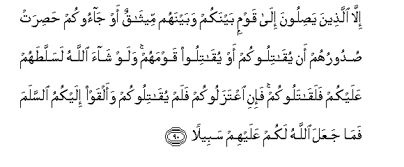

#إِلَّا الَّذِينَ يَصِلُونَ إِلَىٰ قَوْمٍ بَيْنَكُمْ وَبَيْنَهُمْ مِيثَاقٌ أَوْ جَاءُوكُمْ حَصِرَتْ صُدُورُهُمْ أَنْ يُقَاتِلُوكُمْ أَوْ يُقَاتِلُوا قَوْمَهُمْ ۚ وَلَوْ شَاءَ اللَّهُ لَسَلَّطَهُمْ عَلَيْكُمْ فَلَقَاتَلُوكُمْ ۚ فَإِنِ اعْتَزَلُوكُمْ فَلَمْ يُقَاتِلُوكُمْ وَأَلْقَوْا إِلَيْكُمُ السَّلَمَ فَمَا جَعَلَ اللَّهُ لَكُمْ عَلَيْهِمْ سَبِيلًا 

##Illa allatheena yasiloona ila qawmin baynakum wabaynahum meethaqun aw jaookum hasirat sudooruhum an yuqatilookum aw yuqatiloo qawmahum walaw shaa Allahu lasallatahum AAalaykum falaqatalookum faini iAAtazalookum falam yuqatilookum waalqaw ilaykumu alssalama fama jaAAala Allahu lakum AAalayhim sabeelan 

## 翻译(Translation)：

| Translator | 译文(Translation)                                            |
| :--------: | ------------------------------------------------------------ |
|    马坚    | 除非他们逃到曾与你们缔约的民众那里，或来归顺你们，既不愿对你们作战，又不愿对他们的宗族作战。假若真主意欲，他必使他们占优势，而他们必进攻你们。如果他们退避你们，而不进攻你们，并且投降你们，那末，真主绝不许你们进攻他们。 |
|  YUSUFALI  | Except those who join a group between whom and you there is a treaty (of peace), or those who approach you with hearts restraining them from fighting you or fighting their own people. If Allah had pleased, He could have given them power over you, and they would have fought you: Therefore if they withdraw from you but fight you not, and (instead) send you (guarantees of) peace, then Allah Hath opened no way for you (to war against them). |
| PICKTHALL  | Except those who seek refuge with a people between whom and you there is a covenant, or (those who) come unto you because their hearts forbid them to make war on you or make war on their own folk. Had Allah willed He could have given them power over you so that assuredly they would have fought you. So, if they hold aloof from you and wage not war against you and offer you peace, Allah alloweth you no way against them. |
|   SHAKIR   | Except those who reach a people between whom and you there is an alliance, or who come to you, their hearts shrinking from fighting you or fighting their own people; and if Allah had pleased, He would have given them power over you, so that they should have certainly fought you; therefore if they withdraw from you and do not fight you and offer you peace, then Allah has not given you a way against them. |

---

## 对位释义(Words Interpretation)：

| No   | العربية | 中文    | English | 曾用词 |
| ---- | ------: | ------- | ------- | ------ |
| 序号 |    阿文 | Chinese | 英文    | Used   |
|      |         |         |         |        |

---
