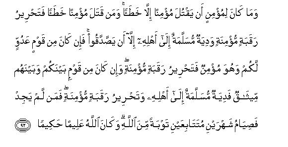

#وَمَا كَانَ لِمُؤْمِنٍ أَنْ يَقْتُلَ مُؤْمِنًا إِلَّا خَطَأً ۚ وَمَنْ قَتَلَ مُؤْمِنًا خَطَأً فَتَحْرِيرُ رَقَبَةٍ مُؤْمِنَةٍ وَدِيَةٌ مُسَلَّمَةٌ إِلَىٰ أَهْلِهِ إِلَّا أَنْ يَصَّدَّقُوا ۚ فَإِنْ كَانَ مِنْ قَوْمٍ عَدُوٍّ لَكُمْ وَهُوَ مُؤْمِنٌ فَتَحْرِيرُ رَقَبَةٍ مُؤْمِنَةٍ ۖ وَإِنْ كَانَ مِنْ قَوْمٍ بَيْنَكُمْ وَبَيْنَهُمْ مِيثَاقٌ فَدِيَةٌ مُسَلَّمَةٌ إِلَىٰ أَهْلِهِ وَتَحْرِيرُ رَقَبَةٍ مُؤْمِنَةٍ ۖ فَمَنْ لَمْ يَجِدْ فَصِيَامُ شَهْرَيْنِ مُتَتَابِعَيْنِ تَوْبَةً مِنَ اللَّهِ ۗ وَكَانَ اللَّهُ عَلِيمًا حَكِيمًا 

## 

## 翻译(Translation)：

| Translator | 译文(Translation) |
| :--------: | ----------------- |
|    马坚    |                   |
|  YUSUFALI  |                   |
| PICKTHALL  |                   |
|   SHAKIR   |                   |

---

## 对位释义(Words Interpretation)：

| No   | العربية | 中文    | English | 曾用词 |
| ---- | ------: | ------- | ------- | ------ |
| 序号 |    阿文 | Chinese | 英文    | Used   |
|      |         |         |         |        |

---
