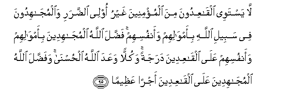

#لَا يَسْتَوِي الْقَاعِدُونَ مِنَ الْمُؤْمِنِينَ غَيْرُ أُولِي الضَّرَرِ وَالْمُجَاهِدُونَ فِي سَبِيلِ اللَّهِ بِأَمْوَالِهِمْ وَأَنْفُسِهِمْ ۚ فَضَّلَ اللَّهُ الْمُجَاهِدِينَ بِأَمْوَالِهِمْ وَأَنْفُسِهِمْ عَلَى الْقَاعِدِينَ دَرَجَةً ۚ وَكُلًّا وَعَدَ اللَّهُ الْحُسْنَىٰ ۚ وَفَضَّلَ اللَّهُ الْمُجَاهِدِينَ عَلَى الْقَاعِدِينَ أَجْرًا عَظِيمًا 

##La yastawee alqaAAidoona mina almumineena ghayru olee alddarari waalmujahidoona fee sabeeli Allahi biamwalihim waanfusihim faddala Allahu almujahideena biamwalihim waanfusihim AAala alqaAAideena darajatan wakullan waAAada Allahu alhusna wafaddala Allahu almujahideena AAala alqaAAideena ajran AAatheeman 

## 翻译(Translation)：

| Translator | 译文(Translation)                                            |
| :--------: | ------------------------------------------------------------ |
|    马坚    | 没有残疾而安坐家中的信士，与凭自己的财产和生命为主道而奋斗的信士，彼此是不相等的。凭自己的财产和生命而奋斗的人，真主使他们超过安坐家中的人一级。真主应许这两等人要受最优厚的报酬，除安坐者所受的报酬外，真主加赐奋斗的人一种重大的报酬。 |
|  YUSUFALI  | Not equal are those believers who sit, except those who are disabled, and those who strive and fight in the cause of Allah with their goods and their persons. Allah hath granted a grade higher to those who strive and fight with their goods and persons than to those who sit (at home). Unto all (in faith) Hath Allah promised good: But those who strive and fight Hath He distinguished above those who sit (at home) by a great reward,- |
| PICKTHALL  | Those of the believers who sit still, other than those who have a (disabling) hurt, are not on an equality with those who strive in the way of Allah with their wealth and lives. Allah hath conferred on those who strive with their wealth and lives a rank above the sedentary. Unto each Allah hath promised good, but He hath bestowed on those who strive a great reward above the sedentary; |
|   SHAKIR   | The holders back from among the believers, not having any injury, and those who strive hard in Allah's way with their property and their persons are not equal; Allah has made the strivers with their property and their persons to excel the holders back a (high) degree, and to each (class) Allah has promised good; and Allah shall grant to the strivers above the holders back a mighty reward: |

---

## 对位释义(Words Interpretation)：

| No   | العربية | 中文    | English | 曾用词 |
| ---- | ------: | ------- | ------- | ------ |
| 序号 |    阿文 | Chinese | 英文    | Used   |
| 4:95.1  | لَا         | 不，不是，没有 | no                        | 见2:2.3    |
| 4:95.2  | يَسْتَوِي      | 他们相等       | equal                     |            |
| 4:95.3  | الْقَاعِدُونَ   | 坐家中者       | those who sit             |            |
| 4:95.4  | مِنَ         | 从             | from                      | 见2:19.3 |
| 4:95.5  | الْمُؤْمِنِينَ   | 信士们         | the believers             | 见2:223.16 |
| 4:95.6  | غَيْرُ        | 之外           | other than                |            |
| 4:95.7  | أُولِي       | 人们           | men                       | 见2:179.6  |
| 4:95.8  | الضَّرَرِ      | 宿疾的         | injury                    |            |
| 4:95.9  | وَالْمُجَاهِدُونَ | 和众奋斗者     | and those who strive hard |            |
| 4:95.10 | فِي         | 在             | in                        | 见2:10.1   |
| 4:95.11 | سَبِيلِ       | 道路           | the way                   | 见2:154.6  |
| 4:95.12 | اللَّهِ       | 真主的         | of Allah                  | 见2:23.17  |
| 4:95.13 | بِأَمْوَالِهِمْ   | 在他们的财产   | with their property       | 参4:34.14  |
| 4:95.14 | وَأَنْفُسِهِمْ    | 和他们自己     | and themselves            | 参2:9.8    |
| 4:95.15 | فَضَّلَ        | 他赐予         | He has bestowed           | 见4:32.4   |
| 4:95.16 | اللَّهُ       | 安拉，真主     | Allah                     | 见2:7.2 |
| 4:95.17 | الْمُجَاهِدِينَ  | 众奋斗者       | the strivers              | 参4:95.9   |
| 4:95.18 | بِأَمْوَالِهِمْ   | 在他们的财产   | with their property       | 见4:95.13  |
| 4:95.19 | وَأَنْفُسِهِمْ    | 和他们自己     | and themselves            | 见4:95.14  |
| 4:95.20 | عَلَى        | 至             | On                        | 见2:5.2    |
| 4:95.21 | الْقَاعِدِينَ   | 坐家中者       | those who sit             | 参4:95.3   |
| 4:95.22 | دَرَجَةً       | 一级           | a degree                  |            |
| 4:95.23 | وَكُلًّا       | 和每个         | and to each               |            |
| 4:95.24 | وَعَدَ        | 他允诺         | promised                  |            |
| 4:95.25 | اللَّهُ       | 安拉，真主     | Allah                     | 见2:7.2 |
| 4:95.26 | الْحُسْنَىٰ     | 好的           | good                      |            |
| 4:95.27 | وَفَضَّلَ       | 和他赐予       | and He has bestowed       | 参4:32.4   |
| 4:95.28 | اللَّهُ       | 安拉，真主     | Allah                     | 见2:7.2 |
| 4:95.29 | الْمُجَاهِدِينَ  | 众奋斗者       | the strivers              | 见4:95.17  |
| 4:95.30 | عَلَى        | 至             | On                        | 见2:5.2    |
| 4:95.31 | الْقَاعِدِينَ   | 坐家中者       | those who sit             | 见4:95.21  |
| 4:95.32 | أَجْرًا       | 报酬           | reward                    | 见4:40.14  |
| 4:95.33 | عَظِيمًا      | 大的           | great                     | 见4:27.13  |

---
