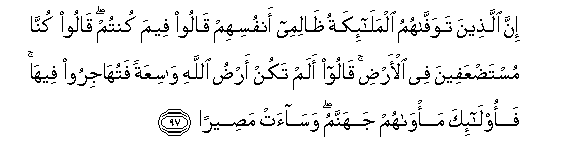

#إِنَّ الَّذِينَ تَوَفَّاهُمُ الْمَلَائِكَةُ ظَالِمِي أَنْفُسِهِمْ قَالُوا فِيمَ كُنْتُمْ ۖ قَالُوا كُنَّا مُسْتَضْعَفِينَ فِي الْأَرْضِ ۚ قَالُوا أَلَمْ تَكُنْ أَرْضُ اللَّهِ وَاسِعَةً فَتُهَاجِرُوا فِيهَا ۚ فَأُولَٰئِكَ مَأْوَاهُمْ جَهَنَّمُ ۖ وَسَاءَتْ مَصِيرًا 

##Inna allatheena tawaffahumu almalaikatu thalimee anfusihim qaloo feema kuntum qaloo kunna mustadAAafeena fee alardi qaloo alam takun ardu Allahi wasiAAatan fatuhajiroo feeha faolaika mawahum jahannamu wasaat maseeran 

## 翻译(Translation)：

| Translator | 译文(Translation)                                            |
| :--------: | ------------------------------------------------------------ |
|    马坚    | 在自欺的情状之下众天神使其死亡的人，众天神必定问他们说：生前你们是在什么情状之下呢！他们说：我们在地方上被人欺负的。他们问：难道真主的大地不是宽阔的、能容你们迁移的吗？这等人的归宿是火狱，那是一个恶劣的归宿。 |
|  YUSUFALI  | When angels take the souls of those who die in sin against their souls, they say: "In what (plight) were ye?" They reply: "Weak and oppressed were we in the earth." They say: "Was not the earth of Allah spacious enough for you to move yourselves away (from evil)?" Such men will find their abode in Hell,- What an evil refuge! - |
| PICKTHALL  | Lo! as for those whom the angels take (in death) while they wrong themselves, (the angels) will ask: In what were ye engaged ? They will say: We were oppressed in the land. (The angels) will say: Was not Allah's earth spacious that ye could have migrated therein ? As for such, their habitation will be hell, an evil journey's end; |
|   SHAKIR   | Surely (as for) those whom the angels cause to die while they are unjust to their souls, they shall say: In what state were you? They shall say: We were weak in the earth. They shall say: Was not Allah's earth spacious, so that you should have migrated therein? So these it is whose abode is hell, and it is an evil resort |

---

## 对位释义(Words Interpretation)：

| No   | العربية | 中文    | English | 曾用词 |
| ---- | ------: | ------- | ------- | ------ |
| 序号 |    阿文 | Chinese | 英文    | Used   |
| 4:97.1  | إِنَّ       | 的确         | surely                           | 见2:6.1    |
| 4:97.2  | الَّذِينَ    | 谁，那些     | those who                        | 见2:6.2    |
| 4:97.3  | تَوَفَّاهُمُ   | 他使他们死亡 | cause to die                     |            |
| 4:97.4  | الْمَلَائِكَةُ | 天使         | the angels                       | 见2:248.22 |
| 4:97.5  | ظَالِمِي    | 欺侮         | unjust                           |            |
| 4:97.6  | أَنْفُسِهِمْ   | 他们自己     | themselves                       | 见2:9.8    |
| 4:97.7  | قَالُوا    | 他们说，     | They said                        | 见2:11.8   |
| 4:97.8  | فِيمَ      | 在什么       | In what                          |            |
| 4:97.9  | كُنْتُمْ     | 你们是       | You are                          | 见2:23.2   |
| 4:97.10 | قَالُوا    | 他们说，     | They said                        | 见2:11.8   |
| 4:97.11 | كُنَّا      | 我们是       | We were                          |            |
| 4:97.12 | مُسْتَضْعَفِينَ | 被欺侮       | oppressed                        |            |
| 4:97.13 | فِي       | 在           | in                               | 见2:10.1   |
| 4:97.14 | الْأَرْضِ    | 大地         | Earth                            | 见2:22.4   |
| 4:97.15 | قَالُوا    | 他们说，     | They said                        | 见2:11.8   |
| 4:97.16 | أَلَمْ      | 难道不       | did not                          | 见2:33.10  |
| 4:97.17 | تَكُنْ      | 是           | be                               | 见3:60.5   |
| 4:97.18 | أَرْضُ      | 大地         | earth                            |            |
| 4:97.19 | اللَّهِ     | 真主的       | of Allah                         | 见2:23.17  |
| 4:97.20 | وَاسِعَةً    | 宽广的       | spacious                         |            |
| 4:97.21 | فَتُهَاجِرُوا | 因此你们迁移 | so that you should have migrated |            |
| 4:97.22 | فِيهَا     | 在其中       | therein                          | 见2:25.29  |
| 4:97.23 | فَأُولَٰئِكَ   | 然后那些人   | then those                       | 见2:81.8   |
| 4:97.24 | مَأْوَاهُمْ   | 他们的归宿   | their abode                      | 见3:197.4  |
| 4:97.25 | جَهَنَّمُ     | 火狱         | hell                             | 见2:206.10 |
| 4:97.26 | وَسَاءَتْ    | 和它恶劣     | and it is an evil                |            |
| 4:97.27 | مَصِيرًا    | 归宿         | refuge                           |            |

---
