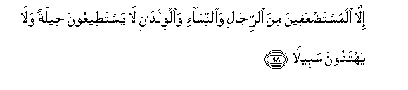

#إِلَّا الْمُسْتَضْعَفِينَ مِنَ الرِّجَالِ وَالنِّسَاءِ وَالْوِلْدَانِ لَا يَسْتَطِيعُونَ حِيلَةً وَلَا يَهْتَدُونَ سَبِيلً 

##Illa almustadAAafeena mina alrrijali waalnnisai waalwildani la yastateeAAoona heelatan wala yahtadoona sabeelan 

## 翻译(Translation)：

| Translator | 译文(Translation)                                            |
| :--------: | ------------------------------------------------------------ |
|    马坚    | 惟老弱和妇孺，他们既无力迁移，又不认识道路。                 |
|  YUSUFALI  | Except those who are (really) weak and oppressed - men, women, and children - who have no means in their power, nor can they find a way (to escape). |
| PICKTHALL  | Except the feeble among men, and the women, and the children, who are unable to devise a plan and are not shown a way. |
|   SHAKIR   | Except the weak from among the men and the children who have not in their power the means nor can they find a way (to escape); |

---

## 对位释义(Words Interpretation)：

| No   | العربية | 中文    | English | 曾用词 |
| ---- | ------: | ------- | ------- | ------ |
| 序号 |    阿文 | Chinese | 英文    | Used   |
| 4:98.1  | إِلَّا        | 除了           | Except                    | 见2:9.7    |
| 4:98.2  | الْمُسْتَضْعَفِينَ | 弱者           | the feeble                |            |
| 4:98.3  | مِنَ         | 从             | from                      | 见2:4.8    |
| 4:98.4  | الرِّجَالِ     | 众男人         | the men                   | 见4:75.10  |
| 4:98.5  | وَالنِّسَاءِ    | 和妇女们       | and the women             | 见4:75.11  |
| 4:98.6  | وَالْوِلْدَانِ   | 和儿童         | and the children          | 见4:75.12  |
| 4:98.7  | لَا         | 不，不是，没有 | no                        | 见2:2.3    |
| 4:98.8  | يَسْتَطِيعُونَ   | 他们能够       | they can                  | 见2:273.8  |
| 4:98.9  | حِيلَةً       | 一个计划       | a plan                    |            |
| 4:98.10 | وَلَا        | 也不           | and not                   | 见1:7.8    |
| 4:98.11 | يَهْتَدُونَ     | 他们遵循正道   | they follow the right way | 见2:170.22 |
| 4:98.12 | سَبِيلً       | 一条出路       | a way                     | 见4:15.22  |

---
