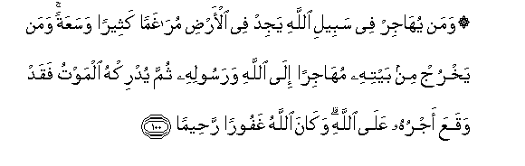

#۞ وَمَنْ يُهَاجِرْ فِي سَبِيلِ اللَّهِ يَجِدْ فِي الْأَرْضِ مُرَاغَمًا كَثِيرًا وَسَعَةً ۚ وَمَنْ يَخْرُجْ مِنْ بَيْتِهِ مُهَاجِرًا إِلَى اللَّهِ وَرَسُولِهِ ثُمَّ يُدْرِكْهُ الْمَوْتُ فَقَدْ وَقَعَ أَجْرُهُ عَلَى اللَّهِ ۗ وَكَانَ اللَّهُ غَفُورًا رَحِيمًا 

##Waman yuhajir fee sabeeli Allahi yajid fee alardi muraghaman katheeran wasaAAatan waman yakhruj min baytihi muhajiran ila Allahi warasoolihi thumma yudrikhu almawtu faqad waqaAAa ajruhu AAala Allahi wakana Allahu ghafooran raheeman 

## 翻译(Translation)：

| Translator | 译文(Translation)                                            |
| :--------: | ------------------------------------------------------------ |
|    马坚    | 谁为主道而迁移，谁在大地上发现许多出路，和丰富的财源。谁从家中出走，欲迁至真主和使者那里，而中途死亡，真主必报酬谁。真主是至赦的，是至慈的。 |
|  YUSUFALI  | He who forsakes his home in the cause of Allah, finds in the earth many a refuge, wide and spacious: Should he die as a refugee from home for Allah and His Messenger, his reward becomes due and sure with Allah. And Allah is Oft-forgiving, Most Merciful. |
| PICKTHALL  | Whoso migrateth for the cause of Allah will find much refuge and abundance in the earth, and whoso forsaketh his home, a fugitive unto Allah and His messenger, and death overtaketh him, his reward is then incumbent on Allah. Allah is ever Forgiving, Merciful. |
|   SHAKIR   | And whoever flies in Allah's way, he will find in the earth many a place of refuge and abundant resources, and whoever goes forth from his house flying to Allah and His Apostle, and then death overtakes him, his reward is indeed with Allah and Allah is Forgiving, Merciful. |

---

## 对位释义(Words Interpretation)：

| No   | العربية | 中文    | English | 曾用词 |
| ---- | ------: | ------- | ------- | ------ |
| 序号 |    阿文 | Chinese | 英文    | Used   |
| 4:100.1  | وَمَنْ    | 和谁       | and who           | 见2:108.11 |
| 4:100.2  | يُهَاجِرْ  | 他迁移     | he migrates       |            |
| 4:100.3  | فِي     | 在         | in                | 见2:10.1   |
| 4:100.4  | سَبِيلِ   | 道路       | the way           | 见2:154.6  |
| 4:100.5  | اللَّهِ   | 真主的     | of Allah          | 见2:23.17  |
| 4:100.6  | يَجِدْ    | 发现       | find              | 见2:196.47 |
| 4:100.7  | فِي     | 在         | in                | 见2:10.1   |
| 4:100.8  | الْأَرْضِ  | 大地       | Earth             | 见2:22.4   |
| 4:100.9  | مُرَاغَمًا | 居所       | a refuge          |            |
| 4:100.10 | كَثِيرًا  | 多         | Much              | 见2:26.31  |
| 4:100.11 | وَسَعَةً   | 和丰富     | and abundance     | 参2:247.23 |
| 4:100.12 | وَمَنْ    | 和谁       | and who           | 见2:108.11 |
| 4:100.13 | يَخْرُجْ   | 离开       | goes forth        |            |
| 4:100.14 | مِنْ     | 从         | from              | 见2:4.8    |
| 4:100.15 | بَيْتِهِ   | 他的家     | his house         |            |
| 4:100.16 | مُهَاجِرًا | 迁移       | a fugitive        |            |
| 4:100.17 | إِلَى    | 至         | to                | 见2:14.9   |
| 4:100.18 | اللَّهِ   | 真主的     | of Allah          | 见2:23.17  |
| 4:100.19 | وَرَسُولِهِ | 和他的使者 | and His Messenger | 见2:279.8  |
| 4:100.20 | ثُمَّ     | 然后       | Then              | 见2:28.7   |
| 4:100.21 | يُدْرِكْهُ  | 它遇到他   | overtakes him     |            |
| 4:100.22 | الْمَوْتُ  | 死亡       | the death         | 见2:19.16  |
| 4:100.23 | فَقَدْ    | 然后当然   | then may          | 见2:108.15 |
| 4:100.24 | وَقَعَ    | 它降临     | it have fallen    |            |
| 4:100.25 | أَجْرُهُ   | 他的报酬   | his reward        | 见2:112.9  |
| 4:100.26 | عَلَى    | 至         | On                | 见2:5.2    |
| 4:100.27 | اللَّهِ   | 真主的     | of Allah          | 见2:23.17  |
| 4:100.28 | وَكَانَ   | 和他是     | and he was        | 见2:34.11  |
| 4:100.29 | اللَّهُ   | 安拉，真主 | Allah             | 见2:7.2 |
| 4:100.30 | غَفُورًا  | 至赦的     | Forgiving         | 见4:23.53  |
| 4:100.31 | رَحِيمًا  | 至慈的     | Most Merciful     | 见4:16.14  |

---
