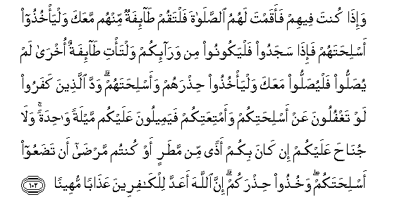

#وَإِذَا كُنْتَ فِيهِمْ فَأَقَمْتَ لَهُمُ الصَّلَاةَ فَلْتَقُمْ طَائِفَةٌ مِنْهُمْ مَعَكَ وَلْيَأْخُذُوا أَسْلِحَتَهُمْ فَإِذَا سَجَدُوا فَلْيَكُونُوا مِنْ وَرَائِكُمْ وَلْتَأْتِ طَائِفَةٌ أُخْرَىٰ لَمْ يُصَلُّوا فَلْيُصَلُّوا مَعَكَ وَلْيَأْخُذُوا حِذْرَهُمْ وَأَسْلِحَتَهُمْ ۗ وَدَّ الَّذِينَ كَفَرُوا لَوْ تَغْفُلُونَ عَنْ أَسْلِحَتِكُمْ وَأَمْتِعَتِكُمْ فَيَمِيلُونَ عَلَيْكُمْ مَيْلَةً وَاحِدَةً ۚ وَلَا جُنَاحَ عَلَيْكُمْ إِنْ كَانَ بِكُمْ أَذًى مِنْ مَطَرٍ أَوْ كُنْتُمْ مَرْضَىٰ أَنْ تَضَعُوا أَسْلِحَتَكُمْ ۖ وَخُذُوا حِذْرَكُمْ ۗ إِنَّ اللَّهَ أَعَدَّ لِلْكَافِرِينَ عَذَابًا مُهِينًا 

##Waitha kunta feehim faaqamta lahumu alssalata faltaqum taifatun minhum maAAaka walyakhuthoo aslihatahum faitha sajadoo falyakoonoo min waraikum waltati taifatun okhra lam yusalloo falyusalloo maAAaka walyakhuthoo hithrahum waaslihatahum wadda allatheena kafaroo law taghfuloona AAan aslihatikum waamtiAAatikum fayameeloona AAalaykum maylatan wahidatan wala junaha AAalaykum in kana bikum athan min matarin aw kuntum marda an tadaAAoo aslihatakum wakhuthoo hithrakum inna Allaha aAAadda lilkafireena AAathaban muheenan 

## 翻译(Translation)：

| Translator | 译文(Translation)                                            |
| :--------: | ------------------------------------------------------------ |
|    马坚    | 当你在他们之间，而你欲带领他们礼拜的时候，教他们中的一队人同你立正，并教他们携带武器。当他们礼拜的时候，叫另一队人防守在你们后面；然后，教还没有礼拜的那一队人来同你礼拜，教他们也要谨慎戒备，并携带武器。不信道的人，希望你们忽视你们的武器和物资，而乘机袭击你们。如果你们为雨水或疾病而感觉烦难，那末，放下武器对于你们是无罪的。你们当谨慎戒备。真主确已为不信道的人而预备凌辱的刑罚。 |
|  YUSUFALI  | When thou (O Messenger) art with them, and standest to lead them in prayer, let one party of them stand up (in prayer) with thee, taking their arms with them: When they finish their prostrations, let them take their position in the rear, and let the other party come up which hath not yet prayed - and let them pray with thee, taking all precaution, and bearing arms: the unbelievers wish, if ye were negligent of your arms and your baggage, to assault you in a single rush. But there is no blame on you if ye put away your arms because of the inconvenience of rain or because ye are ill; but take (every) precaution for yourselves. For the unbelievers Allah hath prepared a humiliating punishment. |
| PICKTHALL  | And when thou (O Muhammad) art among them and arrangest (their) worship for them, let only a party of them stand with thee (to worship) and let them take their arms. Then when they have performed their prostrations let them fall to the rear and let another party come that hath not worshipped and let them worship with thee, and let them take their precaution and their arms. Those who disbelieve long for you to neglect your arms and your baggage that they may attack you once for all. It is no sin for you to lay aside your arms, if rain impedeth you or ye are sick. But take your precaution. Lo! Allah prepareth for the disbelievers shameful punishment. |
|   SHAKIR   | And when you are among them and keep up the prayer for them, let a party of them stand up with you, and let them take their arms; then when they have prostrated themselves let them go to your rear, and let another party who have not prayed come forward and pray with you, and let them take their precautions and their arms; (for) those who disbelieve desire that you may be careless of your arms and your luggage, so that they may then turn upon you with a sudden united attack, and there is no blame on you, if you are annoyed with rain or if you are sick, that you lay down your arms, and take your precautions; surely Allah has prepared a disgraceful chastisement for the unbelievers. |

---

## 对位释义(Words Interpretation)：

| No   | العربية | 中文    | English | 曾用词 |
| ---- | ------: | ------- | ------- | ------ |
| 序号 |    阿文 | Chinese | 英文    | Used   |
| 4:102.1  | وَإِذَا     | 并且如果，当时 | and when                        | 见2:11.1    |
| 4:102.2  | كُنْتَ      | 你是           | You are                         | 见2:143.17  |
| 4:102.3  | فِيهِمْ     | 在他们         | in them                         | 见2:129.3   |
| 4:102.4  | فَأَقَمْتَ    | 然后你带领     | then standest to lead           |             |
| 4:102.5  | لَهُمُ      | 对他们         | for them                        | 见2:11.3    |
| 4:102.6  | الصَّلَاةَ   | 拜功，祈祷     | Prayer                          | 见2:43.2    |
| 4:102.7  | فَلْتَقُمْ    | 然后使他立正   | then let him stand up           |             |
| 4:102.8  | طَائِفَةٌ    | 一部分         | a section                       | 见3:69.2    |
| 4:102.9  | مِنْهُمْ     | 从他们         | from them                       | 见2:75.8    |
| 4:102.10 | مَعَكَ      | 与你共同       | with you                        |             |
| 4:102.11 | وَلْيَأْخُذُوا | 和使他们带     | and let them take               |             |
| 4:102.12 | أَسْلِحَتَهُمْ  | 他们的武器     | their arms                      |             |
| 4:102.13 | فَإِذَا     | 然后当         | then when                       | 见2:196.34  |
| 4:102.14 | سَجَدُوا    | 他们叩首       | they have prostrated themselves |             |
| 4:102.15 | فَلْيَكُونُوا | 使他们是       | then let them be                |             |
| 4:102.16 | مِنْ       | 从             | from                            | 见2:4.8     |
| 4:102.17 | وَرَائِكُمْ   | 你们的后面     | your rear                       |             |
| 4:102.18 | وَلْتَأْتِ    | 和使他来至     | and let them come               |             |
| 4:102.19 | طَائِفَةٌ    | 一部分         | a section                       | 见3:69.2    |
| 4:102.20 | أُخْرَىٰ     | 另一           | another                         |             |
| 4:102.21 | لَمْ       | 不，没有       | did not                         | 见2:6.8     |
| 4:102.22 | يُصَلُّوا    | 他们礼拜       | they prayed                     |             |
| 4:102.23 | فَلْيُصَلُّوا  | 然后使他们礼拜 | then let them pray              |             |
| 4:102.24 | مَعَكَ      | 与你共同       | with you                        | 见4:102.10  |
| 4:102.25 | وَلْيَأْخُذُوا | 和使他们带     | and let them take               | 见4:102.11  |
| 4:102.26 | حِذْرَهُمْ    | 他们的警戒     | their precautions               |             |
| 4:102.27 | وَأَسْلِحَتَهُمْ | 和他们的武器   | and their arms                  | 参4:102.12  |
| 4:102.28 | وَدَّ       | 希望           | wish                            | 见2:109.1   |
| 4:102.29 | الَّذِينَ    | 谁，那些       | those who                       | 见2:6.2     |
| 4:102.30 | كَفَرُوا    | 不信           | disbelieve                      | 见2:6.3     |
| 4:102.31 | لَوْ       | 如果           | If                              | 见2:102.72  |
| 4:102.32 | تَغْفُلُونَ   | 你们忽视       | ye were negligent               |             |
| 4:102.33 | عَنْ       | 从             | on                              | 见2:48.6    |
| 4:102.34 | أَسْلِحَتِكُمْ  | 你们的武器     | your arms                       | 参4:102.12  |
| 4:102.35 | وَأَمْتِعَتِكُمْ | 和你们的物资   | and your baggage                |             |
| 4:102.36 | فَيَمِيلُونَ  | 然后他们袭击   | so that they may attack         |             |
| 4:102.37 | عَلَيْكُمْ    | 在你们         | on you                          | 见2:40.8    |
| 4:102.38 | مَيْلَةً     | 乘机           | sudden                          |             |
| 4:102.39 | وَاحِدَةً    | 一个的         | one                             | 见2:213.4   |
| 4:102.40 | وَلَا      | 也不           | and not                         | 见1:7.8     |
| 4:102.41 | جُنَاحَ     | 罪             | sin                             | 见2:158.13  |
| 4:102.42 | عَلَيْكُمْ    | 在你们         | on you                          | 见2:40.8    |
| 4:102.43 | إِنْ       | 如果           | if                              | 见2:23.18   |
| 4:102.44 | كَانَ      | 他是           | It was                          | 见2:75.6    |
| 4:102.45 | بِكُمْ      | 在你们         | in you                          | 见2:282.121 |
| 4:102.46 | أَذًى      | 些许伤害       | ailment                         | 见2:196.24  |
| 4:102.47 | مِنْ       | 从             | from                            | 见2:4.8     |
| 4:102.48 | مَطَرٍ      | 雨             | rain                            |             |
| 4:102.49 | أَوْ       | 或             | or                              | 见2:19.1    |
| 4:102.50 | كُنْتُمْ     | 你们是         | You are                         | 见2:23.2    |
| 4:102.51 | مَرْضَىٰ     | 生病           | ill                             | 见4:43.23   |
| 4:102.52 | أَنْ       | 该             | that                            | 见2:26.5    |
| 4:102.53 | تَضَعُوا    | 你们放下       | you lay down                    |             |
| 4:102.54 | أَسْلِحَتَكُمْ  | 你们的武器     | your arms                       | 参4:102.34  |
| 4:102.55 | وَخُذُوا    | 和你们守       | and Take hold of                | 参2:63.7    |
| 4:102.56 | حِذْرَكُمْ    | 你们的警戒     | your precautions                | 见4:71.6    |
| 4:102.57 | إِنَّ       | 的确           | surely                          | 见2:6.1     |
| 4:102.58 | اللَّهَ     | 安拉，真主     | Allah                           | 见2:9.2 |
| 4:102.59 | أَعَدَّ      | 他预备         | has prepared                    |             |
| 4:102.60 | لِلْكَافِرِينَ | 对于不信道者   | For disbelievers                | 见2:24.13   |
| 4:102.61 | عَذَابًا    | 刑罚           | chastisement                    | 见3:56.5    |
| 4:102.62 | مُهِينًا    | 凌辱的         | disgraceful                     | 见4:37.15   |

---
