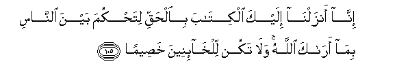

#إِنَّا أَنْزَلْنَا إِلَيْكَ الْكِتَابَ بِالْحَقِّ لِتَحْكُمَ بَيْنَ النَّاسِ بِمَا أَرَاكَ اللَّهُ ۚ وَلَا تَكُنْ لِلْخَائِنِينَ خَصِيمًا 

##Inna anzalna ilayka alkitaba bialhaqqi litahkuma bayna alnnasi bima araka Allahu wala takun lilkhaineena khaseeman 

## 翻译(Translation)：

| Translator | 译文(Translation)                                            |
| :--------: | ------------------------------------------------------------ |
|    马坚    | 我确已降示你包含真理的经典，以便你据真主所昭示你的（律例），而替众人判决。你不要替奸人做辩护人。 |
|  YUSUFALI  | We have sent down to thee the Book in truth, that thou mightest judge between people by that which Allah has shown thee; so be not an advocate by those who betray their trust; |
| PICKTHALL  | Lo! We reveal unto thee the Scripture with the truth, that thou mayst judge between mankind by that which Allah showeth thee. And be not thou a pleader for the treacherous; |
|   SHAKIR   | Surely We have revealed the Book to you with the truth that you may judge between people by means of that which Allah has taught you; and be not an advocate on behalf of the treacherous. |

---

## 对位释义(Words Interpretation)：

| No   | العربية | 中文    | English | 曾用词 |
| ---- | ------: | ------- | ------- | ------ |
| 序号 |    阿文 | Chinese | 英文    | Used   |
| 4:105.1  | إِنَّا      | 确实我们       | surely we           | 见2:14.12 |
| 4:105.2  | أَنْزَلْنَا   | 我们降下       | we sent down        | 见2:99.2  |
| 4:105.3  | إِلَيْكَ     | 至你           | to you              | 见2:4.5   |
| 4:105.4  | الْكِتَابَ   | 这部经，这本书 | the book            | 见2:2.2   |
| 4:105.5  | بِالْحَقِّ    | 以真理         | with truth          | 见2:71.20 |
| 4:105.6  | لِتَحْكُمَ    | 以便你判决     | that you may judge  |           |
| 4:105.7  | بَيْنَ      | 之间           | between             | 见2:66.4  |
| 4:105.8  | النَّاسِ    | 人             | People              | 见2:8.2   |
| 4:105.9  | بِمَا      | 在什么         | in what             | 见2:4.3   |
| 4:105.10 | أَرَاكَ     | 他昭示你       | he has shown you    |           |
| 4:105.11 | اللَّهُ     | 安拉，真主     | Allah               | 见2:7.2 |
| 4:105.12 | وَلَا      | 也不           | and not             | 见1:7.8   |
| 4:105.13 | تَكُنْ      | 是             | be                  | 见3:60.5  |
| 4:105.14 | لِلْخَائِنِينَ | 至众奸人       | for the treacherous |           |
| 4:105.15 | خَصِيمًا    | 一个辩护者     | a pleader           |           |

---
