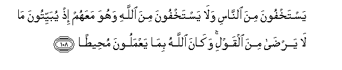

#يَسْتَخْفُونَ مِنَ النَّاسِ وَلَا يَسْتَخْفُونَ مِنَ اللَّهِ وَهُوَ مَعَهُمْ إِذْ يُبَيِّتُونَ مَا لَا يَرْضَىٰ مِنَ الْقَوْلِ ۚ وَكَانَ اللَّهُ بِمَا يَعْمَلُونَ مُحِيطًا 

##Yastakhfoona mina alnnasi wala yastakhfoona mina Allahi wahuwa maAAahum ith yubayyitoona ma la yarda mina alqawli wakana Allahu bima yaAAmaloona muheetan 

## 翻译(Translation)：

| Translator | 译文(Translation)                                            |
| :--------: | ------------------------------------------------------------ |
|    马坚    | 他们躲避世人，而不躲避真主；其实，当他们策划真主所不喜悦的计谋的时候，真主是与他们同在的，真主是周知他们的行为的。 |
|  YUSUFALI  | They seek to hide them selves from people, but they cannot hide from Allah, while He is with them when they plot by night, in words that He cannot approve: And Allah Doth compass round all that they do. |
| PICKTHALL  | They seek to hide from men and seek not to hide from Allah. He is with them when by night they hold discourse displeasing unto Him. Allah ever surroundeth what they do. |
|   SHAKIR   | They hide themselves from men and do not hide themselves from Allah, and He is with them when they meditate by night words which please Him not, and Allah encompasses what they do. |

---

## 对位释义(Words Interpretation)：

| No   | العربية | 中文    | English | 曾用词 |
| ---- | ------: | ------- | ------- | ------ |
| 序号 |    阿文 | Chinese | 英文    | Used   |
| 4:108.1  | يَسْتَخْفُونَ | 他们躲避                          | They seek to hide     |           |
| 4:108.2  | مِنَ      | 从                                | from                  | 见2:4.8   |
| 4:108.3  | النَّاسِ   | 人                                | People                | 见2:8.2   |
| 4:108.4  | وَلَا     | 也不                              | and not               | 见1:7.8   |
| 4:108.5  | يَسْتَخْفُونَ | 他们躲避                          | They seek to hide     | 见4:108.1 |
| 4:108.6  | مِنَ      | 从                                | from                  | 见2:4.8   |
| 4:108.7  | اللَّهِ    | 真主的                            | of Allah              | 见2:23.17 |
| 4:108.8  | وَهُوَ     | 和他                              | and he                | 见2:29.16 |
| 4:108.9  | مَعَهُمْ    | 伴随他们                          | with them             | 见2:89.9  |
| 4:108.10 | إِذْ      | 当时                              | when                  | 见2:131.1 |
| 4:108.11 | يُبَيِّتُونَ  | 他们的阴谋                        | the night in planning | 见4:81.16 |
| 4:108.12 | مَا      | 什么                              | what/ that which      | 见2:17.8  |
| 4:108.13 | لَا      | 不，不是，没有                    | no                    | 见2:2.3   |
| 4:108.14 | يَرْضَىٰ    | 他喜悦                            | he please             |           |
| 4:108.15 | مِنَ      | 从                                | from                  | 见2:4.8   |
| 4:108.16 | الْقَوْلِ   | 众话语                            | words                 |           |
| 4:108.17 | وَكَانَ    | 和他是	and he was	见2:34.11 |                       |           |
| 4:108.18 | اللَّهُ    | 安拉，真主                        | Allah                 | 见1:1.2   |
| 4:108.19 | بِمَا     | 在什么                            | in what               | 见2:4.3   |
| 4:108.20 | يَعْمَلُونَ  | 他们的行为                        | they do               | 见2:96.25 |
| 4:108.21 | مُحِيطًا   | 周知的                            | surroundes            |           |

---
