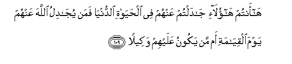

#هَا أَنْتُمْ هَٰؤُلَاءِ جَادَلْتُمْ عَنْهُمْ فِي الْحَيَاةِ الدُّنْيَا فَمَنْ يُجَادِلُ اللَّهَ عَنْهُمْ يَوْمَ الْقِيَامَةِ أَمْ مَنْ يَكُونُ عَلَيْهِمْ وَكِيلًا 

##Haantum haolai jadaltum AAanhum fee alhayati alddunya faman yujadilu Allaha AAanhum yawma alqiyamati am man yakoonu AAalayhim wakeelan 

## 翻译(Translation)：

| Translator | 译文(Translation)                                            |
| :--------: | ------------------------------------------------------------ |
|    马坚    | 你们这些人啊！在今世生活中，你们替他们辩护，复活日，谁替他们辩护呢？谁做他们的监护者呢？ |
|  YUSUFALI  | Ah! These are the sort of men on whose behalf ye may contend in this world; but who will contend with Allah on their behalf on the Day of Judgment, or who will carry their affairs through? |
| PICKTHALL  | Ho! ye are they who pleaded for them in the life of the world. But who will plead with Allah for them on the Day of Resurrection, or who will then be their defender ? |
|   SHAKIR   | Behold! you are they who (may) plead for them in this world's life, but who will plead for them with Allah on the resurrection day, or who shall be their protector? |

---

## 对位释义(Words Interpretation)：

| No   | العربية | 中文    | English | 曾用词 |
| ---- | ------: | ------- | ------- | ------ |
| 序号 |    阿文 | Chinese | 英文    | Used   |
| 4:109.1  | هَا      | 啊               | Ah           | 见3:66.1   |
| 4:109.2  | أَنْتُمْ    | 你们             | you          | 见2:85.2   |
| 4:109.3  | هَٰؤُلَاءِ   | 这些             | Those        | 见2:31.12  |
| 4:109.4  | جَادَلْتُمْ  | 你们辩护         | you plead    |            |
| 4:109.5  | عَنْهُمْ    | 在他们           | on them      | 见3:10.6   |
| 4:109.6  | فِي      | 在               | in           | 见2:10.1   |
| 4:109.7  | الْحَيَاةِ  | 生活             | Life         | 见2:85.37  |
| 4:109.8  | الدُّنْيَا  | 今世             | this world   | 见2:85.38  |
| 4:109.9  | فَمَنْ     | 无论谁           | whosoever    | 见2:38.9   |
| 4:109.10 | يُجَادِلُ   | 他辩护           | he pleads    |            |
| 4:109.11 | اللَّهَ    | 安拉，真主       | Allah        | 见2:9.2 |
| 4:109.12 | عَنْهُمْ    | 在他们           | on them      | 见3:10.6   |
| 4:109.13 | يَوْمَ     | 日，日子，时候的 | day          | 见1:4.2    |
| 4:109.14 | الْقِيَامَةِ | 复活的           | Resurrection | 见2:85.40  |
| 4:109.15 | أَمْ      | 或               | or           | 见2:6.7    |
| 4:109.16 | مَنْ      | 谁               | who          | 见2:97.2   |
| 4:109.17 | يَكُونُ    | 他是             | he is        | 见2:247.13 |
| 4:109.18 | عَلَيْهِمْ   | 在他们           | on they      | 见1:7.4    |
| 4:109.19 | وَكِيلًا   | 监护者           | protector    |            |

---
