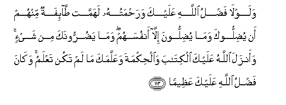

#وَلَوْلَا فَضْلُ اللَّهِ عَلَيْكَ وَرَحْمَتُهُ لَهَمَّتْ طَائِفَةٌ مِنْهُمْ أَنْ يُضِلُّوكَ وَمَا يُضِلُّونَ إِلَّا أَنْفُسَهُمْ ۖ وَمَا يَضُرُّونَكَ مِنْ شَيْءٍ ۚ وَأَنْزَلَ اللَّهُ عَلَيْكَ الْكِتَابَ وَالْحِكْمَةَ وَعَلَّمَكَ مَا لَمْ تَكُنْ تَعْلَمُ ۚ وَكَانَ فَضْلُ اللَّهِ عَلَيْكَ عَظِيمًا 

##Walawla fadlu Allahi AAalayka warahmatuhu lahammat taifatun minhum an yudillooka wama yudilloona illa anfusahum wama yadurroonaka min shayin waanzala Allahu AAalayka alkitaba waalhikmata waAAallamaka ma lam takun taAAlamu wakana fadlu Allahi AAalayka AAatheeman 

## 翻译(Translation)：

| Translator | 译文(Translation)                                            |
| :--------: | ------------------------------------------------------------ |
|    马坚    | 假若没有真主赐你恩惠和慈恩，那末，他们中的一部分人，必欲使你迷误；他们只能使自己迷误，他们不能伤害你一丝毫。真主降示你天经和智慧，并以你所不知道的（义理）教导你。真主赐你的恩惠是重大的。 |
|  YUSUFALI  | But for the Grace of Allah to thee and his Mercy, a party of them would certainly have plotted to lead thee astray. But (in fact) they will only lead their own souls astray, and to thee they can do no harm in the least. For Allah hath sent down to thee the Book and wisdom and taught thee what thou knewest not (before): And great is the Grace of Allah unto thee. |
| PICKTHALL  | But for the grace of Allah upon thee (Muhammad), and His mercy, a party of them had resolved to mislead thee, but they will mislead only themselves and they will hurt thee not at all. Allah revealeth unto thee the Scripture and wisdom, and teacheth thee that which thou knewest not. The grace of Allah toward thee hath been infinite. |
|   SHAKIR   | And were it not for Allah's grace upon you and His mercy a party of them had certainly designed to bring you to perdition and they do not bring (aught) to perdition but their own souls, and they shall not harm you in any way, and Allah has revealed to you the Book and the wisdom, and He has taught you what you did not know, and Allah's grace on you is very great. |

---

## 对位释义(Words Interpretation)：

| No   | العربية | 中文    | English | 曾用词 |
| ---- | ------: | ------- | ------- | ------ |
| 序号 |    阿文 | Chinese | 英文    | Used   |
| 4:113.1  | وَلَوْلَا   | 和如果不               | and if did not             | 见2:251.14 |
| 4:113.2  | فَضْلُ     | 恩惠                   | the grace                  | 见2:64.7   |
| 4:113.3  | اللَّهِ    | 真主的                 | of Allah                   | 见2:23.17  |
| 4:113.4  | عَلَيْكَ    | 在你                   | on you                     | 见2:252.5  |
| 4:113.5  | وَرَحْمَتُهُ  | 和他的慈恩             | And his mercy              | 见2:64.10  |
| 4:113.6  | لَهَمَّتْ    | 必定她决定             | she had certainly resolved |            |
| 4:113.7  | طَائِفَةٌ   | 一部分                 | a section                  | 见3:69.2   |
| 4:113.8  | مِنْهُمْ    | 从他们                 | from them                  | 见2:75.8   |
| 4:113.9  | أَنْ      | 该                     | that                       | 见2:26.5   |
| 4:113.10 | يُضِلُّوكَ   | 他们迷误你             | they will mislead you      |            |
| 4:113.11 | وَمَا     | 和不                   | And not                    | 见2:9.9    |
| 4:113.12 | يُضِلُّونَ   | 他们使迷误             | they go astray             | 见3:69.9   |
| 4:113.13 | إِلَّا     | 除了                   | Except                     | 见2:9.7    |
| 4:113.14 | أَنْفُسَهُمْ  | 他们自己               | themselves                 | 见2:9.8    |
| 4:113.15 | وَمَا     | 和不                   | And not                    | 见2:9.9    |
| 4:113.16 | يَضُرُّونَكَ  | 他们伤害你             | they will hurt you         |            |
| 4:113.17 | مِنْ      | 从                     | from                       | 见2:4.8    |
| 4:113.18 | شَيْءٍ     | 事物                   | Thing                      | 见2:20.24  |
| 4:113.19 | وَأَنْزَلَ   | 下降，颁降，降示，揭秘 | and get down               | 见2:22.8   |
| 4:113.20 | اللَّهُ    | 安拉，真主             | Allah                      | 见2:7.2 |
| 4:113.21 | عَلَيْكَ    | 在你                   | on you                     | 见2:252.5  |
| 4:113.22 | الْكِتَابَ  | 这部经，这本书         | the book                   | 见2:2.2    |
| 4:113.23 | وَالْحِكْمَةَ | 和智慧                 | and wisdom                 | 见2:129.11 |
| 4:113.24 | وَعَلَّمَكَ   | 和他教你               | and He has taught you      |            |
| 4:113.25 | مَا      | 什么                   | what/ that which           | 见2:17.8   |
| 4:113.26 | لَمْ      | 不，没有               | did not                    | 见2:6.8    |
| 4:113.27 | تَكُنْ     | 是                     | be                         | 见3:60.5   |
| 4:113.28 | تَعْلَمُ    | 你知道                 | you know                   |            |
| 4:113.29 | وَكَانَ    | 和他是                 | and he was                 | 见2:34.11  |
| 4:113.30 | فَضْلُ     | 恩惠                   | the grace                  | 见2:64.7   |
| 4:113.31 | اللَّهِ    | 真主的                 | of Allah                   | 见2:23.17  |
| 4:113.32 | عَلَيْكَ    | 在你                   | on you                     | 见2:252.5  |
| 4:113.33 | عَظِيمًا   | 大的                   | great                      | 见4:27.13  |

---
