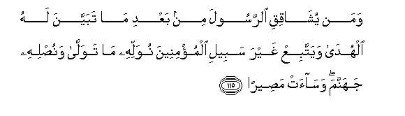

#وَمَنْ يُشَاقِقِ الرَّسُولَ مِنْ بَعْدِ مَا تَبَيَّنَ لَهُ الْهُدَىٰ وَيَتَّبِعْ غَيْرَ سَبِيلِ الْمُؤْمِنِينَ نُوَلِّهِ مَا تَوَلَّىٰ وَنُصْلِهِ جَهَنَّمَ ۖ وَسَاءَتْ مَصِيرًا 

##Waman yushaqiqi alrrasoola min baAAdi ma tabayyana lahu alhuda wayattabiAA ghayra sabeeli almumineena nuwallihi ma tawalla wanuslihi jahannama wasaat maseeran 

## 翻译(Translation)：

| Translator | 译文(Translation)                                            |
| :--------: | ------------------------------------------------------------ |
|    马坚    | 谁在认清正道之后反对使者，而遵循非信士的道路，我将听谁自便，并使他入于火狱中，那是一个恶劣的归宿。 |
|  YUSUFALI  | If anyone contends with the Messenger even after guidance has been plainly conveyed to him, and follows a path other than that becoming to men of Faith, We shall leave him in the path he has chosen, and land him in Hell,- what an evil refuge! |
| PICKTHALL  | And whoso opposeth the messenger after the guidance (of Allah) hath been manifested unto him, and followeth other than the believer's way, We appoint for him that unto which he himself hath turned, and expose him unto hell - a hapless journey's end! |
|   SHAKIR   | And whoever acts hostilely to the Apostle after that guidance has become manifest to him, and follows other than the way of the believers, We will turn him to that to which he has (himself) turned and make him enter hell; and it is an evil resort |

---

## 对位释义(Words Interpretation)：

| No   | العربية | 中文    | English | 曾用词 |
| ---- | ------: | ------- | ------- | ------ |
| 序号 |    阿文 | Chinese | 英文    | Used   |
| 4:115.1  | وَمَنْ      | 和谁                     | and who             | 见2:108.11 |
| 4:115.2  | يُشَاقِقِ    | 他反对                   | he opposes          |            |
| 4:115.3  | الرَّسُولَ   | 使者                     | the messenger       | 见2:143.10 |
| 4:115.4  | مِنْ       | 从                       | from                | 见2:4.8    |
| 4:115.5  | بَعْدِ      | 之后                     | after               | 见2:27.6   |
| 4:115.6  | مَا       | 什么                     | what/ that which    | 见2:17.8   |
| 4:115.7  | تَبَيَّنَ     | 明白                     | become manifest     | 见2:109.19 |
| 4:115.8  | لَهُ       | 对他                     | for he              | 见2:102.62 |
| 4:115.9  | الْهُدَىٰ    | 正道，指南，引导         | the Guidance        | 见2:120.15 |
| 4:115.10 | وَيَتَّبِعْ    | 和他遵循                 | and he follows      |            |
| 4:115.11 | غَيْرَ      | 非，除了，除开，不是，但 | non, but            | 见1:7.5    |
| 4:115.12 | سَبِيلِ     | 道路                     | the way             | 见2:154.6  |
| 4:115.13 | الْمُؤْمِنِينَ | 信士们                   | the believers       | 见2:223.16 |
| 4:115.14 | نُوَلِّهِ     | 我们转变他               | We will turn him to |            |
| 4:115.15 | مَا       | 什么                     | what/ that which    | 见2:17.8   |
| 4:115.16 | تَوَلَّىٰ     | 他转脸                   | he turns back       | 见2:205.2  |
| 4:115.17 | وَنُصْلِهِ    | 和使他                   | and make him        |            |
| 4:115.18 | جَهَنَّمَ     | 火狱                     | Hell                | 见3:12.7   |
| 4:115.19 | وَسَاءَتْ    | 和它恶劣                 | and it is an evil   | 见4:97.26  |
| 4:115.20 | مَصِيرًا    | 归宿                     | refuge              | 见4:97.27  |

---
