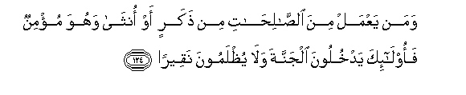

#وَمَنْ يَعْمَلْ مِنَ الصَّالِحَاتِ مِنْ ذَكَرٍ أَوْ أُنْثَىٰ وَهُوَ مُؤْمِنٌ فَأُولَٰئِكَ يَدْخُلُونَ الْجَنَّةَ وَلَا يُظْلَمُونَ نَقِيرًا 

##Waman yaAAmal mina alssalihati min thakarin aw ontha wahuwa muminun faolaika yadkhuloona aljannata wala yuthlamoona naqeeran 

## 翻译(Translation)：

| Translator | 译文(Translation)                                            |
| :--------: | ------------------------------------------------------------ |
|    马坚    | 信士和信女，谁行善谁得入乐园，他们不受丝毫的亏枉。           |
|  YUSUFALI  | If any do deeds of righteousness,- be they male or female - and have faith, they will enter Heaven, and not the least injustice will be done to them. |
| PICKTHALL  | And whoso doeth good works, whether of male or female, and he (or she) is a believer, such will enter paradise and they will not be wronged the dint in a date- stone. |
|   SHAKIR   | And whoever does good deeds whether male or female and he (or she) is a believer-- these shall enter the garden, and they shall not be dealt with a jot unjustly. |

---

## 对位释义(Words Interpretation)：

| No   | العربية | 中文    | English | 曾用词 |
| ---- | ------: | ------- | ------- | ------ |
| 序号 |    阿文 | Chinese | 英文    | Used   |
| 4:124.1  | وَمَنْ      | 和谁       | and who         | 见2:108.11 |
| 4:124.2  | يَعْمَلْ     | 他做       | he does         | 见4:110.2  |
| 4:124.3  | مِنَ       | 从         | from            | 见2:19.3 |
| 4:124.4  | الصَّالِحَاتِ | 善行       | Good deeds      | 见2:25.5   |
| 4:124.5  | مِنْ       | 从         | from            | 见2:4.8    |
| 4:124.6  | ذَكَرٍ      | 男性       | male            | 见3:195.11 |
| 4:124.7  | أَوْ       | 或         | or              | 见2:19.1   |
| 4:124.8  | أُنْثَىٰ     | 一个女的   | a female        | 见3:36.7   |
| 4:124.9  | وَهُوَ      | 和他       | and he          | 见2:29.16  |
| 4:124.10 | مُؤْمِنٌ     | 归信的     | believing       | 见2:221.19 |
| 4:124.11 | فَأُولَٰئِكَ   | 然后那些人 | then those      | 见2:81.8   |
| 4:124.12 | يَدْخُلُونَ   | 他们进入   | they will enter |            |
| 4:124.13 | الْجَنَّةَ    | 天园       | Paradise        | 见2:35.7   |
| 4:124.14 | وَلَا      | 也不       | and not         | 见1:7.8    |
| 4:124.15 | يُظْلَمُونَ   | 被亏枉     | be wronged      | 见2:281.15 |
| 4:124.16 | نَقِيرًا    | 一丝毫     | the date stone  | 见4:53.10  |

---
