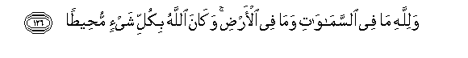

#وَلِلَّهِ مَا فِي السَّمَاوَاتِ وَمَا فِي الْأَرْضِ ۚ وَكَانَ اللَّهُ بِكُلِّ شَيْءٍ مُحِيطًا 

##Walillahi ma fee alssamawati wama fee alardi wakana Allahu bikulli shayin muheetan 

## 翻译(Translation)：

| Translator | 译文(Translation)                                            |
| :--------: | ------------------------------------------------------------ |
|    马坚    | 天地万物，只是真主的。真主是周知万物的。                     |
|  YUSUFALI  | But to Allah belong all things in the heavens and on earth: And He it is that Encompasseth all things. |
| PICKTHALL  | Unto Allah belongeth whatsoever is in the heavens and whatsoever is in the earth. Allah ever surroundeth all things. |
|   SHAKIR   | And whatever is in the heavens and whatever is in the earth is Allah's; and Allah encompasses all things. |

---

## 对位释义(Words Interpretation)：

| No   | العربية | 中文    | English | 曾用词 |
| ---- | ------: | ------- | ------- | ------ |
| 序号 |    阿文 | Chinese | 英文    | Used   |
| 4:126.1  | وَلِلَّهِ     | 和归真主   | and to Allah     | 见2:115.1  |
| 4:126.2  | مَا       | 什么       | what/ that which | 见2:17.8   |
| 4:126.3  | فِي       | 在         | in               | 见2:10.1   |
| 4:126.4  | السَّمَاوَاتِ | 诸天的     | of the heavens   | 见2:33.16  |
| 4:126.5  | وَمَا      | 和什么     | and that         | 见2:4.6    |
| 4:126.6  | فِي       | 在         | in               | 见2:10.1   |
| 4:126.7  | الْأَرْضِ    | 大地       | Earth            | 见2:22.4   |
| 4:126.8  | وَكَانَ     | 和他是     | and he was       | 见2:34.11  |
| 4:126.9  | اللَّهُ     | 安拉，真主 | Allah            | 见1:1.2    |
| 4:126.10 | بِكُلِّ      | 所有       | All              | 见2:29.17  |
| 4:126.11 | شَيْءٍ      | 事物       | Thing            | 见2:20.24  |
| 4:126.12 | مُحِيطًا    | 周知的     | surroundes       | 见4:108.21 |

---
