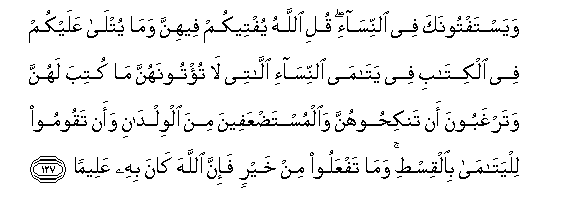

#وَيَسْتَفْتُونَكَ فِي النِّسَاءِ ۖ قُلِ اللَّهُ يُفْتِيكُمْ فِيهِنَّ وَمَا يُتْلَىٰ عَلَيْكُمْ فِي الْكِتَابِ فِي يَتَامَى النِّسَاءِ اللَّاتِي لَا تُؤْتُونَهُنَّ مَا كُتِبَ لَهُنَّ وَتَرْغَبُونَ أَنْ تَنْكِحُوهُنَّ وَالْمُسْتَضْعَفِينَ مِنَ الْوِلْدَانِ وَأَنْ تَقُومُوا لِلْيَتَامَىٰ بِالْقِسْطِ ۚ وَمَا تَفْعَلُوا مِنْ خَيْرٍ فَإِنَّ اللَّهَ كَانَ بِهِ عَلِيمًا 

##Wayastaftoonaka fee alnnisai quli Allahu yufteekum feehinna wama yutla AAalaykum fee alkitabi fee yatama alnnisai allatee la tutoonahunna ma kutiba lahunna watarghaboona an tankihoohunna waalmustadAAafeena mina alwildani waan taqoomoo lilyatama bialqisti wama tafAAaloo min khayrin fainna Allaha kana bihi AAaleeman 

## 翻译(Translation)：

| Translator | 译文(Translation)                                            |
| :--------: | ------------------------------------------------------------ |
|    马坚    | 他们请求你解释关于女子的律例，你说：真主将为你们解释关于她们的律例，此经中常对你们宣读的明文内，（有若干律例），有关于你们既不愿交付其应得的遗产，又不愿娶以为妻的孤女的，有关于被人欺负的儿童的，有教你们公平地照管孤儿的。无论你们所行的是什么善事，真主确是全知的。 |
|  YUSUFALI  | They ask thy instruction concerning the women: Say: Allah doth instruct you about them: And (remember) what hath been rehearsed unto you in the Book, concerning the orphans of women to whom ye give not the portions prescribed, and yet whom ye desire to marry, as also concerning the children who are weak and oppressed: that ye stand firm for justice to orphans. There is not a good deed which ye do, but Allah is well-acquainted therewith. |
| PICKTHALL  | They consult thee concerning women. Say: Allah giveth you decree concerning them, and the Scripture which hath been recited unto you (giveth decree), concerning female orphans and those unto whom ye give not that which is ordained for them though ye desire to marry them, and (concerning) the weak among children, and that ye should deal justly with orphans. Whatever good ye do, lo! Allah is ever Aware of it. |
|   SHAKIR   | And they ask you a decision about women. Say: Allah makes known to you His decision concerning them, and that which is recited to you in the Book concerning female orphans whom you do not give what is appointed for them while you desire to marry them, and concerning the weak among children, and that you should deal towards orphans with equity; and whatever good you do, Allah surely knows it. |

---

## 对位释义(Words Interpretation)：

| No   | العربية | 中文    | English | 曾用词 |
| ---- | ------: | ------- | ------- | ------ |
| 序号 |    阿文 | Chinese | 英文    | Used   |
| 4:127.1  | وَيَسْتَفْتُونَكَ   | 和他们询问你   | And they ask you      |            |
| 4:127.2  | فِي          | 在             | in                    | 见2:10.1   |
| 4:127.3  | النِّسَاءِ      | 妇女们的       | of women              | 见2:235.9  |
| 4:127.4  | قُلِ          | 你说           | Say                   | 见2:219.30 |
| 4:127.5  | اللَّهُ        | 安拉，真主     | Allah                 | 见2:7.2 |
| 4:127.6  | يُفْتِيكُمْ      | 他为你们解释   | he makes known to you |            |
| 4:127.7  | فِيهِنَّ        | 其中           | therein               | 见2:197.6  |
| 4:127.8  | وَمَا         | 和什么         | and that              | 见2:4.6    |
| 4:127.9  | يُتْلَىٰ        | 它被宣读       | it is recited         |            |
| 4:127.10 | عَلَيْكُمْ       | 在你们         | on you                | 见2:40.8   |
| 4:127.11 | فِي          | 在             | in                    | 见2:10.1   |
| 4:127.12 | الْكِتَابِ      | 这部经的       | of the Book           | 见2:85.25  |
| 4:127.13 | فِي          | 在             | in                    | 见2:10.1   |
| 4:127.14 | يَتَامَى       | 众孤儿         | the orphans           |            |
| 4:127.15 | النِّسَاءِ      | 妇女们的       | of women              | 见2:235.9  |
| 4:127.16 | اللَّاتِي      | 那个           | that                  | 见4:23.13  |
| 4:127.17 | لَا          | 不，不是，没有 | no                    | 见2:2.3    |
| 4:127.18 | تُؤْتُونَهُنَّ     | 你们给她们     | you give them         |            |
| 4:127.19 | مَا          | 什么           | what/ that which      | 见2:17.8   |
| 4:127.20 | كُتِبَ         | 被规定         | is prescribed         | 见2:178.5  |
| 4:127.21 | لَهُنَّ         | 为她们         | for them              | 见2:187.13 |
| 4:127.22 | وَتَرْغَبُونَ     | 和你们希望     | and you desire        |            |
| 4:127.23 | أَنْ          | 该             | that                  | 见2:26.5   |
| 4:127.24 | تَنْكِحُوهُنَّ     | 你们与她们结婚 | you marry them        |            |
| 4:127.25 | وَالْمُسْتَضْعَفِينَ | 和弱者         | and of the weak       | 见4:75.8   |
| 4:127.26 | مِنَ          | 从             | from                  | 见2:4.8    |
| 4:127.27 | الْوِلْدَانِ     | 儿童           | the children          |            |
| 4:127.28 | وَأَنْ         | 和那个         | and that              | 见2:169.5  |
| 4:127.29 | تَقُومُوا      | 你们照顾       | you deal              |            |
| 4:127.30 | لِلْيَتَامَىٰ     | 为众孤儿       | to orphans            |            |
| 4:127.31 | بِالْقِسْطِ      | 在公正         | on justice            | 见3:18.12  |
| 4:127.32 | وَمَا         | 和什么         | and that              | 见2:4.6    |
| 4:127.33 | تَفْعَلُوا      | 做             | Do                    | 见2:24.3   |
| 4:127.34 | مِنْ          | 从             | from                  | 见2:4.8    |
| 4:127.35 | خَيْرٍ         | 较好的         | be better             | 见2:54.18  |
| 4:127.36 | فَإِنَّ         | 因此确实       | so surely             | 见2:61.34  |
| 4:127.37 | اللَّهَ        | 安拉，真主     | Allah                 | 见2:9.2 |
| 4:127.38 | كَانَ         | 他是           | It was                | 见2:75.6   |
| 4:127.39 | بِهِ          | 以它           | with it               | 见2:22.13  |
| 4:127.40 | عَلِيمًا       | 全知的         | All-Knowing           | 见4:11.70  |

---
