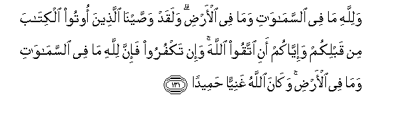

#وَلِلَّهِ مَا فِي السَّمَاوَاتِ وَمَا فِي الْأَرْضِ ۗ وَلَقَدْ وَصَّيْنَا الَّذِينَ أُوتُوا الْكِتَابَ مِنْ قَبْلِكُمْ وَإِيَّاكُمْ أَنِ اتَّقُوا اللَّهَ ۚ وَإِنْ تَكْفُرُوا فَإِنَّ لِلَّهِ مَا فِي السَّمَاوَاتِ وَمَا فِي الْأَرْضِ ۚ وَكَانَ اللَّهُ غَنِيًّا حَمِيدًا 

##Walillahi ma fee alssamawati wama fee alardi walaqad wassayna allatheena ootoo alkitaba min qablikum waiyyakum ani ittaqoo Allaha wain takfuroo fainna lillahi ma fee alssamawati wama fee alardi wakana Allahu ghaniyyan hameedan 

## 翻译(Translation)：

| Translator | 译文(Translation)                                            |
| :--------: | ------------------------------------------------------------ |
|    马坚    | 天地万物，只是真主的。我确已嘱咐在你们之前曾受天经的人，也嘱咐你们说：你们当敬畏真主。如果你们孤恩，那末，你们须知天地万物只是真主的，真主是无求的，是可颂的。 |
|  YUSUFALI  | To Allah belong all things in the heavens and on earth. Verily We have directed the People of the Book before you, and you (O Muslims) to fear Allah. But if ye deny Him, lo! unto Allah belong all things in the heavens and on earth, and Allah is free of all wants, worthy of all praise. |
| PICKTHALL  | Unto Allah belongeth whatsoever is in the heavens and whatsoever is in the earth. And We charged those who received the Scripture before you, and (We charge) you, that ye keep your duty toward Allah. And if ye disbelieve, lo! unto Allah belongeth whatsoever is in the heavens and whatsoever is in the earth, and Allah is ever Absolute, Owner of Praise. |
|   SHAKIR   | And whatever is in the heavens and whatever is in the earth is Allah's and certainly We enjoined those who were given the Book before you and (We enjoin) you too that you should be careful of (your duty to) Allah; and if you disbelieve, then surely whatever is in the heavens and whatever is in the earth is Allah's and Allah is Self-sufficient, Praise-worthy. |

---

## 对位释义(Words Interpretation)：

| No   | العربية | 中文    | English | 曾用词 |
| ---- | ------: | ------- | ------- | ------ |
| 序号 |    阿文 | Chinese | 英文    | Used   |
| 4:131.1  | وَلِلَّهِ     | 和归真主       | and to Allah     | 见2:115.1  |
| 4:131.2  | مَا       | 什么           | what/ that which | 见2:17.8   |
| 4:131.3  | فِي       | 在             | in               | 见2:10.1   |
| 4:131.4  | السَّمَاوَاتِ | 诸天的         | of the heavens   | 见2:33.16  |
| 4:131.5  | وَمَا      | 和什么         | and that         | 见2:4.6    |
| 4:131.6  | فِي       | 在             | in               | 见2:10.1   |
| 4:131.7  | الْأَرْضِ    | 大地           | Earth            | 见2:22.4   |
| 4:131.8  | وَلَقَدْ     | 和确实         | And certainly    | 见2:65.1   |
| 4:131.9  | وَصَّيْنَا    | 我们嘱咐       | We enjoined      |            |
| 4:131.10 | الَّذِينَ    | 谁，那些       | those who        | 见2:6.2    |
| 4:131.11 | أُوتُوا    | 被给           | were given       | 见2:101.14 |
| 4:131.12 | الْكِتَابَ   | 这部经，这本书 | the book         | 见2:2.2    |
| 4:131.13 | مِنْ       | 从             | from             | 见2:4.8    |
| 4:131.14 | قَبْلِكُمْ    | 在你以前       | Before you       | 见2:21.10  |
| 4:131.15 | وَإِيَّاكُمْ   | 和你们         | and you          |            |
| 4:131.16 | أَنِ       | 那个           | that             | 见4:66.5   |
| 4:131.17 | اتَّقُوا    | 敬畏           | fear             | 见2:278.5  |
| 4:131.18 | اللَّهَ     | 安拉，真主     | Allah            | 见1:1.2    |
| 4:131.19 | وَإِنْ      | 和如果         | and if           | 见2:137.9  |
| 4:131.20 | تَكْفُرُوا   | 你们孤恩       | you disbelieve   |            |
| 4:131.21 | فَإِنَّ      | 和确实         | so surely        | 见2:98.9   |
| 4:131.22 | لِلَّهِ      | 为真主         | for Allah        | 见1:2.2    |
| 4:131.23 | مَا       | 什么           | what/ that which | 见2:17.8   |
| 4:131.24 | فِي       | 在             | in               | 见2:10.1   |
| 4:131.25 | السَّمَاوَاتِ | 诸天的         | of the heavens   | 见2:33.16  |
| 4:131.26 | وَمَا      | 和什么         | and that         | 见2:4.6    |
| 4:131.27 | فِي       | 在             | in               | 见2:10.1   |
| 4:131.28 | الْأَرْضِ    | 大地           | Earth            | 见2:22.4   |
| 4:131.29 | وَكَانَ     | 和他是         | and he was       | 见2:34.11  |
| 4:131.30 | اللَّهُ     | 安拉，真主     | Allah            | 见1:1.2    |
| 4:131.31 | غَنِيًّا     | 富足           | rich             | 见4:6.22   |
| 4:131.32 | حَمِيدًا    | 可颂的         | Praise-worthy    |            |

---
