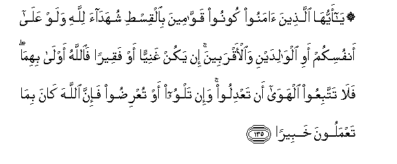

#۞ يَا أَيُّهَا الَّذِينَ آمَنُوا كُونُوا قَوَّامِينَ بِالْقِسْطِ شُهَدَاءَ لِلَّهِ وَلَوْ عَلَىٰ أَنْفُسِكُمْ أَوِ الْوَالِدَيْنِ وَالْأَقْرَبِينَ ۚ إِنْ يَكُنْ غَنِيًّا أَوْ فَقِيرًا فَاللَّهُ أَوْلَىٰ بِهِمَا ۖ فَلَا تَتَّبِعُوا الْهَوَىٰ أَنْ تَعْدِلُوا ۚ وَإِنْ تَلْوُوا أَوْ تُعْرِضُوا فَإِنَّ اللَّهَ كَانَ بِمَا تَعْمَلُونَ خَبِيرًا 

##Ya ayyuha allatheena amanoo koonoo qawwameena bialqisti shuhadaa lillahi walaw AAala anfusikum awi alwalidayni waalaqrabeena in yakun ghaniyyan aw faqeeran faAllahu awla bihima fala tattabiAAoo alhawa an taAAdiloo wain talwoo aw tuAAridoo fainna Allaha kana bima taAAmaloona khabeeran 

## 翻译(Translation)：

| Translator | 译文(Translation)                                            |
| :--------: | ------------------------------------------------------------ |
|    马坚    | 信道的人们啊！你们当维护公道，当为真主而作证，即使不利于你们自身，和父母和至亲。无论被证的人，富足的，还是贫穷的，你们都应当秉公作证；真主是最宜于关切富翁和贫民的。你们不要顺从私欲，以致偏私。 如果你们歪曲事实，或拒绝作证，那末，真主确是彻知你们的行为的。 |
|  YUSUFALI  | O ye who believe! stand out firmly for justice, as witnesses to Allah, even as against yourselves, or your parents, or your kin, and whether it be (against) rich or poor: for Allah can best protect both. Follow not the lusts (of your hearts), lest ye swerve, and if ye distort (justice) or decline to do justice, verily Allah is well- acquainted with all that ye do. |
| PICKTHALL  | O ye who believe! Be ye staunch in justice, witnesses for Allah, even though it be against yourselves or (your) parents or (your) kindred, whether (the case be of) a rich man or a poor man, for Allah is nearer unto both (them ye are). So follow not passion lest ye lapse (from truth) and if ye lapse or fall away, then lo! Allah is ever Informed of what ye do. |
|   SHAKIR   | O you who beljeve! be maintainers of justice, bearers of witness of Allah's sake, though it may be against your own selves or (your) parents or near relatives; if he be rich or poor, Allah is nearer to them both in compassion; therefore do not follow (your) low desires, lest you deviate; and if you swerve or turn aside, then surely Allah is aware of what you do. |

---

## 对位释义(Words Interpretation)：

| No   | العربية | 中文    | English | 曾用词 |
| ---- | ------: | ------- | ------- | ------ |
| 序号 |    阿文 | Chinese | 英文    | Used   |
| 4:135.1  | يَا        | 啊         | Oh                 | 见2:21.1   |
| 4:135.2  | أَيُّهَا      | 语气词     | O                  | 见2:21.2   |
| 4:135.3  | الَّذِينَ     | 谁，那些   | those who          | 见2:6.2    |
| 4:135.4  | آمَنُوا     | 诚信       | believe            | 见2:9.4    |
| 4:135.5  | كُونُوا     | 你们是     | Be you             | 见2:65.10  |
| 4:135.6  | قَوَّامِينَ    | 维护       | maintain           |            |
| 4:135.7  | بِالْقِسْطِ    | 在公正     | on justice         | 见3:18.12  |
| 4:135.8  | شُهَدَاءَ     | 见证       | Witness            | 见2:133.3  |
| 4:135.9  | لِلَّهِ       | 为真主     | for Allah          | 见1:2.2    |
| 4:135.10 | وَلَوْ       | 和如果     | and if             | 见2:20.14  |
| 4:135.11 | عَلَىٰ       | 至         | On                 | 见2:5.2    |
| 4:135.12 | أَنْفُسِكُمْ    | 你们自己   | yourselves         | 见2:235.13 |
| 4:135.13 | أَوِ        | 或         | or                 | 见2:19.1   |
| 4:135.14 | الْوَالِدَيْنِ  | 父母       | parents            | 参2:180.11 |
| 4:135.15 | وَالْأَقْرَبِينَ | 和近亲     | and near relatives | 见2:180.12 |
| 4:135.16 | إِنْ        | 如果       | if                 | 见2:23.18  |
| 4:135.17 | يَكُنْ       | 他是       | it is              | 见2:196.62 |
| 4:135.18 | غَنِيًّا      | 富足       | rich               | 见4:6.22   |
| 4:135.19 | أَوْ        | 或         | or                 | 见2:19.1   |
| 4:135.20 | فَقِيرًا     | 贫穷       | poor               | 见4:6.26   |
| 4:135.21 | فَاللَّهُ     | 因此真主   | then Allah         | 见2:113.23 |
| 4:135.22 | أَوْلَىٰ      | 最相宜     | is nearer          |            |
| 4:135.23 | بِهِمَا      | 在它们     | around them        | 见2:158.17 |
| 4:135.24 | فَلَا       | 因此不     | shall not          | 见2:22.18  |
| 4:135.25 | تَتَّبِعُوا    | 追随       | follow             | 见2:168.11 |
| 4:135.26 | الْهَوَىٰ     | 众私欲     | the lusts          |            |
| 4:135.27 | أَنْ        | 该         | that               | 见2:26.5   |
| 4:135.28 | تَعْدِلُوا    | 你们公正   | you do justice     | 见4:3.19   |
| 4:135.29 | وَإِنْ       | 和如果     | and if             | 见2:137.9  |
| 4:135.30 | تَلْوُوا     | 你们歪曲   | you distort        |            |
| 4:135.31 | أَوْ        | 或         | or                 | 见2:19.1   |
| 4:135.32 | تُعْرِضُوا    | 你们拒绝   | decline            |            |
| 4:135.33 | فَإِنَّ       | 因此确实   | so surely          | 见2:61.34  |
| 4:135.34 | اللَّهَ      | 安拉，真主 | Allah              | 见2:9.2 |
| 4:135.35 | كَانَ       | 他是       | It was             | 见2:75.6   |
| 4:135.36 | بِمَا       | 在什么     | in what            | 见2:4.3    |
| 4:135.37 | تَعْمَلُونَ    | 你们行为   | you do             | 见2:74.37  |
| 4:135.38 | خَبِيرًا     | 彻知的     | Aware              | 见4:35.22  |

---
