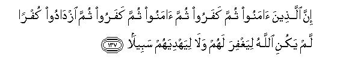

#إِنَّ الَّذِينَ آمَنُوا ثُمَّ كَفَرُوا ثُمَّ آمَنُوا ثُمَّ كَفَرُوا ثُمَّ ازْدَادُوا كُفْرًا لَمْ يَكُنِ اللَّهُ لِيَغْفِرَ لَهُمْ وَلَا لِيَهْدِيَهُمْ سَبِيلً 

##Inna allatheena amanoo thumma kafaroo thumma amanoo thumma kafaroo thumma izdadoo kufran lam yakuni Allahu liyaghfira lahum wala liyahdiyahum sabeelan 

## 翻译(Translation)：

| Translator | 译文(Translation)                                            |
| :--------: | ------------------------------------------------------------ |
|    马坚    | 先信道，后叛道，再信道，再叛道，而叛逆日增的人，真主不会赦宥他们，也不会指引他们任何道路。 |
|  YUSUFALI  | Those who believe, then reject faith, then believe (again) and (again) reject faith, and go on increasing in unbelief,- Allah will not forgive them nor guide them on the Way. |
| PICKTHALL  | Lo! those who believe, then disbelieve and then (again) believe, then disbelieve, and then increase in disbelief, Allah will never pardon them, nor will He guide them unto a way. |
|   SHAKIR   | Surely (as for) those who believe then disbelieve, again believe and again disbelieve, then increase in disbelief, Allah will not forgive them nor guide them in the (right) path. |

---

## 对位释义(Words Interpretation)：

| No   | العربية | 中文    | English | 曾用词 |
| ---- | ------: | ------- | ------- | ------ |
| 序号 |    阿文 | Chinese | 英文    | Used   |
| 4:137.1  | إِنَّ      | 的确         | surely        | 见2:6.1   |
| 4:137.2  | الَّذِينَ   | 谁，那些     | those who     | 见2:6.2   |
| 4:137.3  | آمَنُوا   | 诚信         | believe       | 见2:9.4   |
| 4:137.4  | ثُمَّ      | 然后         | Then          | 见2:28.7  |
| 4:137.5  | كَفَرُوا   | 不信         | disbelieve    | 见2:6.3   |
| 4:137.6  | ثُمَّ      | 然后         | Then          | 见2:28.7  |
| 4:137.7  | آمَنُوا   | 诚信         | believe       | 见2:9.4   |
| 4:137.8  | ثُمَّ      | 然后         | Then          | 见2:28.7  |
| 4:137.9  | كَفَرُوا   | 不信         | disbelieve    | 见2:6.3   |
| 4:137.10 | ثُمَّ      | 然后         | Then          | 见2:28.7  |
| 4:137.11 | ازْدَادُوا | 增加         | increase in   | 见3:90.7  |
| 4:137.12 | كُفْرًا    | 不信         | unbelief      | 见3:90.8  |
| 4:137.13 | لَمْ      | 不，没有     | did not       | 见2:6.8   |
| 4:137.14 | يَكُنِ     | 他是         | he is         | 见4:38.13 |
| 4:137.15 | اللَّهُ    | 安拉，真主   | Allah         | 见1:1.2   |
| 4:137.16 | لِيَغْفِرَ   | 对他赦宥     | forgive       |           |
| 4:137.17 | لَهُمْ     | 对他们       | for them      | 见2:11.3  |
| 4:137.18 | وَلَا     | 也不         | and not       | 见1:7.8   |
| 4:137.19 | لِيَهْدِيَهُمْ | 至他引导他们 | He guide them |           |
| 4:137.20 | سَبِيلً    | 一条出路     | a way         | 见4:15.22 |

---
