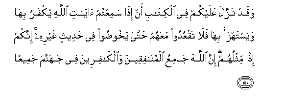

#وَقَدْ نَزَّلَ عَلَيْكُمْ فِي الْكِتَابِ أَنْ إِذَا سَمِعْتُمْ آيَاتِ اللَّهِ يُكْفَرُ بِهَا وَيُسْتَهْزَأُ بِهَا فَلَا تَقْعُدُوا مَعَهُمْ حَتَّىٰ يَخُوضُوا فِي حَدِيثٍ غَيْرِهِ ۚ إِنَّكُمْ إِذًا مِثْلُهُمْ ۗ إِنَّ اللَّهَ جَامِعُ الْمُنَافِقِينَ وَالْكَافِرِينَ فِي جَهَنَّمَ جَمِيعًا 

##Waqad nazzala AAalaykum fee alkitabi an itha samiAAtum ayati Allahi yukfaru biha wayustahzao biha fala taqAAudoo maAAahum hatta yakhoodoo fee hadeethin ghayrihi innakum ithan mithluhum inna Allaha jamiAAu almunafiqeena waalkafireena fee jahannama jameeAAan 

## 翻译(Translation)：

| Translator | 译文(Translation)                                            |
| :--------: | ------------------------------------------------------------ |
|    马坚    | 他确已在这经典中启示你们说：当你们听见真主的迹象被人否认而加以嘲笑的时候，你们必与他们同罪。真主必定把伪信者和不信者全体集合在火狱里。 |
|  YUSUFALI  | Already has He sent you in the Book, that when ye hear the message of Allah held in defiance and ridicule, ye are not to sit with them unless they turn to a different theme: if ye did, ye would be like them. For Allah will collect the hypocrites and those who defy faith - all in Hell:- |
| PICKTHALL  | He hath already revealed unto you in the Scripture that, when ye hear the revelations of Allah rejected and derided, (ye) sit not with them (who disbelieve and mock) until they engage in some other conversation. Lo! in that case (if ye stayed) ye would be like unto them. Lo! Allah will gather hypocrites and disbelievers, all together, into hell; |
|   SHAKIR   | And indeed He has revealed to you in the Book that when you hear Allah's communications disbelieved in and mocked at do not sit with them until they enter into some other discourse; surely then you would be like them; surely Allah will gather together the hypocrites and the unbelievers all in hell. |

---

## 对位释义(Words Interpretation)：

| No   | العربية | 中文    | English | 曾用词 |
| ---- | ------: | ------- | ------- | ------ |
| 序号 |    阿文 | Chinese | 英文    | Used   |
| 4:140.1  | وَقَدْ       | 和当然     | and may             | 见2:75.5   |
| 4:140.2  | نَزَّلَ       | 降示       | sent down           | 见2:176.4  |
| 4:140.3  | عَلَيْكُمْ     | 在你们     | on you              | 见2:40.8   |
| 4:140.4  | فِي        | 在         | in                  | 见2:10.1   |
| 4:140.5  | الْكِتَابِ    | 这部经的   | of the Book         | 见2:85.25  |
| 4:140.6  | أَنْ        | 该         | that                | 见2:26.5   |
| 4:140.7  | إِذَا       | 当时       | when                | 见2:156.2  |
| 4:140.8  | سَمِعْتُمْ     | 你们听见   | you hear            |            |
| 4:140.9  | آيَاتِ      | 迹象       | Signs               | 见2:231.23 |
| 4:140.10 | اللَّهِ      | 真主的     | of Allah            | 见2:23.17  |
| 4:140.11 | يُكْفَرُ      | 它被否认   | rejected            |            |
| 4:140.12 | بِهَا       | 在他们     | in them             | 见2:99.8   |
| 4:140.13 | وَيُسْتَهْزَأُ   | 和它被嘲笑 | and derided         |            |
| 4:140.14 | بِهَا       | 在他们     | in them             | 见2:99.8   |
| 4:140.15 | فَلَا       | 因此不     | shall not           | 见2:22.18  |
| 4:140.16 | تَقْعُدُوا    | 你们坐     | you sit             |            |
| 4:140.17 | مَعَهُمْ      | 伴随他们   | with them           | 见2:89.9   |
| 4:140.18 | حَتَّىٰ       | 直到       | Until               | 见2:55.8   |
| 4:140.19 | يَخُوضُوا    | 他们进行   | they engage         |            |
| 4:140.20 | فِي        | 在         | in                  | 见2:10.1   |
| 4:140.21 | حَدِيثٍ      | 一个谈话   | discourse           |            |
| 4:140.22 | غَيْرِهِ      | 其他的     | some other          |            |
| 4:140.23 | إِنَّكُمْ      | 你们确实   | surely you          | 见2:54.7   |
| 4:140.24 | إِذًا       | 然后       | then                | 见2:145.30 |
| 4:140.25 | مِثْلُهُمْ     | 像他们     | like them           |            |
| 4:140.26 | إِنَّ        | 的确       | surely              | 见2:6.1    |
| 4:140.27 | اللَّهَ      | 安拉，真主 | Allah               | 见1:1.2    |
| 4:140.28 | جَامِعُ      | 集合       | gather              | 见3:9.3    |
| 4:140.29 | الْمُنَافِقِينَ | 众伪信者   | the hypocrites      | 见4:61.12  |
| 4:140.30 | وَالْكَافِرِينَ | 和不信道者 | and the unbelievers | 参2:34.13  |
| 4:140.31 | فِي        | 在         | in                  | 见2:10.1   |
| 4:140.32 | جَهَنَّمَ      | 火狱       | Hell                | 见3:12.7   |
| 4:140.33 | جَمِيعًا     | 所有       | All                 | 见2:29.8   |

---
