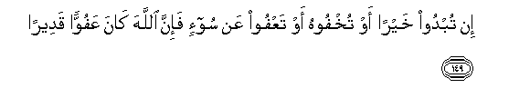

#إِنْ تُبْدُوا خَيْرًا أَوْ تُخْفُوهُ أَوْ تَعْفُوا عَنْ سُوءٍ فَإِنَّ اللَّهَ كَانَ عَفُوًّا قَدِيرًا 

##In tubdoo khayran aw tukhfoohu aw taAAfoo AAan sooin fainna Allaha kana AAafuwwan qadeeran 

## 翻译(Translation)：

| Translator | 译文(Translation)                                            |
| :--------: | ------------------------------------------------------------ |
|    马坚    | 如果你们公开行善，或秘密行善，或恕饶罪行，（这对于你们是更相宜的），因为真主确是至恕的，确是全能的。 |
|  YUSUFALI  | Whether ye publish a good deed or conceal it or cover evil with pardon, verily Allah doth blot out (sins) and hath power (in the judgment of values). |
| PICKTHALL  | If ye do good openly or keep it secret, or forgive evil, lo! Allah is ever Forgiving, Powerful. |
|   SHAKIR   | If you do good openly or do it in secret or pardon an evil then surely Allah is Pardoning, Powerful. |

---

## 对位释义(Words Interpretation)：

| No   | العربية | 中文    | English | 曾用词 |
| ---- | ------: | ------- | ------- | ------ |
| 序号 |    阿文 | Chinese | 英文    | Used   |
| 4:149.1  | إِنْ    | 如果       | if             | 见2:23.18  |
| 4:149.2  | تُبْدُوا | 你们公开   | you publish    | 见2:271.2  |
| 4:149.3  | خَيْرًا  | 好的       | Good           | 见2:158.20 |
| 4:149.4  | أَوْ    | 或         | or             | 见2:19.1   |
| 4:149.5  | تُخْفُوهُ | 隐藏它     | hide it        | 见2:284.14 |
| 4:149.6  | أَوْ    | 或         | or             | 见2:19.1   |
| 4:149.7  | تَعْفُوا | 你们放弃   | you relinquish | 见2:237.24 |
| 4:149.8  | عَنْ    | 从         | on             | 见2:48.6   |
| 4:149.9  | سُوءٍ   | 恶         | evil           | 见3:30.13  |
| 4:149.10 | فَإِنَّ   | 因此确实   | so surely      | 见2:61.34  |
| 4:149.11 | اللَّهَ  | 安拉，真主 | Allah          | 见2:9.2 |
| 4:149.12 | كَانَ   | 他是       | It was         | 见2:75.6   |
| 4:149.13 | عَفُوًّا  | 至恕的     | Pardoning      | 见4:43.48  |
| 4:149.14 | قَدِيرًا | 全能       | has the power  | 见4:133.12 |

---
