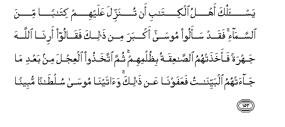

#يَسْأَلُكَ أَهْلُ الْكِتَابِ أَنْ تُنَزِّلَ عَلَيْهِمْ كِتَابًا مِنَ السَّمَاءِ ۚ فَقَدْ سَأَلُوا مُوسَىٰ أَكْبَرَ مِنْ ذَٰلِكَ فَقَالُوا أَرِنَا اللَّهَ جَهْرَةً فَأَخَذَتْهُمُ الصَّاعِقَةُ بِظُلْمِهِمْ ۚ ثُمَّ اتَّخَذُوا الْعِجْلَ مِنْ بَعْدِ مَا جَاءَتْهُمُ الْبَيِّنَاتُ فَعَفَوْنَا عَنْ ذَٰلِكَ ۚ وَآتَيْنَا مُوسَىٰ سُلْطَانًا مُبِينًا 

##Yasaluka ahlu alkitabi an tunazzila AAalayhim kitaban mina alssamai faqad saaloo moosa akbara min thalika faqaloo arina Allaha jahratan faakhathathumu alssaAAiqatu bithulmihim thumma ittakhathoo alAAijla min baAAdi ma jaathumu albayyinatu faAAafawna AAan thalika waatayna moosa sultanan mubeenan 

## 翻译(Translation)：

| Translator | 译文(Translation)                                            |
| :--------: | ------------------------------------------------------------ |
|    马坚    | 信奉天经的人，请求你从天上降示他们一部经典。 他们确已向穆萨请求过比这更重大的事，他们说：你使我们亲眼看见真主吧。 急雷为他们的不义而袭击他们。在许多明证降临他们之后，他们又认犊为神，但我已恕饶这件事。 这曾赏赐穆萨一个明显的证据。 |
|  YUSUFALI  | The people of the Book ask thee to cause a book to descend to them from heaven: Indeed they asked Moses for an even greater (miracle), for they said: "Show us Allah in public!," But they were seized for their presumption, by thunder and lightning. Yet they worshipped the calf even after clear signs had come to them; even so We forgave them; and gave Moses manifest proofs of authority. |
| PICKTHALL  | The people of the Scripture ask of thee that thou shouldst cause an (actual) Book to descend upon them from heaven. They asked a greater thing of Moses aforetime, for they said: Show us Allah plainly. The storm of lightning seized them for their wickedness. Then (even) after that) they chose the calf (for worship) after clear proofs (of Allah's Sovereignty) had come unto them. And We forgave them that! And We bestowed on Moses evident authority. |
|   SHAKIR   | The followers of the Book ask you to bring down to them a book from heaven; so indeed they demanded of Musa a greater thing than that, for they said: Show us Allah manifestly; so the lightning overtook them on account of their injustice. Then they took the calf (for a god), after clear signs had come to them, but We pardoned this; and We gave to Musa clear authority. |

---

## 对位释义(Words Interpretation)：

| No   | العربية | 中文    | English | 曾用词 |
| ---- | ------: | ------- | ------- | ------ |
| 序号 |    阿文 | Chinese | 英文    | Used   |
| 4:153.1  | يَسْأَلُكَ   | 他请求你       | he ask you          |            |
| 4:153.2  | أَهْلُ     | 人们           | the People          | 见3:110.15 |
| 4:153.3  | الْكِتَابِ  | 这部经的       | of the Book         | 见2:85.25  |
| 4:153.4  | أَنْ      | 该             | that                | 见2:26.5   |
| 4:153.5  | تُنَزِّلَ    | 你降示         | you bring down      |            |
| 4:153.6  | عَلَيْهِمْ   | 在他们         | on they             | 见1:7.4    |
| 4:153.7  | كِتَابًا   | 一部经典       | a book              | 异3:145.9  |
| 4:153.8  | مِنَ      | 从             | from                | 见2:4.8    |
| 4:153.9  | السَّمَاءِ  | 天空           | The sky, heaven     | 见2:19.4   |
| 4:153.10 | فَقَدْ     | 然后当然       | then may            | 见2:108.15 |
| 4:153.11 | سَأَلُوا   | 他们请求       | they asked          |            |
| 4:153.12 | مُوسَىٰ    | 穆萨           | Moses               | 见2:51.3   |
| 4:153.13 | أَكْبَرَ    | 更大的         | a greater           |            |
| 4:153.14 | مِنْ      | 比             | than                | 见2:219.25 |
| 4:153.15 | ذَٰلِكَ     | 这个           | this                | 见2:2.1    |
| 4:153.16 | فَقَالُوا  | 然后他们说     | then they said      | 参2:11.8   |
| 4:153.17 | أَرِنَا    | 你使我们看见   | Show us             |            |
| 4:153.18 | اللَّهَ    | 安拉，真主     | Allah               | 见1:1.2    |
| 4:153.19 | جَهْرَةً    | 清楚地         | Manifestly          | 见2:55.11  |
| 4:153.20 | فَأَخَذَتْهُمُ | 因此它袭击他们 | so it overtook them |            |
| 4:153.21 | الصَّاعِقَةُ | 疾雷           | Thunderbolt         | 见2:55.13  |
| 4:153.22 | بِظُلْمِهِمْ  | 在他们的不义   | for their injustice |            |
| 4:153.23 | ثُمَّ      | 然后           | Then                | 见2:28.7   |
| 4:153.24 | اتَّخَذُوا  | 他们采取       | they took           |            |
| 4:153.25 | الْعِجْلَ   | 牛犊           | the calf            | 见2:51.8   |
| 4:153.26 | مِنْ      | 从             | from                | 见2:4.8    |
| 4:153.27 | بَعْدِ     | 之后           | after               | 见2:27.6   |
| 4:153.28 | مَا      | 什么           | what/ that which    | 见2:17.8   |
| 4:153.29 | جَاءَتْهُمُ  | 来至他们       | come to them        | 见2:213.29 |
| 4:153.30 | الْبَيِّنَاتُ | 明证           | the clear Signs     | 见2:209.7  |
| 4:153.31 | فَعَفَوْنَا  | 然后我们恕饶   | then We pardon      | 参2:52.2   |
| 4:153.32 | عَنْ      | 从             | on                  | 见2:48.6   |
| 4:153.33 | ذَٰلِكَ     | 这个           | this                | 见2:2.1    |
| 4:153.34 | وَآتَيْنَا  | 和我们给       | and we gave         | 见2:87.9   |
| 4:153.35 | مُوسَىٰ    | 穆萨           | Moses               | 见2:51.3   |
| 4:153.36 | سُلْطَانًا  | 证据           | authority           | 见3:151.14 |
| 4:153.37 | مُبِينًا   | 明显的         | manifest            | 见4:20.17  |

---
