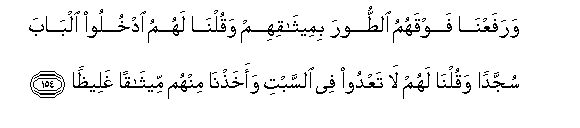

#وَرَفَعْنَا فَوْقَهُمُ الطُّورَ بِمِيثَاقِهِمْ وَقُلْنَا لَهُمُ ادْخُلُوا الْبَابَ سُجَّدًا وَقُلْنَا لَهُمْ لَا تَعْدُوا فِي السَّبْتِ وَأَخَذْنَا مِنْهُمْ مِيثَاقًا غَلِيظًا 

##WarafaAAna fawqahumu alttoora bimeethaqihim waqulna lahumu odkhuloo albaba sujjadan waqulna lahum la taAAdoo fee alssabti waakhathna minhum meethaqan ghaleethan 

## 翻译(Translation)：

| Translator | 译文(Translation)                                            |
| :--------: | ------------------------------------------------------------ |
|    马坚    | 为与他们缔约，我曾把山高耸在他们的上面，我曾对他们说：你们应当鞠躬而入城门。我又对他们说：你们在安息日不要超过法度。 我曾与他们缔结一个严重的盟约。 |
|  YUSUFALI  | And for their covenant We raised over them the Mount (Sinai); and (on another occasion) we said: "Enter the gate with humility"; and (once again) we commanded them: "Transgress not in the matter of the Sabbath." And We took from them a solemn covenant. |
| PICKTHALL  | And We caused the Mount to tower above them at (the taking of) their covenant: and We bade them: Enter the gate, prostrate! and We bode them: Transgress not the Sabbath! and We took from them a firm covenant. |
|   SHAKIR   | And We lifted the mountain (Sainai) over them at (the li taking of the covenant) and We said to them: Enter the door making obeisance; and We said to them: Do not exceed the limits of the Sabbath, and We made with them a firm covenant. |

---

## 对位释义(Words Interpretation)：

| No   | العربية | 中文    | English | 曾用词 |
| ---- | ------: | ------- | ------- | ------ |
| 序号 |    阿文 | Chinese | 英文    | Used   |
| 4:154.1  | وَرَفَعْنَا   | 和我们树立       | and we raised         | 见2:63.4  |
| 4:154.2  | فَوْقَهُمُ    | 他们的上面       | above them            |           |
| 4:154.3  | الطُّورَ    | 山               | the mountain          | 见2:63.6  |
| 4:154.4  | بِمِيثَاقِهِمْ | 为他们的盟约     | at their covenant     |           |
| 4:154.5  | وَقُلْنَا    | 和我们说         | and we said           | 见2:35.1  |
| 4:154.6  | لَهُمُ      | 对他们           | for them              | 见2:11.3  |
| 4:154.7  | ادْخُلُوا   | 进入             | Enter                 | 见2:58.3  |
| 4:154.8  | الْبَابَ    | 城门             | the gate              | 见2:58.12 |
| 4:154.9  | سُجَّدًا     | 鞠躬             | prostrate             | 见2:58.13 |
| 4:154.10 | وَقُلْنَا    | 和我们说         | and we said           | 见2:35.1  |
| 4:154.11 | لَهُمْ      | 对他们           | for them              | 见2:11.3  |
| 4:154.12 | لَا       | 不，不是，没有   | no                    | 见2:2.3   |
| 4:154.13 | تَعْدُوا    | 你们超越法度     | you exceed the limits |           |
| 4:154.14 | فِي       | 在               | in                    | 见2:10.1  |
| 4:154.15 | السَّبْتِ    | 星期六（安息日） | the Sabbath           | 见2:65.7  |
| 4:154.16 | وَأَخَذْنَا   | 和我们缔结       | and we took           | 参2:63.2  |
| 4:154.17 | مِنْهُمْ     | 从他们           | from them             | 见2:75.8  |
| 4:154.18 | مِيثَاقًا   | 一个盟约         | a covenant            | 见4:21.10 |
| 4:154.19 | غَلِيظًا    | 坚实的           | firm                  | 见4:21.11 |

---
