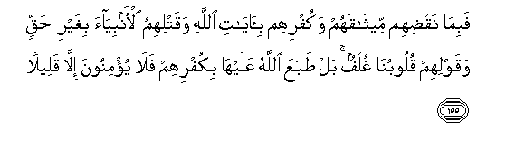

#فَبِمَا نَقْضِهِمْ مِيثَاقَهُمْ وَكُفْرِهِمْ بِآيَاتِ اللَّهِ وَقَتْلِهِمُ الْأَنْبِيَاءَ بِغَيْرِ حَقٍّ وَقَوْلِهِمْ قُلُوبُنَا غُلْفٌ ۚ بَلْ طَبَعَ اللَّهُ عَلَيْهَا بِكُفْرِهِمْ فَلَا يُؤْمِنُونَ إِلَّا قَلِيلًا  

##Fabima naqdihim meethaqahum wakufrihim biayati Allahi waqatlihimu alanbiyaa bighayri haqqin waqawlihim quloobuna ghulfun bal tabaAAa Allahu AAalayha bikufrihim fala yuminoona illa qaleelan  

## 翻译(Translation)：

| Translator | 译文(Translation)                                            |
| :--------: | ------------------------------------------------------------ |
|    马坚    | （我弃绝他们），因为他们破坏盟约，不信真主的迹象，枉杀众先知， 并且说：我们的心是受蒙蔽的。不然，真主为他们不信道而封闭了他们的心，故他们除少数人外，都不信道。 |
|  YUSUFALI  | (They have incurred divine displeasure): In that they broke their covenant; that they rejected the Signs of Allah; that they slew the Messengers in defiance of right; that they said, "Our hearts are the Wrappings (which preserve Allah's Word; We need no more)";- Nay, Allah hath set the seal on their hearts for their blasphemy, and little is it they believe;- |
| PICKTHALL  | Then because of their breaking of their covenant, and their disbelieving in the revelations of Allah, and their slaying of the prophets wrongfully, and their saying: Our hearts are hardened - Nay, but Allah set a seal upon them for their disbelief, so that they believe not save a few - |
|   SHAKIR   | Therefore, for their breaking their covenant and their disbelief in the communications of Allah and their killing the prophets wrongfully and their saying: Our hearts are covered; nay! Allah set a seal upon them owing to their unbelief, so they shall not believe except a few. |

---

## 对位释义(Words Interpretation)：

| No   | العربية | 中文    | English | 曾用词 |
| ---- | ------: | ------- | ------- | ------ |
| 序号 |    阿文 | Chinese | 英文    | Used   |
| 4:155.1  | فَبِمَا     | 然后因为       | Then because of     | 见3:159.1  |
| 4:155.2  | نَقْضِهِمْ    | 他们的破坏     | their breaking      |            |
| 4:155.3  | مِيثَاقَهُمْ  | 他们的盟约     | their covenant      |            |
| 4:155.4  | وَكُفْرِهِمْ   | 和他们的不信   | and their disbelief |            |
| 4:155.5  | بِآيَاتِ    | 在众迹象       | in the Signs of     | 见2:61.50  |
| 4:155.6  | اللَّهِ     | 真主的         | of Allah            | 见2:23.17  |
| 4:155.7  | وَقَتْلِهِمُ   | 和他们的杀害   | and their killing   | 参3:181.15 |
| 4:155.8  | الْأَنْبِيَاءَ | 众先知         | the prophets        | 见3:112.28 |
| 4:155.9  | بِغَيْرِ     | 在没有        | without             | 见2:61.54  |
| 4:155.10 | حَقٍّ       | 正确的，真理   | Right, truth        | 见2:121.5  |
| 4:155.11 | وَقَوْلِهِمْ   | 和他们说       | and they say        | 参2:113.22 |
| 4:155.12 | قُلُوبُنَا   | 我们的心       | Our hearts          | 见2:88.2   |
| 4:155.13 | غُلْفٌ      | 被蒙蔽         | are coverd          | 见2:88.3   |
| 4:155.14 | بَلْ       | 不然           | Nay, but            | 见2:88.4   |
| 4:155.15 | طَبَعَ      | 他封闭         | He set a seal       |            |
| 4:155.16 | اللَّهُ     | 安拉，真主     | Allah               | 见2:7.2 |
| 4:155.17 | عَلَيْهَا    | 在它           | on it               | 见2:142.11 |
| 4:155.18 | بِكُفْرِهِمْ   | 因为他们的不信 | for their unbelief  | 见2:88.7   |
| 4:155.19 | فَلَا      | 因此不         | shall not           | 见2:22.18  |
| 4:155.20 | يُؤْمِنُونَ   | 他们确信       | they believe        | 见2:3.2    |
| 4:155.21 | إِلَّا      | 除了           | Except              | 见2:9.7    |
| 4:155.22 | قَلِيلًا    | 微小的         | A little            | 见2:41.16  |

---
