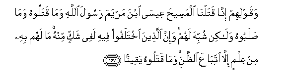

#وَقَوْلِهِمْ إِنَّا قَتَلْنَا الْمَسِيحَ عِيسَى ابْنَ مَرْيَمَ رَسُولَ اللَّهِ وَمَا قَتَلُوهُ وَمَا صَلَبُوهُ وَلَٰكِنْ شُبِّهَ لَهُمْ ۚ وَإِنَّ الَّذِينَ اخْتَلَفُوا فِيهِ لَفِي شَكٍّ مِنْهُ ۚ مَا لَهُمْ بِهِ مِنْ عِلْمٍ إِلَّا اتِّبَاعَ الظَّنِّ ۚ وَمَا قَتَلُوهُ يَقِينًا 

##Waqawlihim inna qatalna almaseeha AAeesa ibna maryama rasoola Allahi wama qataloohu wama salaboohu walakin shubbiha lahum wainna allatheena ikhtalafoo feehi lafee shakkin minhu ma lahum bihi min AAilmin illa ittibaAAa alththanni wama qataloohu yaqeenan 

## 翻译(Translation)：

| Translator | 译文(Translation)                                            |
| :--------: | ------------------------------------------------------------ |
|    马坚    | 又因为他们说：我们确已杀死麦尔彦之子麦西哈. 尔撒，真主的使者。他们没有杀死他，也没有把他钉死在十字架上，但他们不明白这件事的真相。为尔撒而争论的人，对于他的被杀害，确是在迷惑之中。他们对于这件事， 毫无认识，不过根据猜想罢了。他们没能确实地杀死他。 |
|  YUSUFALI  | That they said (in boast), "We killed Christ Jesus the son of Mary, the Messenger of Allah.";- But they killed him not, nor crucified him, but so it was made to appear to them, and those who differ therein are full of doubts, with no (certain) knowledge, but only conjecture to follow, for of a surety they killed him not:- |
| PICKTHALL  | And because of their saying: We slew the Messiah, Jesus son of Mary, Allah's messenger - they slew him not nor crucified him, but it appeared so unto them; and lo! those who disagree concerning it are in doubt thereof; they have no knowledge thereof save pursuit of a conjecture; they slew him not for certain. |
|   SHAKIR   | And their saying: Surely we have killed the Messiah, Isa son of Marium, the apostle of Allah; and they did not kill him nor did they crucify him, but it appeared to them so (like Isa) and most surely those who differ therein are only in a doubt about it; they have no knowledge respecting it, but only follow a conjecture, and they killed him not for sure. |

---

## 对位释义(Words Interpretation)：

| No   | العربية | 中文    | English | 曾用词 |
| ---- | ------: | ------- | ------- | ------ |
| 序号 |    阿文 | Chinese | 英文    | Used   |
| 4:157.1  | وَقَوْلِهِمْ  | 和他们说             | and they say       | 见4:155.11 |
| 4:157.2  | إِنَّا     | 确实我们             | surely we          | 见2:14.12  |
| 4:157.3  | قَتَلْنَا   | 我们杀死             | We killed          |            |
| 4:157.4  | الْمَسِيحَ  | 麦西哈               | the Messiah        |            |
| 4:157.5  | عِيسَى    | 尔撒                 | Isa                | 见2:87.10  |
| 4:157.6  | ابْنَ     | 儿子                 | Son                | 见2:87.11  |
| 4:157.7  | مَرْيَمَ    | 麦尔彦               | Marium             | 见2:87.12  |
| 4:157.8  | رَسُولَ    | 使者                 | messenger          |            |
| 4:157.9  | اللَّهِ    | 真主的               | of Allah           | 见2:23.17  |
| 4:157.10 | وَمَا     | 和不                 | And not            | 见2:9.9    |
| 4:157.11 | قَتَلُوهُ   | 他们杀死他           | they killed him    |            |
| 4:157.12 | وَمَا     | 和不                 | And not            | 见2:9.9    |
| 4:157.13 | صَلَبُوهُ   | 他们把他钉在十字架上 | they crucified him |            |
| 4:157.14 | وَلَٰكِنْ    | 并且但是             | and but            | 见2:12.5   |
| 4:157.15 | شُبِّهَ     | 它被模糊             | it appeared        |            |
| 4:157.16 | لَهُمْ     | 对他们               | for them           | 见2:11.3   |
| 4:157.17 | وَإِنَّ     | 和确实               | and is             | 见2:143.28 |
| 4:157.18 | الَّذِينَ   | 谁，那些             | those who          | 见2:6.2    |
| 4:157.19 | اخْتَلَفُوا | 争论                 | differed           | 见2:176.9  |
| 4:157.20 | فِيهِ     | 它，其中             | in it              | 见2:2.5    |
| 4:157.21 | لَفِي     | 必定在               | are in             | 见2:176.12 |
| 4:157.22 | شَكٍّ      | 怀疑                 | doubt              |            |
| 4:157.23 | مِنْهُ     | 从它                 | from it            | 见2:60.10  |
| 4:157.24 | مَا      | 不                   | not                | 见2:120.24 |
| 4:157.25 | لَهُمْ     | 对他们               | for them           | 见2:11.3   |
| 4:157.26 | بِهِ      | 以它                 | with it            | 见2:22.13  |
| 4:157.27 | مِنْ      | 从                   | from               | 见2:4.8    |
| 4:157.28 | عِلْمٍ     | 知识                 | knowledge          |            |
| 4:157.29 | إِلَّا     | 除了                 | Except             | 见2:9.7    |
| 4:157.30 | اتِّبَاعَ   | 追随                 | follow             |            |
| 4:157.31 | الظَّنِّ    | 猜想                 | a conjecture       |            |
| 4:157.32 | وَمَا     | 和不                 | And not            | 见2:9.9    |
| 4:157.33 | قَتَلُوهُ   | 他们杀死他           | they killed him    | 见4:157.11 |
| 4:157.34 | يَقِينًا   | 确实地               | for sure           |            |

---
