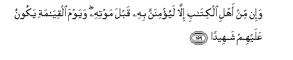

#وَإِنْ مِنْ أَهْلِ الْكِتَابِ إِلَّا لَيُؤْمِنَنَّ بِهِ قَبْلَ مَوْتِهِ ۖ وَيَوْمَ الْقِيَامَةِ يَكُونُ عَلَيْهِمْ شَهِيدًا 

##Wain min ahli alkitabi illa layuminanna bihi qabla mawtihi wayawma alqiyamati yakoonu AAalayhim shaheedan 

## 翻译(Translation)：

| Translator | 译文(Translation)                                            |
| :--------: | ------------------------------------------------------------ |
|    马坚    | 信奉天经的人，在他未死之前，没有一个信仰他的，在复活日他要作证他们。 |
|  YUSUFALI  | And there is none of the People of the Book but must believe in him before his death; and on the Day of Judgment he will be a witness against them;- |
| PICKTHALL  | There is not one of the People of the Scripture but will believe in him before his death, and on the Day of Resurrection he will be a witness against them - |
|   SHAKIR   | And there is not one of the followers of the Book but most certainly believes in this before his death, and on the day of resurrection he (Isa) shall be a witness against them. |

---

## 对位释义(Words Interpretation)：

| No   | العربية | 中文    | English | 曾用词 |
| ---- | ------: | ------- | ------- | ------ |
| 序号 |    阿文 | Chinese | 英文    | Used   |
| 4:159.1  | وَإِنْ     | 和不       | and no          | 见2:78.8 |
| 4:159.2  | مِنْ      | 从         | from            | 见2:4.8    |
| 4:159.3  | أَهْلِ     | 人们       | the people      | 见2:105.6  |
| 4:159.4  | الْكِتَابِ  | 这部经的   | of the Book     | 见2:85.25  |
| 4:159.5  | إِلَّا     | 除了       | Except          | 见2:9.7    |
| 4:159.6  | لَيُؤْمِنَنَّ  | 他必定诚信 | he must believe |            |
| 4:159.7  | بِهِ      | 以它       | with it         | 见2:22.13  |
| 4:159.8  | قَبْلَ     | 之前       | before          |            |
| 4:159.9  | مَوْتِهِ    | 他的死亡   | his death       |            |
| 4:159.10 | وَيَوْمَ    | 和日子     | and day         | 见2:85.39  |
| 4:159.11 | الْقِيَامَةِ | 复活的     | Resurrection    | 见2:85.40  |
| 4:159.12 | يَكُونُ    | 他是       | he is           | 见2:247.13 |
| 4:159.13 | عَلَيْهِمْ   | 在他们     | on they         | 见1:7.4    |
| 4:159.14 | شَهِيدًا   | 作证       | Witness         | 见2:143.12 |

---
