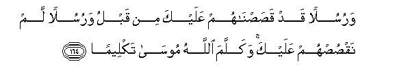

#وَرُسُلًا قَدْ قَصَصْنَاهُمْ عَلَيْكَ مِنْ قَبْلُ وَرُسُلًا لَمْ نَقْصُصْهُمْ عَلَيْكَ ۚ وَكَلَّمَ اللَّهُ مُوسَىٰ تَكْلِيمًا 

##Warusulan qad qasasnahum AAalayka min qablu warusulan lam naqsushum AAalayka wakallama Allahu moosa takleeman 

## 翻译(Translation)：

| Translator | 译文(Translation)                                            |
| :--------: | ------------------------------------------------------------ |
|    马坚    | 我确已派遣许多使者，他们中有我在以前已告诉你的， 有我未告诉你的。真主曾与穆萨对话。 |
|  YUSUFALI  | Of some messengers We have already told thee the story; of others We have not;- and to Moses Allah spoke direct;- |
| PICKTHALL  | And messengers We have mentioned unto thee before and messengers We have not mentioned unto thee; and Allah spake directly unto Moses; |
|   SHAKIR   | And (We sent) apostles We have mentioned to you before and apostles we have not |

---

## 对位释义(Words Interpretation)：

| No   | العربية | 中文    | English | 曾用词 |
| ---- | ------: | ------- | ------- | ------ |
| 序号 |    阿文 | Chinese | 英文    | Used   |
| 4:164.1  | وَرُسُلًا   | 和众使者     | and messengers            |           |
| 4:164.2  | قَدْ      | 当然         | may                       | 见2:60.14 |
| 4:164.3  | قَصَصْنَاهُمْ | 我们告诉他们 | We have already told them |           |
| 4:164.4  | عَلَيْكَ    | 在你         | on you                    | 见2:252.5 |
| 4:164.5  | مِنْ      | 从           | from                      | 见2:4.8   |
| 4:164.6  | قَبْلُ     | 以前         | Before                    | 见2:25.24 |
| 4:164.7  | وَرُسُلًا   | 和众使者     | and messengers            | 见4:164.1 |
| 4:164.8  | لَمْ      | 不，没有     | did not                   | 见2:6.8   |
| 4:164.9  | نَقْصُصْهُمْ  | 我们告诉他们 | We tell them              |           |
| 4:164.10 | عَلَيْكَ    | 在你         | on you                    | 见2:252.5 |
| 4:164.11 | وَكَلَّمَ    | 和说话       | and spoke                 | 参2:253.9 |
| 4:164.12 | اللَّهُ    | 安拉，真主   | Allah                     | 见2:7.2 |
| 4:164.13 | مُوسَىٰ    | 穆萨         | Moses                     | 见2:51.3  |
| 4:164.14 | تَكْلِيمًا  | 话语         | words                     |           |

---
