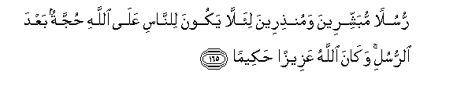

#رُسُلًا مُبَشِّرِينَ وَمُنْذِرِينَ لِئَلَّا يَكُونَ لِلنَّاسِ عَلَى اللَّهِ حُجَّةٌ بَعْدَ الرُّسُلِ ۚ وَكَانَ اللَّهُ عَزِيزًا حَكِيمًا 

##Rusulan mubashshireena wamunthireena lialla yakoona lilnnasi AAala Allahi hujjatun baAAda alrrusuli wakana Allahu AAazeezan hakeeman  

## 翻译(Translation)：

| Translator | 译文(Translation)                                            |
| :--------: | ------------------------------------------------------------ |
|    马坚    | 我曾派遣许多使者报喜信，传警告，以免派遣使者之后，世人对真主有任何托辞。真主是万能的，至睿的。 |
|  YUSUFALI  | Messengers who gave good news as well as warning, that mankind, after (the coming) of the messengers, should have no plea against Allah. For Allah is Exalted in Power, Wise. |
| PICKTHALL  | Messengers of good cheer and of warning, in order that mankind might have no argument against Allah after the messengers. Allah was ever Mighty, Wise. |
|   SHAKIR   | (We sent) apostles as the givers of good news and as warners, so that people should not have a plea against Allah after the (coming of) apostles; and Allah is Mighty, Wise. |

---

## 对位释义(Words Interpretation)：

| No   | العربية | 中文    | English | 曾用词 |
| ---- | ------: | ------- | ------- | ------ |
| 序号 |    阿文 | Chinese | 英文    | Used   |
| 4:165.1  | رُسُلًا    | 众使者       | messengers              | 参4:164.1  |
| 4:165.2  | مُبَشِّرِينَ  | 作为报喜者   | as bearers of good news | 见2:213.8  |
| 4:165.3  | وَمُنْذِرِينَ | 和作为警告者 | and as warners          | 见2:213.9  |
| 4:165.4  | لِئَلَّا    | 以免         | lest                    | 见2:150.15 |
| 4:165.5  | يَكُونَ    | 是           | is being                | 见2:150.16 |
| 4:165.6  | لِلنَّاسِ   | 对世人       | For people              | 见2:83.17  |
| 4:165.7  | عَلَى     | 至           | On                      | 见2:5.2    |
| 4:165.8  | اللَّهِ    | 真主的       | of Allah                | 见2:23.17  |
| 4:165.9  | حُجَّةٌ     | 借口，论据   | argument                | 见2:150.19 |
| 4:165.10 | بَعْدَ     | 之后         | after                   | 见2:27.6   |
| 4:165.11 | الرُّسُلِ   | 众使者的     | of the messengers       |            |
| 4:165.12 | وَكَانَ    | 和他是       | and he was              | 见2:34.11  |
| 4:165.13 | اللَّهُ    | 安拉，真主   | Allah                   | 见2:7.2 |
| 4:165.14 | عَزِيزًا   | 万能的       | Mighty                  | 见4:56.19  |
| 4:165.15 | حَكِيمًا   | 至睿的       | All-wise                | 见4:11.71  |

---
