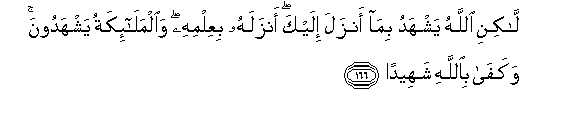

#لَٰكِنِ اللَّهُ يَشْهَدُ بِمَا أَنْزَلَ إِلَيْكَ ۖ أَنْزَلَهُ بِعِلْمِهِ ۖ وَالْمَلَائِكَةُ يَشْهَدُونَ ۚ وَكَفَىٰ بِاللَّهِ شَهِيدًا 

##Lakini Allahu yashhadu bima anzala ilayka anzalahu biAAilmihi waalmalaikatu yashhadoona wakafa biAllahi shaheedan 

## 翻译(Translation)：

| Translator | 译文(Translation)                                            |
| :--------: | ------------------------------------------------------------ |
|    马坚    | 但真主作证他所降示你的经典是真实的——他降示此经时， 自知其内容--众天神也同样作证。真主足为见证。 |
|  YUSUFALI  | But Allah beareth witness that what He hath sent unto thee He hath sent from His (own) knowledge, and the angels bear witness: But enough is Allah for a witness. |
| PICKTHALL  | But Allah (Himself) testifieth concerning that which He hath revealeth unto thee; in His knowledge hath He revealed it; and the angels also testify. And Allah is sufficient Witness. |
|   SHAKIR   | But Allah bears witness by what He has revealed to you that He has revealed it with His knowledge, and the angels bear witness (also); and Allah is sufficient as a witness. |

---

## 对位释义(Words Interpretation)：

| No   | العربية | 中文    | English | 曾用词 |
| ---- | ------: | ------- | ------- | ------ |
| 序号 |    阿文 | Chinese | 英文    | Used   |
| 4:166.1  | لَٰكِنِ       | 但是                   | but                | 见3:198.1  |
| 4:166.2  | اللَّهُ      | 安拉，真主             | Allah              | 见2:7.2 |
| 4:166.3  | يَشْهَدُ      | 他作证                 | he bears witness   | 参2:143.12 |
| 4:166.4  | بِمَا       | 在什么                 | in what            | 见2:4.3    |
| 4:166.5  | أَنْزَلَ      | 下降，颁降，降示，揭秘 | get down           | 见2:4.4    |
| 4:166.6  | إِلَيْكَ      | 至你                   | to you             | 见2:4.5    |
| 4:166.7  | أَنْزَلَهُ     | 他降示它               | He has revealed it | 参2:4.4    |
| 4:166.8  | بِعِلْمِهِ     | 在他的知识             | with His knowledge |            |
| 4:166.9  | وَالْمَلَائِكَةُ | 和众天使               | and the angels     | 见2:210.11 |
| 4:166.10 | يَشْهَدُونَ    | 他们作证               | they bear witness  |            |
| 4:166.11 | وَكَفَىٰ      | 和充分                 | and enough         | 见4:6.35   |
| 4:166.12 | بِاللَّهِ     | 在真主                 | in Allah           | 见2:8.6    |
| 4:166.13 | شَهِيدًا     | 作证                   | Witness            | 见2:143.12 |

---
