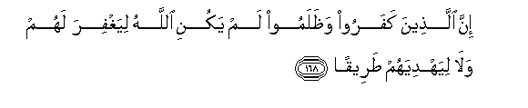

#إِنَّ الَّذِينَ كَفَرُوا وَظَلَمُوا لَمْ يَكُنِ اللَّهُ لِيَغْفِرَ لَهُمْ وَلَا لِيَهْدِيَهُمْ طَرِيقًا 

##Inna allatheena kafaroo wathalamoo lam yakuni Allahu liyaghfira lahum wala liyahdiyahum tareeqan 

## 翻译(Translation)：

| Translator | 译文(Translation)                                            |
| :--------: | ------------------------------------------------------------ |
|    马坚    | 不信正道而且多行不义的人，真主不致于赦宥他们，也不致于指引他们任何道路； |
|  YUSUFALI  | Those who reject Faith and do wrong,- Allah will not forgive them nor guide them to any way- |
| PICKTHALL  | Lo! those who disbelieve and deal in wrong, Allah will never forgive them, neither will He guide them unto a road, |
|   SHAKIR   | Surely (as for) those who disbelieve and act unjustly Allah will not forgive them nor guide them to a path |

---

## 对位释义(Words Interpretation)：

| No   | العربية | 中文    | English | 曾用词 |
| ---- | ------: | ------- | ------- | ------ |
| 序号 |    阿文 | Chinese | 英文    | Used   |
| 4:168.1  | إِنَّ      | 的确         | surely        | 见2:6.1    |
| 4:168.2  | الَّذِينَ   | 谁，那些     | those who     | 见2:6.2    |
| 4:168.3  | كَفَرُوا   | 不信         | disbelieve    | 见2:6.3    |
| 4:168.4  | وَظَلَمُوا  | 和不义的人   | and unjust    | 参2:59.3   |
| 4:168.5  | لَمْ      | 不，没有     | did not       | 见2:6.8    |
| 4:168.6  | يَكُنِ     | 他是         | he is         | 见4:38.13  |
| 4:168.7  | اللَّهُ    | 安拉，真主   | Allah         | 见1:1.2    |
| 4:168.8  | لِيَغْفِرَ   | 对他赦宥     | forgive       | 见4:137.16 |
| 4:168.9  | لَهُمْ     | 对他们       | for them      | 见2:11.3   |
| 4:168.10 | وَلَا     | 也不         | and not       | 见1:7.8    |
| 4:168.11 | لِيَهْدِيَهُمْ | 至他引导他们 | He guide them | 见4:137.19 |
| 4:168.12 | طَرِيقًا   | 任何道路     | any way       |            |

---
