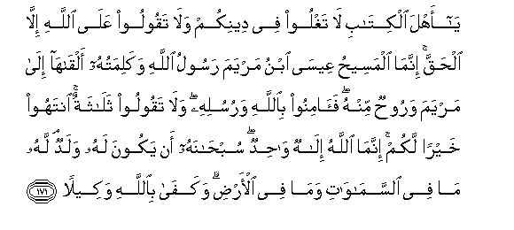

#يَا أَهْلَ الْكِتَابِ لَا تَغْلُوا فِي دِينِكُمْ وَلَا تَقُولُوا عَلَى اللَّهِ إِلَّا الْحَقَّ ۚ إِنَّمَا الْمَسِيحُ عِيسَى ابْنُ مَرْيَمَ رَسُولُ اللَّهِ وَكَلِمَتُهُ أَلْقَاهَا إِلَىٰ مَرْيَمَ وَرُوحٌ مِنْهُ ۖ فَآمِنُوا بِاللَّهِ وَرُسُلِهِ ۖ وَلَا تَقُولُوا ثَلَاثَةٌ ۚ انْتَهُوا خَيْرًا لَكُمْ ۚ إِنَّمَا اللَّهُ إِلَٰهٌ وَاحِدٌ ۖ سُبْحَانَهُ أَنْ يَكُونَ لَهُ وَلَدٌ ۘ لَهُ مَا فِي السَّمَاوَاتِ وَمَا فِي الْأَرْضِ ۗ وَكَفَىٰ بِاللَّهِ وَكِيلًا  

##Ya ahla alkitabi la taghloo fee deenikum wala taqooloo AAala Allahi illa alhaqqa innama almaseehu AAeesa ibnu maryama rasoolu Allahi wakalimatuhu alqaha ila maryama waroohun minhu faaminoo biAllahi warusulihi wala taqooloo thalathatun intahoo khayran lakum innama Allahu ilahun wahidun subhanahu an yakoona lahu waladun lahu ma fee alssamawati wama fee alardi wakafa biAllahi wakeelan 

## 翻译(Translation)：

| Translator | 译文(Translation)                                            |
| :--------: | ------------------------------------------------------------ |
|    马坚    | 信奉天经的人啊！你们对于自己的宗教不要过分，对于真主不要说无理的话。麦西哈. 尔撒——麦尔彦之子，只是真主的使者，只是他授予麦尔彦的一句话，只是从他发出的精神；故你们当确信真主和他的众使者，你们不要说三位。你们当停止谬说，这对于你们是有益的。真主是独一的主宰，赞颂真主，超绝万物， 他绝无子嗣，天地万物只是他的。真主足为见证。 |
|  YUSUFALI  | O People of the Book! Commit no excesses in your religion: Nor say of Allah aught but the truth. Christ Jesus the son of Mary was (no more than) a messenger of Allah, and His Word, which He bestowed on Mary, and a Spirit proceeding from Him: so believe in Allah and His messengers. Say not "Three (Trinity)" : desist: it will be better for you: for Allah is One God. Glory be to Him: (far exalted is He) above having a son. To Him belong all things in the heavens and on earth. And enough is Allah as a Disposer of affairs. |
| PICKTHALL  | O People of the Scripture! Do not exaggerate in your religion nor utter aught concerning Allah save the truth. The Messiah, Jesus son of Mary, was only a messenger of Allah, and His word which He conveyed unto Mary, and a spirit from Him. So believe in Allah and His messengers, and say not "Three" - Cease! (it is) better for you! - Allah is only One God. Far is it removed from His Transcendent Majesty that He should have a son. His is all that is in the heavens and all that is in the earth. And Allah is sufficient as Defender. |
|   SHAKIR   | O followers of the Book! do not exceed the limits in your religion, and do not speak (lies) against Allah, but (speak) the truth; the Messiah, Isa son of Marium is only an apostle of Allah and His Word which He communicated to Marium and a spirit from Him; believe therefore in Allah and His apostles, and say not, Three. Desist, it is better for you; Allah is only one God; far be It from His glory that He should have a son, whatever is in the heavens and whatever is in the earth is His, and Allah is sufficient for a Protector. |

---

## 对位释义(Words Interpretation)：

| No   | العربية | 中文    | English | 曾用词 |
| ---- | ------: | ------- | ------- | ------ |
| 序号 |    阿文 | Chinese | 英文    | Used   |
| 4:171.1  | يَا       | 啊             | Oh                 | 见2:21.1   |
| 4:171.2  | أَهْلَ      | 人们           | People             | 见3:64.3   |
| 4:171.3  | الْكِتَابِ   | 这部经的       | of the Book        | 见2:85.25  |
| 4:171.4  | لَا       | 不，不是，没有 | no                 | 见2:2.3    |
| 4:171.5  | تَغْلُوا    | 过分           | excesses           |            |
| 4:171.6  | فِي       | 在             | in                 | 见2:10.1   |
| 4:171.7  | دِينِكُمْ    | 你们的宗教     | your religion      | 见2:217.35 |
| 4:171.8  | وَلَا      | 也不           | and not            | 见1:7.8    |
| 4:171.9  | تَقُولُوا   | 你们说         | You say            | 见2:104.6  |
| 4:171.10 | عَلَى      | 至             | On                 | 见2:5.2    |
| 4:171.11 | اللَّهِ     | 真主的         | of Allah           | 见2:23.17  |
| 4:171.12 | إِلَّا      | 除了           | Except             | 见2:9.7    |
| 4:171.13 | الْحَقَّ     | 正确的，真理   | Right, truth       | 见2:26.17  |
| 4:171.14 | إِنَّمَا     | 仅仅           | only               | 见2:11.9   |
| 4:171.15 | الْمَسِيحُ   | 麦西哈         | the Messiah        | 见3:45.12  |
| 4:171.16 | عِيسَى     | 尔撒           | Isa                | 见2:87.10  |
| 4:171.17 | ابْنُ      | 儿子           | son                | 见3:45.14  |
| 4:171.18 | مَرْيَمَ     | 麦尔彦         | Marium             | 见2:87.12  |
| 4:171.19 | رَسُولُ     | 一个使者       | a messenger        |            |
| 4:171.20 | اللَّهِ     | 真主的         | of Allah           | 见2:23.17  |
| 4:171.21 | وَكَلِمَتُهُ   | 和他的一句话   | and His Word       |            |
| 4:171.22 | أَلْقَاهَا   | 他传达它       | He communicated it |            |
| 4:171.23 | إِلَىٰ      | 至             | to                 | 见2:14.9   |
| 4:171.24 | مَرْيَمَ     | 麦尔彦         | Marium             | 见2:87.12  |
| 4:171.25 | وَرُوحٌ     | 和一个精神     | and a spirit       |            |
| 4:171.26 | مِنْهُ      | 从它           | from it            | 见2:60.10  |
| 4:171.27 | فَآمِنُوا   | 因此诚信       | so believe         | 见3:179.28 |
| 4:171.28 | بِاللَّهِ    | 在真主         | in Allah           | 见2:8.6    |
| 4:171.29 | وَرُسُلِهِ    | 和他的众使者   | And his messengers | 见2:98.6   |
| 4:171.30 | وَلَا      | 也不           | and not            | 见1:7.8    |
| 4:171.31 | تَقُولُوا   | 你们说         | You say            | 见2:104.6  |
| 4:171.32 | ثَلَاثَةٌ    | 三位           | Three              |            |
| 4:171.33 | انْتَهُوا   | 你们应放弃     | desist             |            |
| 4:171.34 | خَيْرًا     | 好的           | Good               | 见2:158.20 |
| 4:171.35 | لَكُمْ      | 为你们         | For you            | 见2:22.3   |
| 4:171.36 | إِنَّمَا     | 仅仅           | only               | 见2:11.9   |
| 4:171.37 | اللَّهُ     | 安拉，真主     | Allah              | 见2:7.2 |
| 4:171.38 | إِلَٰهٌ      | 主宰           | Allah              | 见2:163.2  |
| 4:171.39 | وَاحِدٌ     | 独一的         | One                | 见2:163.3  |
| 4:171.40 | سُبْحَانَهُ   | 赞颂他超绝     | Glory be to Him    | 见2:116.5  |
| 4:171.41 | أَنْ       | 该             | that               | 见2:26.5   |
| 4:171.42 | يَكُونَ     | 他是           | he is              | 见2:150.16 |
| 4:171.43 | لَهُ       | 对他           | for he             | 见2:102.62 |
| 4:171.44 | وَلَدٌ      | 子女           | a son              | 见3:47.6   |
| 4:171.45 | لَهُ       | 对他           | for he             | 见2:102.62 |
| 4:171.46 | مَا       | 什么           | what/ that which   | 见2:17.8   |
| 4:171.47 | فِي       | 在             | in                 | 见2:10.1   |
| 4:171.48 | السَّمَاوَاتِ | 诸天的         | of the heavens     | 见2:33.16  |
| 4:171.49 | وَمَا      | 和什么         | and that           | 见2:4.6    |
| 4:171.50 | فِي       | 在             | in                 | 见2:10.1   |
| 4:171.51 | الْأَرْضِ    | 大地           | Earth              | 见2:22.4   |
| 4:171.52 | وَكَفَىٰ     | 和充分         | and enough         | 见4:6.35   |
| 4:171.53 | بِاللَّهِ    | 在真主         | in Allah           | 见2:8.6    |
| 4:171.54 | وَكِيلًا    | 监护者         | protector          | 见4:109.19 |

---
