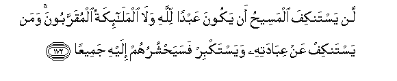

#لَنْ يَسْتَنْكِفَ الْمَسِيحُ أَنْ يَكُونَ عَبْدًا لِلَّهِ وَلَا الْمَلَائِكَةُ الْمُقَرَّبُونَ ۚ وَمَنْ يَسْتَنْكِفْ عَنْ عِبَادَتِهِ وَيَسْتَكْبِرْ فَسَيَحْشُرُهُمْ إِلَيْهِ جَمِيعًا 

##Lan yastankifa almaseehu an yakoona AAabdan lillahi wala almalaikatu almuqarraboona waman yastankif AAan AAibadatihi wayastakbir fasayahshuruhum ilayhi jameeAAan 

## 翻译(Translation)：

| Translator | 译文(Translation)                                            |
| :--------: | ------------------------------------------------------------ |
|    马坚    | 麦西哈绝不拒绝做真主的奴仆，蒙主眷顾的众天神，也绝不拒绝做真主的奴仆。凡拒绝崇拜真主，而且妄自尊大的人，他要把他们的全体集合到他那里。 |
|  YUSUFALI  | Christ disdaineth not to serve and worship Allah, nor do the angels, those nearest (to Allah): those who disdain His worship and are arrogant,-He will gather them all together unto Himself to (answer). |
| PICKTHALL  | The Messiah will never scorn to be a slave unto Allah, nor will the favoured angels. Whoso scorneth His service and is proud, all such will He assemble unto Him; |
|   SHAKIR   | The Messiah does by no means disdain that he should be a servant of Allah, nor do the angels who are near to Him, and whoever disdains His service and is proud, He will gather them all together to Himself. |

---

## 对位释义(Words Interpretation)：

| No   | العربية | 中文    | English | 曾用词 |
| ---- | ------: | ------- | ------- | ------ |
| 序号 |    阿文 | Chinese | 英文    | Used   |
| 4:172.1  | لَنْ       | 绝不             | will not                 | 见2:55.5   |
| 4:172.2  | يَسْتَنْكِفَ   | 他拒绝           | he disdaines             |            |
| 4:172.3  | الْمَسِيحُ   | 麦西哈           | the Messiah              | 见3:45.12  |
| 4:172.4  | أَنْ       | 该               | that                     | 见2:26.5   |
| 4:172.5  | يَكُونَ     | 他是             | he is                    | 见2:150.16 |
| 4:172.6  | عَبْدًا     | 一个奴仆         | a servant                |            |
| 4:172.7  | لِلَّهِ      | 为真主           | for Allah                | 见1:2.2    |
| 4:172.8  | وَلَا      | 也不             | and not                  | 见1:7.8    |
| 4:172.9  | الْمَلَائِكَةُ | 天使             | the angels               | 见2:248.22 |
| 4:172.10 | الْمُقَرَّبُونَ | 临近的           | nearest                  |            |
| 4:172.11 | وَمَنْ      | 和谁             | and who                  | 见2:108.11 |
| 4:172.12 | يَسْتَنْكِفْ   | 他拒绝           | he disdaines             | 参4:172.2  |
| 4:172.13 | عَنْ       | 从               | on                       | 见2:48.6   |
| 4:172.14 | عِبَادَتِهِ   | 他的崇拜         | His worship              |            |
| 4:172.15 | وَيَسْتَكْبِرْ  | 和他自大         | and he is arrogant       |            |
| 4:172.16 | فَسَيَحْشُرُهُمْ | 然后他将集合他们 | then He will gather them |            |
| 4:172.17 | إِلَيْهِ     | 至他             | to him                   | 见2:28.12  |
| 4:172.18 | جَمِيعًا    | 所有             | All                      | 见2:29.8   |

---
