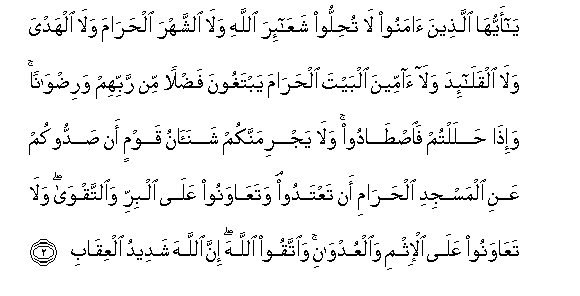

#يَا أَيُّهَا الَّذِينَ آمَنُوا لَا تُحِلُّوا شَعَائِرَ اللَّهِ وَلَا الشَّهْرَ الْحَرَامَ وَلَا الْهَدْيَ وَلَا الْقَلَائِدَ وَلَا آمِّينَ الْبَيْتَ الْحَرَامَ يَبْتَغُونَ فَضْلًا مِنْ رَبِّهِمْ وَرِضْوَانًا ۚ وَإِذَا حَلَلْتُمْ فَاصْطَادُوا ۚ وَلَا يَجْرِمَنَّكُمْ شَنَآنُ قَوْمٍ أَنْ صَدُّوكُمْ عَنِ الْمَسْجِدِ الْحَرَامِ أَنْ تَعْتَدُوا ۘ وَتَعَاوَنُوا عَلَى الْبِرِّ وَالتَّقْوَىٰ ۖ وَلَا تَعَاوَنُوا عَلَى الْإِثْمِ وَالْعُدْوَانِ ۚ وَاتَّقُوا اللَّهَ ۖ إِنَّ اللَّهَ شَدِيدُ الْعِقَابِ 

##Ya ayyuha allatheena amanoo la tuhilloo shaAAaira Allahi wala alshshahra alharama wala alhadya wala alqalaida wala ammeena albayta alharama yabtaghoona fadlan min rabbihim waridwanan waitha halaltum faistadoo wala yajrimannakum shanaanu qawmin an saddookum AAani almasjidi alharami an taAAtadoo wataAAawanoo AAala albirri waalttaqwa wala taAAawanoo AAala alithmi waalAAudwani waittaqoo Allaha inna Allaha shadeedu alAAiqabi 

## 翻译(Translation)：

| Translator | 译文(Translation)                                            |
| :--------: | ------------------------------------------------------------ |
|    马坚    | 信道的人们啊! 你们不要亵渎真主的标识和禁月, 不要侵犯作牺牲用的牲畜, 不要破坏那些牲畜的项圈, 不要伤害朝觐禁寺以求主的恩惠和喜悦的人。当你们开戒的时候，可以打猎。有人曾阻止你们进禁寺，你们绝不要为怨恨他们而过分。你们当为正义和敬畏而互助，不要为罪恶和横暴而互助。你们当敬畏真主，因为真主的刑罚确是严厉的。 |
|  YUSUFALI  | O ye who believe! violate not the sanctity of the Symbols of Allah nor of the Sacred Month nor of the animals brought for sacrifice nor the garlands that mark out such animals nor the people resorting to the Sacred House seeking of the bounty and good pleasure of their Lord. But when ye are clear of the Sacred Precincts and of pilgrim garb ye may hunt and let not the hatred of some people in (once) shutting you out of the Sacred Mosque lead you to transgression (and hostility on your part). Help ye one another in righteousness and piety but help ye not one another in sin and rancor: fear Allah: for Allah is strict in punishment. |
| PICKTHALL  | O ye who believe! Profane not Allah's monuments nor the Sacred Month nor the offerings nor the garlands, nor those repairing to the Sacred House, seeking the grace and pleasure of their Lord. But when ye have left the sacred territory, then go hunting (if ye will). And let not your hatred of a folk who (once) stopped your going to the inviolable place of worship seduce you to transgress; but help ye one another unto righteousness and pious duty. Help not one another unto sin and transgression, but keep your duty to Allah. Lo! Allah is severe in punishment. |
|   SHAKIR   | O you who believe! do not violate the signs appointed by Allah nor the sacred month, nor (interfere with) the offerings, nor the sacrificial animals with garlands, nor those going to the sacred house seeking the grace and pleasure of their Lord; and when you are free from the obligations of the pilgrimage, then hunt, and let not hatred of a people-- because they hindered you from the Sacred Masjid-- incite you to exceed the limits, and help one another in goodness and piety, and do not help one another in sin and aggression; and be careful of (your duty to) Allah; surely Allah is severe in requiting (evil). |

---

## 对位释义(Words Interpretation)：

| No   | العربية | 中文    | English | 曾用词 |
| ---- | ------: | ------- | ------- | ------ |
| 序号 |    阿文 | Chinese | 英文    | Used   |
| 5:2.1  | يَا       | 啊             | Oh                      | 见2:21.1   |
| 5:2.2  | أَيُّهَا     | 语气词         | O                       | 见2:21.2   |
| 5:2.3  | الَّذِينَ    | 谁，那些       | those who               | 见2:6.2    |
| 5:2.4  | آمَنُوا    | 诚信           | believe                 | 见2:9.4    |
| 5:2.5  | لَا       | 不，不是，没有 | no                      | 见2:2.3    |
| 5:2.6  | تُحِلُّوا    | 你们亵渎       | you violate             |            |
| 5:2.7  | شَعَائِرَ    | 众标识         | the signs               |            |
| 5:2.8  | اللَّهِ     | 真主的         | of Allah                | 见2:23.17  |
| 5:2.9  | وَلَا      | 也不           | and not                 | 见1:7.8    |
| 5:2.10 | الشَّهْرَ    | 这个月         | the month               | 见2:185.16 |
| 5:2.11 | الْحَرَامَ   | 禁止的         | Sacred                  |            |
| 5:2.12 | وَلَا      | 也不           | and not                 | 见1:7.8    |
| 5:2.13 | الْهَدْيَ    | 牺牲用的       | the offerings           |            |
| 5:2.14 | وَلَا      | 也不           | and not                 | 见1:7.8    |
| 5:2.15 | الْقَلَائِدَ  | 挂项饰的       | the garlands            |            |
| 5:2.16 | وَلَا      | 也不           | and not                 | 见1:7.8    |
| 5:2.17 | آمِّينَ     | 信士们         | the people resorting to |            |
| 5:2.18 | الْبَيْتَ    | 天房           | the House               | 见2:125.3  |
| 5:2.19 | الْحَرَامَ   | 禁止的         | Sacred                  | 见5:2.11   |
| 5:2.20 | يَبْتَغُونَ   | 他们寻找       | they are seeking        | 参2:198.5  |
| 5:2.21 | فَضْلًا     | 恩惠           | bounty                  | 见2:198.6  |
| 5:2.22 | مِنْ       | 从             | from                    | 见2:4.8    |
| 5:2.23 | رَبِّهِمْ     | 他们的主       | their Lord              | 见2:5.5    |
| 5:2.24 | وَرِضْوَانًا  | 和喜悦         | and pleasure            |            |
| 5:2.25 | وَإِذَا     | 并且如果，当时 | and when                | 见2:11.1   |
| 5:2.26 | حَلَلْتُمْ    | 你们开戒       | you are free            |            |
| 5:2.27 | فَاصْطَادُوا | 然后你们打猎   | then go hunting         |            |
| 5:2.28 | وَلَا      | 也不           | and not                 | 见1:7.8    |
| 5:2.29 | يَجْرِمَنَّكُمْ  | 它使你们       | it let you              |            |
| 5:2.30 | شَنَآنُ     | 怨恨           | hatred                  |            |
| 5:2.31 | قَوْمٍ      | 人们的         | of a people             | 见3:117.14 |
| 5:2.32 | أَنْ       | 该             | that                    | 见2:26.5   |
| 5:2.33 | صَدُّوكُمْ    | 他们阻止你们   | they hindered you       |            |
| 5:2.34 | عَنِ       | 关于           | about                   | 见2:189.2  |
| 5:2.35 | الْمَسْجِدِ   | 清真寺         | The mosque              | 见2:144.13 |
| 5:2.36 | الْحَرَامِ   | 神圣的         | The Sacred              | 见2:144.14 |
| 5:2.37 | أَنْ       | 该             | that                    | 见2:26.5   |
| 5:2.38 | تَعْتَدُوا   | 过分           | exceeds the limit       | 见2:190.8  |
| 5:2.39 | وَتَعَاوَنُوا | 和你们应互助   | and help one another    |            |
| 5:2.40 | عَلَى      | 至             | On                      | 见2:5.2    |
| 5:2.41 | الْبِرِّ     | 正义           | righteousness           |            |
| 5:2.42 | وَالتَّقْوَىٰ  | 和敬畏         | and the Allah-fearing   | 参2:197.26 |
| 5:2.43 | وَلَا      | 也不           | and not                 | 见1:7.8    |
| 5:2.44 | تَعَاوَنُوا  | 你们互助       | help one another        | 参5:2.39   |
| 5:2.45 | عَلَى      | 至             | On                      | 见2:5.2    |
| 5:2.46 | الْإِثْمِ    | 罪恶           | sin                     | 参2:85.13  |
| 5:2.47 | وَالْعُدْوَانِ | 和横暴         | and transgression       | 见2:85.14  |
| 5:2.48 | وَاتَّقُوا   | 和畏惧         | And fear                | 见2:48.1   |
| 5:2.49 | اللَّهَ     | 安拉，真主     | Allah                   | 见2:9.2 |
| 5:2.50 | إِنَّ       | 的确           | surely                  | 见2:6.1    |
| 5:2.51 | اللَّهَ     | 安拉，真主     | Allah                   | 见2:9.2 |
| 5:2.52 | شَدِيدُ     | 严厉           | strongly                | 见2:165.30 |
| 5:2.53 | الْعِقَابِ   | 刑罚           | punishment              | 见2:196.73 |

---
