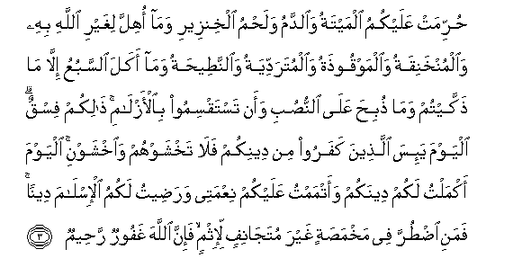

#حُرِّمَتْ عَلَيْكُمُ الْمَيْتَةُ وَالدَّمُ وَلَحْمُ الْخِنْزِيرِ وَمَا أُهِلَّ لِغَيْرِ اللَّهِ بِهِ وَالْمُنْخَنِقَةُ وَالْمَوْقُوذَةُ وَالْمُتَرَدِّيَةُ وَالنَّطِيحَةُ وَمَا أَكَلَ السَّبُعُ إِلَّا مَا ذَكَّيْتُمْ وَمَا ذُبِحَ عَلَى النُّصُبِ وَأَنْ تَسْتَقْسِمُوا بِالْأَزْلَامِ ۚ ذَٰلِكُمْ فِسْقٌ ۗ الْيَوْمَ يَئِسَ الَّذِينَ كَفَرُوا مِنْ دِينِكُمْ فَلَا تَخْشَوْهُمْ وَاخْشَوْنِ ۚ الْيَوْمَ أَكْمَلْتُ لَكُمْ دِينَكُمْ وَأَتْمَمْتُ عَلَيْكُمْ نِعْمَتِي وَرَضِيتُ لَكُمُ الْإِسْلَامَ دِينًا ۚ فَمَنِ اضْطُرَّ فِي مَخْمَصَةٍ غَيْرَ مُتَجَانِفٍ لِإِثْمٍ ۙ فَإِنَّ اللَّهَ غَفُورٌ رَحِيمٌ 

##Hurrimat AAalaykumu almaytatu waalddamu walahmu alkhinzeeri wama ohilla lighayri Allahi bihi waalmunkhaniqatu waalmawqoothatu waalmutaraddiyatu waalnnateehatu wama akala alssabuAAu illa ma thakkaytum wama thubiha AAala alnnusubi waan tastaqsimoo bialazlami thalikum fisqun alyawma yaisa allatheena kafaroo min deenikum fala takhshawhum waikhshawni alyawma akmaltu lakum deenakum waatmamtu AAalaykum niAAmatee waradeetu lakumu alislama deenan famani idturra fee makhmasatin ghayra mutajanifin liithmin fainna Allaha ghafoorun raheemun 

## 翻译(Translation)：

| Translator | 译文(Translation)                                            |
| :--------: | ------------------------------------------------------------ |
|    马坚    | 禁止你们吃自死物、血液、猪肉、以及诵非真主之名而宰杀的、勒死的、捶死的、跌死的、觝死的、野兽吃剩的动物，但宰后才死的，仍然可吃；禁止你们吃在神石上宰杀的；禁止你们求签，那是罪恶。今天，不信道的人，对于（消灭）你们的宗教已经绝望了，故你们不要畏惧他们，你们当畏惧我。今天，我已为你们成全你们的宗教，我已完成我所赐你们的恩典，我已选择伊斯兰做你们的宗教。凡为饥荒所迫，而无意犯罪的，（虽吃禁物，毫无罪过），因为真主确是至赦的，确是至慈的。 |
|  YUSUFALI  | Forbidden to you (for food) are: dead meat blood the flesh of swine and that on which hath been invoked the name of other than Allah that which hath been killed by strangling or by a violent blow or by a headlong fall or by being gored to death; that which hath been (partly) eaten by a wild animal; unless ye are able to slaughter it (in due form); that which is sacrificed on stone (altars); (forbidden) also is the division (of meat) by raffling with arrows: that is impiety. This day have those who reject faith given up all hope of your religion: yet fear them not but fear Me. This day have I perfected your religion for you completed my favor upon you and have chosen for you Islam as your religion. But if any forced by hunger with no inclination to transgression Allah is indeed Oft-Forgiving Most Merciful. |
| PICKTHALL  | Forbidden unto you (for food) are carrion and blood and swineflesh, and that which hath been dedicated unto any other than Allah, and the strangled, and the dead through beating, and the dead through falling from a height, and that which hath been killed by (the goring of) horns, and the devoured of wild beasts, saving that which ye make lawful (by the death-stroke), and that which hath been immolated unto idols. And (forbidden is it) that ye swear by the divining arrows. This is an abomination. This day are those who disbelieve in despair of (ever harming) your religion; so fear them not, fear Me! This day have I perfected your religion for you and completed My favour unto you, and have chosen for you as religion al-Islam. Whoso is forced by hunger, not by will, to sin: (for him) lo! Allah is Forgiving, Merciful. |
|   SHAKIR   | Forbidden to you is that which dies of itself, and blood, and flesh of swine, and that on which any other name than that of Allah has been invoked, and the strangled (animal) and that beaten to death, and that killed by a fall and that killed by being smitten with the horn, and that which wild beasts have eaten, except what you slaughter, and what is sacrificed on stones set up (for idols) and that you divide by the arrows; that is a transgression. This day have those who disbelieve despaired of your religion, so fear them not, and fear Me. This day have I perfected for you your religion and completed My favor on you and chosen for you Islam as a religion; but whoever is compelled by hunger, not inclining willfully to sin, then surely Allah is Forgiving, Merciful. |

---

## 对位释义(Words Interpretation)：

| No   | العربية | 中文    | English | 曾用词 |
| ---- | ------: | ------- | ------- | ------ |
| 序号 |    阿文 | Chinese | 英文    | Used   |
| 5:3.1  | حُرِّمَتْ      | 被禁止                   | Forbidden                                      | 见4:23.1   |
| 5:3.2  | عَلَيْكُمُ     | 在你们                   | on you                                         | 见2:40.8   |
| 5:3.3  | الْمَيْتَةُ    | 自死物                   | what dies of itself                            | 参2:173.4  |
| 5:3.4  | وَالدَّمُ     | 和血液                   | and blood                                      | 参2:173.5  |
| 5:3.5  | وَلَحْمُ      | 和肉                     | and the flesh                                  | 参2:173.6  |
| 5:3.6  | الْخِنْزِيرِ   | 猪的                     | of swine                                       | 见2:173.7  |
| 5:3.7  | وَمَا       | 和什么                   | and that                                       | 见2:4.6    |
| 5:3.8  | أُهِلَّ       | 牠被诵                   | has been invoked                               | 见2:173.9  |
| 5:3.9  | لِغَيْرِ      | 以不                     | for non                                        | 见2:173.11 |
| 5:3.10 | اللَّهِ      | 真主的                   | of Allah                                       | 见2:23.17  |
| 5:3.11 | بِهِ        | 以它                     | with it                                        | 见2:22.13  |
| 5:3.12 | وَالْمُنْخَنِقَةُ | 和勒死的                 | and the strangled                              |            |
| 5:3.13 | وَالْمَوْقُوذَةُ | 和捶死的                 | and the dead through beating                   |            |
| 5:3.14 | وَالْمُتَرَدِّيَةُ | 和跌死的                 | and that killed by a fall                      |            |
| 5:3.15 | وَالنَّطِيحَةُ  | 和觝死的                 | and that killed by being smitten with the horn |            |
| 5:3.16 | وَمَا       | 和什么                   | and that                                       | 见2:4.6    |
| 5:3.17 | أَكَلَ       | 它吃                     | have eaten                                     |            |
| 5:3.18 | السَّبُعُ     | 野兽                     | wild beasts                                    |            |
| 5:3.19 | إِلَّا       | 除了                     | Except                                         | 见2:9.7    |
| 5:3.20 | مَا        | 什么                     | what/ that which                               | 见2:17.8   |
| 5:3.21 | ذَكَّيْتُمْ     | 你们宰                   | you slaughter                                  |            |
| 5:3.22 | وَمَا       | 和什么                   | and that                                       | 见2:4.6    |
| 5:3.23 | ذُبِحَ       | 它被宰                   | it is sacrificed                               |            |
| 5:3.24 | عَلَى       | 至                       | On                                             | 见2:5.2    |
| 5:3.25 | النُّصُبِ     | 神石                     | stone                                          |            |
| 5:3.26 | وَأَنْ       | 和那个                   | and that                                       | 见2:169.5  |
| 5:3.27 | تَسْتَقْسِمُوا  | 你们求                   | you divide                                     |            |
| 5:3.28 | بِالْأَزْلَامِ  | 在签                     | by the arrows                                  |            |
| 5:3.29 | ذَٰلِكُمْ      | 那个是                   | That's it                                      | 见2:49.14  |
| 5:3.30 | فِسْقٌ       | 罪恶                     | a transgression                                |            |
| 5:3.31 | الْيَوْمَ     | 今日                     | today                                          | 见2:249.40 |
| 5:3.32 | يَئِسَ       | 他绝望                   | he despaired                                   |            |
| 5:3.33 | الَّذِينَ     | 谁，那些                 | those who                                      | 见2:6.2    |
| 5:3.34 | كَفَرُوا     | 不信                     | disbelieve                                     | 见2:6.3    |
| 5:3.35 | مِنْ        | 从                       | from                                           | 见2:4.8    |
| 5:3.36 | دِينِكُمْ     | 你们的宗教               | your religion                                  | 见2:217.35 |
| 5:3.37 | فَلَا       | 因此不                   | shall not                                      | 见2:22.18  |
| 5:3.38 | تَخْشَوْهُمْ    | 畏惧他们                 | fear them                                      | 见2:150.25 |
| 5:3.39 | وَاخْشَوْنِ    | 和应畏惧我               | and fear Me                                    | 参2:150.26 |
| 5:3.40 | الْيَوْمَ     | 今日                     | today                                          | 见2:249.40 |
| 5:3.41 | أَكْمَلْتُ     | 我成全                   | I perfected                                    |            |
| 5:3.42 | لَكُمْ       | 为你们                   | For you                                        | 见2:22.3   |
| 5:3.43 | دِينَكُمْ     | 你们的宗教               | your religion                                  | 见3:73.6   |
| 5:3.44 | وَأَتْمَمْتُ    | 和我完成                 | and I completed                                |            |
| 5:3.45 | عَلَيْكُمْ     | 在你们                   | on you                                         | 见2:40.8   |
| 5:3.46 | نِعْمَتِي     | 我的恩典                 | my favours                                     | 见2:150.28 |
| 5:3.47 | وَرَضِيتُ     | 和我选择                 | and I have chosen                              |            |
| 5:3.48 | لَكُمُ       | 为你们                   | For you                                        | 见2:22.3   |
| 5:3.49 | الْإِسْلَامَ   | 伊斯兰                   | Islam                                          |            |
| 5:3.50 | دِينًا      | 宗教                     | religion                                       | 见3:85.5   |
| 5:3.51 | فَمَنِ       | 然后谁                   | then who                                       | 见2:173.13 |
| 5:3.52 | اضْطُرَّ      | 他被迫                   | be forced                                      | 见2:173.14 |
| 5:3.53 | فِي        | 在                       | in                                             | 见2:10.1   |
| 5:3.54 | مَخْمَصَةٍ     | 饥荒                     | hunger                                         |            |
| 5:3.55 | غَيْرَ       | 非，除了，除开，不是，但 | non, but                                       | 见1:7.5    |
| 5:3.56 | مُتَجَانِفٍ    | 意向                     | inclination                                    |            |
| 5:3.57 | لِإِثْمٍ      | 至罪                     | to transgression                               |            |
| 5:3.58 | فَإِنَّ       | 因此确实                 | so surely                                      | 见2:61.34  |
| 5:3.59 | اللَّهَ      | 安拉，真主               | Allah                                          | 见1:1.2    |
| 5:3.60 | غَفُورٌ      | 至赦的                   | Forgiving                                      | 见2:173.24 |
| 5:3.61 | رَحِيمٌ      | 至慈的                   | Merciful                                       | 见2:143.45 |

---
