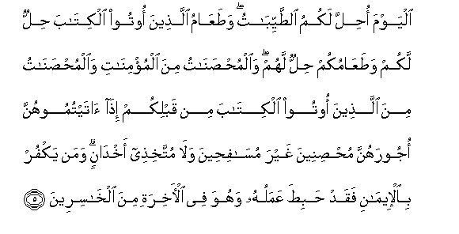

#الْيَوْمَ أُحِلَّ لَكُمُ الطَّيِّبَاتُ ۖ وَطَعَامُ الَّذِينَ أُوتُوا الْكِتَابَ حِلٌّ لَكُمْ وَطَعَامُكُمْ حِلٌّ لَهُمْ ۖ وَالْمُحْصَنَاتُ مِنَ الْمُؤْمِنَاتِ وَالْمُحْصَنَاتُ مِنَ الَّذِينَ أُوتُوا الْكِتَابَ مِنْ قَبْلِكُمْ إِذَا آتَيْتُمُوهُنَّ أُجُورَهُنَّ مُحْصِنِينَ غَيْرَ مُسَافِحِينَ وَلَا مُتَّخِذِي أَخْدَانٍ ۗ وَمَنْ يَكْفُرْ بِالْإِيمَانِ فَقَدْ حَبِطَ عَمَلُهُ وَهُوَ فِي الْآخِرَةِ مِنَ الْخَاسِرِينَ 

##Alyawma ohilla lakumu alttayyibatu wataAAamu allatheena ootoo alkitaba hillun lakum wataAAamukum hillun lahum waalmuhsanatu mina almuminati waalmuhsanatu mina allatheena ootoo alkitaba min qablikum itha ataytumoohunna ojoorahunna muhsineena ghayra musafiheena wala muttakhithee akhdanin waman yakfur bialeemani faqad habita AAamaluhu wahuwa fee alakhirati mina alkhasireena 

## 翻译(Translation)：

| Translator | 译文(Translation)                                            |
| :--------: | ------------------------------------------------------------ |
|    马坚    | 今天，准许你们吃一切佳美的食物；曾受天经者的食物，对于你们是合法的；你们的食物，对于他们也是合法的；信道的自由女，和曾受天经的自由女，对于你们都是合法的，如果你们把他们的聘仪交给她们，但你们应当是贞节的，不可是淫荡的，也不可是有情人的。谁否认正信，谁的善功，确已无效了；他在后世，是亏折的人。 |
|  YUSUFALI  | This day are (all) things good and pure made lawful unto you. The food of the People of the Book is lawful unto you and yours is lawful unto them. (Lawful unto you in marriage) are (not only) chaste women who are believers but chaste women among the People of the Book revealed before your time when ye give them their due dowers and desire chastity not lewdness nor secret intrigues. If anyone rejects faith fruitless is his work and in the Hereafter he will be in the ranks of those who have lost (all spiritual good). |
| PICKTHALL  | This day are (all) good things made lawful for you. The food of those who have received the Scripture is lawful for you, and your food is lawful for them. And so are the virtuous women of the believers and the virtuous women of those who received the Scripture before you (lawful for you) when ye give them their marriage portions and live with them in honour, not in fornication, nor taking them as secret concubines. Whoso denieth the faith, his work is vain and he will be among the losers in the Hereafter. |
|   SHAKIR   | This day (all) the good things are allowed to you; and the food of those who have been given the Book is lawful for you and your food is lawful for them; and the chaste from among the believing women and the chaste from among those who have been given the Book before you (are lawful for you); when you have given them their dowries, taking (them) in marriage, not fornicating nor taking them for paramours in secret; and whoever denies faith, his work indeed is of no account, and in the hereafter he shall be one of the losers. |

---

## 对位释义(Words Interpretation)：

| No   | العربية | 中文    | English | 曾用词 |
| ---- | ------: | ------- | ------- | ------ |
| 序号 |    阿文 | Chinese | 英文    | Used   |
| 5:5.1  | الْيَوْمَ     | 今日                     | today               | 见2:249.40 |
| 5:5.2  | أُحِلَّ       | 它合法                   | Permitted           | 见2:187.1  |
| 5:5.3  | لَكُمُ       | 为你们                   | For you             | 见2:22.3   |
| 5:5.4  | الطَّيِّبَاتُ   | 佳美的食物               | the good things     | 见5:4.8    |
| 5:5.5  | وَطَعَامُ     | 和食物                   | and the food        | 参2:184.18 |
| 5:5.6  | الَّذِينَ     | 谁，那些                 | those who           | 见2:6.2    |
| 5:5.7  | أُوتُوا     | 被给                     | were given          | 见2:101.14 |
| 5:5.8  | الْكِتَابَ    | 这部经，这本书           | the book            | 见2:2.2    |
| 5:5.9  | حِلٌّ        | 合法                     | lawful              |            |
| 5:5.10 | لَكُمْ       | 为你们                   | For you             | 见2:22.3   |
| 5:5.11 | وَطَعَامُكُمْ   | 和你们的食物             | and your food       | 参2:184.18 |
| 5:5.12 | حِلٌّ        | 合法                     | lawful              | 见5:5.9    |
| 5:5.13 | لَهُمْ       | 对他们                   | for them            | 见2:11.3   |
| 5:5.14 | وَالْمُحْصَنَاتُ | 和贞洁女                 | and chaste women    | 见4:24.1   |
| 5:5.15 | مِنَ        | 从                       | from                | 见2:4.8    |
| 5:5.16 | الْمُؤْمِنَاتِ  | 众女信士们的             | believing women     | 见4:25.9   |
| 5:5.17 | وَالْمُحْصَنَاتُ | 和贞洁女                 | and chaste women    | 见4:24.1   |
| 5:5.18 | مِنَ        | 从                       | from                | 见2:4.8    |
| 5:5.19 | الَّذِينَ     | 谁，那些                 | those who           | 见2:6.2    |
| 5:5.20 | أُوتُوا     | 被给                     | were given          | 见2:101.14 |
| 5:5.21 | الْكِتَابَ    | 这部经，这本书           | the book            | 见2:2.2    |
| 5:5.22 | مِنْ        | 从                       | from                | 见2:4.8    |
| 5:5.23 | قَبْلِكُمْ     | 在你以前                 | Before you          | 见2:21.10  |
| 5:5.24 | إِذَا       | 当时                     | when                | 见2:156.2  |
| 5:5.25 | آتَيْتُمُوهُنَّ  | 你们给她们               | you have given them | 见2:229.14 |
| 5:5.26 | أُجُورَهُنَّ    | 她们的聘仪               | their dowers        | 见4:24.27  |
| 5:5.27 | مُحْصِنِينَ    | 贞节的                   | in honest wedlock   | 见4:24.19  |
| 5:5.28 | غَيْرَ       | 非，除了，除开，不是，但 | non, but            | 见1:7.5    |
| 5:5.29 | مُسَافِحِينَ   | 淫荡的                   | debauchery          | 见4:24.21  |
| 5:5.30 | وَلَا       | 也不                     | and not             | 见1:7.8    |
| 5:5.31 | مُتَّخِذِي     | 以她们为                 | taking them as      | 参4:25.33  |
| 5:5.32 | أَخْدَانٍ     | 秘密情人                 | paramours           | 见4:25.34  |
| 5:5.33 | وَمَنْ       | 和谁                     | and who             | 见2:108.11 |
| 5:5.34 | يَكْفُرْ      | 他不信                   | he disbelieve       | 见2:99.7   |
| 5:5.35 | بِالْإِيمَانِ  | 以正信                   | with faith          | 见2:108.14 |
| 5:5.36 | فَقَدْ       | 然后当然                 | then may            | 见2:108.15 |
| 5:5.37 | حَبِطَ       | 它无效                   | fruitless           |            |
| 5:5.38 | عَمَلُهُ      | 他的善功                 | his work            |            |
| 5:5.39 | وَهُوَ       | 和他                     | and he              | 见2:29.16  |
| 5:5.40 | فِي        | 在                       | in                  | 见2:10.1   |
| 5:5.41 | الْآخِرَةِ    | 后世                     | the Hereafter       | 见2:102.64 |
| 5:5.42 | مِنَ        | 从                       | from                | 见2:4.8    |
| 5:5.43 | الْخَاسِرِينَ  | 众亏折者                 | the Losers          | 见2:64.13  |

---
