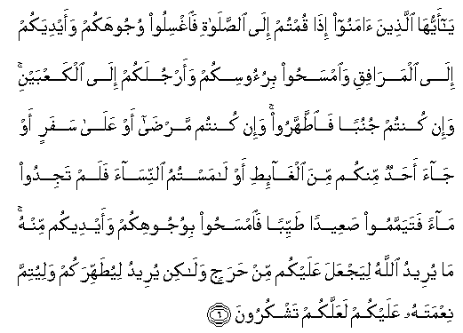

#يَا أَيُّهَا الَّذِينَ آمَنُوا إِذَا قُمْتُمْ إِلَى الصَّلَاةِ فَاغْسِلُوا وُجُوهَكُمْ وَأَيْدِيَكُمْ إِلَى الْمَرَافِقِ وَامْسَحُوا بِرُءُوسِكُمْ وَأَرْجُلَكُمْ إِلَى الْكَعْبَيْنِ ۚ وَإِنْ كُنْتُمْ جُنُبًا فَاطَّهَّرُوا ۚ وَإِنْ كُنْتُمْ مَرْضَىٰ أَوْ عَلَىٰ سَفَرٍ أَوْ جَاءَ أَحَدٌ مِنْكُمْ مِنَ الْغَائِطِ أَوْ لَامَسْتُمُ النِّسَاءَ فَلَمْ تَجِدُوا مَاءً فَتَيَمَّمُوا صَعِيدًا طَيِّبًا فَامْسَحُوا بِوُجُوهِكُمْ وَأَيْدِيكُمْ مِنْهُ ۚ مَا يُرِيدُ اللَّهُ لِيَجْعَلَ عَلَيْكُمْ مِنْ حَرَجٍ وَلَٰكِنْ يُرِيدُ لِيُطَهِّرَكُمْ وَلِيُتِمَّ نِعْمَتَهُ عَلَيْكُمْ لَعَلَّكُمْ تَشْكُرُونَ 

##Ya ayyuha allatheena amanoo itha qumtum ila alssalati faighsiloo wujoohakum waaydiyakum ila almarafiqi waimsahoo biruoosikum waarjulakum ila alkaAAbayni wain kuntum junuban faittahharoo wain kuntum marda aw AAala safarin aw jaa ahadun minkum mina alghaiti aw lamastumu alnnisaa falam tajidoo maan fatayammamoo saAAeedan tayyiban faimsahoo biwujoohikum waaydeekum minhu ma yureedu Allahu liyajAAala AAalaykum min harajin walakin yureedu liyutahhirakum waliyutimma niAAmatahu AAalaykum laAAallakum tashkuroona 

## 翻译(Translation)：

| Translator | 译文(Translation)                                            |
| :--------: | ------------------------------------------------------------ |
|    马坚    | 信道的人们啊! 当你们起身去礼拜的时候, 你们当洗脸和手, 洗至于两肘, 当摩头, 当洗脚, 洗至两踝。如果你们是不洁的，你们就当洗周身。如果你们害病或旅行，或从厕所来，或与妇女交接，而得不到水，你们就当趋向清洁的地面，而用一部分土摩脸和手。真主不欲使你们烦难，但他欲使你们清洁，并完成他所赐你们的恩典，以便你们感谢。 |
|  YUSUFALI  | O ye who believe! when ye prepare for prayer wash your faces and your hands (and arms) to the elbows; rub your heads (with water); and (wash) your feet to the ankles. If ye are in a state of ceremonial impurity bathe your whole body. But if ye are ill or on a journey or one of you cometh from offices of nature or ye have been in contact with women and ye find no water then take for yourselves clean sand or earth and rub therewith your faces and hands. Allah doth not wish to place you in a difficulty but to make you clean and to complete His favor to you that ye may be grateful. |
| PICKTHALL  | O ye who believe! When ye rise up for prayer, wash you faces, and your hands up to the elbows, and lightly rub your heads and (wash) your feet up to the ankles. And if ye are unclean, purify yourselves. And if ye are sick or on a journey, or one of you cometh from the closet, or ye have had contact with women, and ye find not water, then go to clean, high ground and rub your faces and your hands with some of it. Allah would not place a burden on you, but He would purify you and would perfect His grace upon you, that ye may give thanks. |
|   SHAKIR   | O you who believe! when you rise up to prayer, wash your faces and your hands as far as the elbows, and wipe your heads and your feet to the ankles; and if you are under an obligation to perform a total ablution, then wash (yourselves) and if you are sick or on a journey, or one of you come from the privy, or you have touched the women, and you cannot find water, betake yourselves to pure earth and wipe your faces and your hands therewith, Allah does not desire to put on you any difficulty, but He wishes to purify you and that He may complete His favor on you, so that you may be grateful. |

---

## 对位释义(Words Interpretation)：

| No   | العربية | 中文    | English | 曾用词 |
| ---- | ------: | ------- | ------- | ------ |
| 序号 |    阿文 | Chinese | 英文    | Used   |
| 5:6.1  | يَا      | 啊             | Oh                                | 见2:21.1   |
| 5:6.2  | أَيُّهَا    | 语气词         | O                                 | 见2:21.2   |
| 5:6.3  | الَّذِينَ   | 谁，那些       | those who                         | 见2:6.2    |
| 5:6.4  | آمَنُوا   | 诚信           | believe                           | 见2:9.4    |
| 5:6.5  | إِذَا     | 当时           | when                              | 见2:156.2  |
| 5:6.6  | قُمْتُمْ    | 你们站立       | you rise up                       |            |
| 5:6.7  | إِلَى     | 至             | to                                | 见2:14.9   |
| 5:6.8  | الصَّلَاةِ  | 拜功           | the prayer                        | 见4:101.11 |
| 5:6.9  | فَاغْسِلُوا | 然后你们应洗   | then wash                         |            |
| 5:6.10 | وُجُوهَكُمْ  | 你们的脸       | Your faces                        | 见2:144.19 |
| 5:6.11 | وَأَيْدِيَكُمْ | 和你们的众手   | and your hands                    | 参4:77.8   |
| 5:6.12 | إِلَى     | 至             | to                                | 见2:14.9   |
| 5:6.13 | الْمَرَافِقِ | 众肘           | the elbows                        |            |
| 5:6.14 | وَامْسَحُوا | 和你们应抹     | and wipe                          | 参4:43.42  |
| 5:6.15 | بِرُءُوسِكُمْ | 在你们的众头   | with your heads                   |            |
| 5:6.16 | وَأَرْجُلَكُمْ | 和你们的众脚   | and your feet                     |            |
| 5:6.17 | إِلَى     | 至             | to                                | 见2:14.9   |
| 5:6.18 | الْكَعْبَيْنِ | 众脚踝         | the ankles                        |            |
| 5:6.19 | وَإِنْ     | 和如果         | and if                            | 见2:137.9  |
| 5:6.20 | كُنْتُمْ    | 你们是         | You are                           | 见2:23.2   |
| 5:6.21 | جُنُبًا    | 无大净         | in a state of ceremonial impurity | 见4:43.15  |
| 5:6.22 | فَاطَّهَّرُوا | 然后你们洗周身 | then bathe your whole body        |            |
| 5:6.23 | وَإِنْ     | 和如果         | and if                            | 见2:137.9  |
| 5:6.24 | كُنْتُمْ    | 你们是         | You are                           | 见2:23.2   |
| 5:6.25 | مَرْضَىٰ    | 生病           | ill                               | 见4:43.23  |
| 5:6.26 | أَوْ      | 或             | or                                | 见2:19.1   |
| 5:6.27 | عَلَىٰ     | 至             | On                                | 见2:5.2    |
| 5:6.28 | سَفَرٍ     | 旅行           | a journey                         | 见2:184.9  |
| 5:6.29 | أَوْ      | 或             | or                                | 见2:19.1   |
| 5:6.30 | جَاءَ     | 他来           | come                              | 见4:43.28  |
| 5:6.31 | أَحَدٌ     | 某些人         | anyone                            | 见3:73.14  |
| 5:6.32 | مِنْكُمْ    | 从你们         | Of you                            | 见2:65.5   |
| 5:6.33 | مِنَ      | 从             | from                              | 见2:4.8    |
| 5:6.34 | الْغَائِطِ  | 厕所           | the privy                         | 见4:43.32  |
| 5:6.35 | أَوْ      | 或             | or                                | 见2:19.1   |
| 5:6.36 | لَامَسْتُمُ  | 你们交接       | you have touched                  | 见4:43.34  |
| 5:6.37 | النِّسَاءَ  | 妇女           | the women                         | 见2:222.8  |
| 5:6.38 | فَلَمْ     | 然后不         | then not                          | 见4:43.36  |
| 5:6.39 | تَجِدُوا   | 你们发现       | you find                          | 见2:283.6  |
| 5:6.40 | مَاءً     | 水             | Water                             | 见2:22.11  |
| 5:6.41 | فَتَيَمَّمُوا | 然后你们土净   | then take for yourselves          | 见4:43.39  |
| 5:6.42 | صَعِيدًا   | 地面           | soil                              | 见4:43.40  |
| 5:6.43 | طَيِّبًا    | 清洁的         | pure                              | 见2:168.9  |
| 5:6.44 | فَامْسَحُوا | 然后你们抹     | then wipe                         | 见4:43.42  |
| 5:6.45 | بِوُجُوهِكُمْ | 在你们的脸     | with your faces                   | 见4:43.43  |
| 5:6.46 | وَأَيْدِيكُمْ | 和你们的手     | and your hands                    | 见4:43.44  |
| 5:6.47 | مِنْهُ     | 从它           | from it                           | 见2:60.10  |
| 5:6.48 | مَا      | 不             | not                               | 见2:120.24 |
| 5:6.49 | يُرِيدُ    | 希望           | desire                            | 见2:185.29 |
| 5:6.50 | اللَّهُ    | 安拉，真主     | Allah                             | 见1:1.2    |
| 5:6.51 | لِيَجْعَلَ   | 以便他使       | to make                           | 见3:156.25 |
| 5:6.52 | عَلَيْكُمْ   | 在你们         | on you                            | 见2:40.8   |
| 5:6.53 | مِنْ      | 从             | from                              | 见2:4.8    |
| 5:6.54 | حَرَجٍ     | 困难           | a difficulty                      |            |
| 5:6.55 | وَلَٰكِنْ    | 并且但是       | and but                           | 见2:12.5   |
| 5:6.56 | يُرِيدُ    | 希望           | desire                            | 见2:185.29 |
| 5:6.57 | لِيُطَهِّرَكُمْ | 他使你们清洁   | to purify you                     |            |
| 5:6.58 | وَلِيُتِمَّ   | 和至他完成     | and to complete                   |            |
| 5:6.59 | نِعْمَتَهُ   | 他的恩典       | His grace                         |            |
| 5:6.60 | عَلَيْكُمْ   | 在你们         | on you                            | 见2:40.8   |
| 5:6.61 | لَعَلَّكُمْ   | 以便你们       | you may                           | 见2:21.11  |
| 5:6.62 | تَشْكُرُونَ  | 感谢           | give thanks                       | 见2:52.7   |

---
