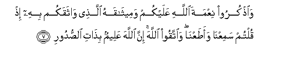

#وَاذْكُرُوا نِعْمَةَ اللَّهِ عَلَيْكُمْ وَمِيثَاقَهُ الَّذِي وَاثَقَكُمْ بِهِ إِذْ قُلْتُمْ سَمِعْنَا وَأَطَعْنَا ۖ وَاتَّقُوا اللَّهَ ۚ إِنَّ اللَّهَ عَلِيمٌ بِذَاتِ الصُّدُورِ 

##Waothkuroo niAAmata Allahi AAalaykum wameethaqahu allathee wathaqakum bihi ith qultum samiAAna waataAAna waittaqoo Allaha inna Allaha AAaleemun bithati alssudoori 

## 翻译(Translation)：

| Translator | 译文(Translation)                                            |
| :--------: | ------------------------------------------------------------ |
|    马坚    | 你们当铭记真主所赐你们的恩典, 和他与你们所缔的盟约; 当时, 你们曾说: 我们听从了。你们当敬畏真主。真主确是全知心事的。 |
|  YUSUFALI  | And call in remembrance the favor of Allah unto you and His Covenant which He ratified with you when ye said: "We hear and we obey": and fear Allah for Allah knoweth well the secrets of your hearts. |
| PICKTHALL  | Remember Allah's grace upon you and His covenant by which He bound you when ye said: We hear and we obey; And keep your duty to Allah. Lo! He knoweth what is in the breasts (of men). |
|   SHAKIR   | And remember the favor of Allah on you and His covenant with which He bound you firmly, when you said: We have heard and we obey, and be careful of (your duty to) Allah, surely Allah knows what is in the breasts. |

---

## 对位释义(Words Interpretation)：

| No   | العربية | 中文    | English | 曾用词 |
| ---- | ------: | ------- | ------- | ------ |
| 序号 |    阿文 | Chinese | 英文    | Used   |
| 5:7.1  | وَاذْكُرُوا | 和记得     | and remember     | 见2:63.11  |
| 5:7.2  | نِعْمَةَ    | 恩典       | favour           | 见2:211.11 |
| 5:7.3  | اللَّهِ    | 真主的     | of Allah         | 见2:23.17  |
| 5:7.4  | عَلَيْكُمْ   | 在你们     | on you           | 见2:40.8   |
| 5:7.5  | وَمِيثَاقَهُ | 和他的盟约 | and His covenant | 参2:83.3   |
| 5:7.6  | الَّذِي    | 谁，那些   | those who        | 见2:6.2    |
| 5:7.7  | وَاثَقَكُمْ  | 他与你们缔 | He bound you     |            |
| 5:7.8  | بِهِ      | 以它       | with it          | 见2:22.13  |
| 5:7.9  | إِذْ      | 当时       | when             | 见2:131.1  |
| 5:7.10 | قُلْتُمْ    | 你们说     | You said         | 见2:55.2   |
| 5:7.11 | سَمِعْنَا   | 我们听了   | we heard         | 见2:93.13  |
| 5:7.12 | وَأَطَعْنَا  | 和我们服从 | and we obey      | 见2:285.23 |
| 5:7.13 | وَاتَّقُوا  | 和畏惧     | And fear         | 见2:48.1   |
| 5:7.14 | اللَّهَ    | 安拉，真主 | Allah            | 见1:1.2    |
| 5:7.15 | إِنَّ      | 的确       | surely           | 见2:6.1    |
| 5:7.16 | اللَّهَ    | 安拉，真主 | Allah            | 见1:1.2    |
| 5:7.17 | عَلِيمٌ    | 全知的     | Knowing          | 见2:29.19  |
| 5:7.18 | بِذَاتِ    | 在什么     | in what          | 见3:119.27 |
| 5:7.19 | الصُّدُورِ  | 众胸       | the breasts      | 见3:119.28 |

---
