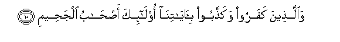

#وَالَّذِينَ كَفَرُوا وَكَذَّبُوا بِآيَاتِنَا أُولَٰئِكَ أَصْحَابُ الْجَحِيمِ 

##Waallatheena kafaroo wakaththaboo biayatina olaika ashabu aljaheemi 

## 翻译(Translation)：

| Translator | 译文(Translation)                                            |
| :--------: | ------------------------------------------------------------ |
|    马坚    | 不信道而且否认我的迹象的人, 是火狱的居民。                   |
|  YUSUFALI  | Those who reject faith and deny our signs will be companions of hell-fire. |
| PICKTHALL  | And they who disbelieve and deny Our revelations, such are rightful owners of hell. |
|   SHAKIR   | And (as for) those who disbelieve and reject our communications, these are the companions of the name. |

---

## 对位释义(Words Interpretation)：

| No   | العربية | 中文    | English | 曾用词 |
| ---- | ------: | ------- | ------- | ------ |
| 序号 |    阿文 | Chinese | 英文    | Used   |
| 5:10.1 | وَالَّذِينَ  | 和那些       | and those who | 见2:21.8   |
| 5:10.2 | كَفَرُوا   | 不信         | disbelieve    | 见2:6.3    |
| 5:10.3 | وَكَذَّبُوا  | 和否认       | and deny      | 见2:39.3   |
| 5:10.4 | بِآيَاتِنَا | 在我们的迹象 | in Our signs  | 见2:39.4   |
| 5:10.5 | أُولَٰئِكَ   | 这等人       | These are     | 见2:5.1    |
| 5:10.6 | أَصْحَابُ   | 居民         | companions | 见2:39.6   |
| 5:10.7 | الْجَحِيمِ  | 火狱         | hell-fire     | 见2:119.10 |

---
