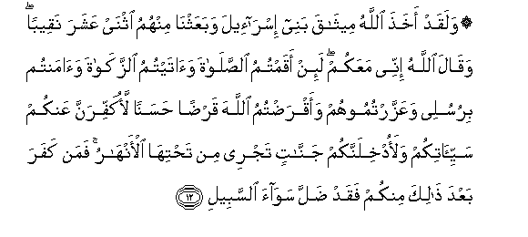

#۞ وَلَقَدْ أَخَذَ اللَّهُ مِيثَاقَ بَنِي إِسْرَائِيلَ وَبَعَثْنَا مِنْهُمُ اثْنَيْ عَشَرَ نَقِيبًا ۖ وَقَالَ اللَّهُ إِنِّي مَعَكُمْ ۖ لَئِنْ أَقَمْتُمُ الصَّلَاةَ وَآتَيْتُمُ الزَّكَاةَ وَآمَنْتُمْ بِرُسُلِي وَعَزَّرْتُمُوهُمْ وَأَقْرَضْتُمُ اللَّهَ قَرْضًا حَسَنًا لَأُكَفِّرَنَّ عَنْكُمْ سَيِّئَاتِكُمْ وَلَأُدْخِلَنَّكُمْ جَنَّاتٍ تَجْرِي مِنْ تَحْتِهَا الْأَنْهَارُ ۚ فَمَنْ كَفَرَ بَعْدَ ذَٰلِكَ مِنْكُمْ فَقَدْ ضَلَّ سَوَاءَ السَّبِيلِ 

##Walaqad akhatha Allahu meethaqa banee israeela wabaAAathna minhumu ithnay AAashara naqeeban waqala Allahu innee maAAakum lain aqamtumu alssalata waataytumu alzzakata waamantum birusulee waAAazzartumoohum waaqradtumu Allaha qardan hasanan laokaffiranna AAankum sayyiatikum walaodkhilannakum jannatin tajree min tahtiha alanharu faman kafara baAAda thalika minkum faqad dalla sawaa alssabeeli 

## 翻译(Translation)：

| Translator | 译文(Translation)                                            |
| :--------: | ------------------------------------------------------------ |
|    马坚    | 真主与以色列的后裔确已缔约，并从他们中派出十二个首领。真主说：我确与你们同在。如果你们谨守拜功，完纳天课，确信我的众使者，并协助他们，并以善债借给真主，我必勾销你们的罪恶，我必让你们进入下临诸河的乐园。此后，谁不信道，谁已迷失了正路。 |
|  YUSUFALI  | Allah did aforetime take a Covenant from the Children of Israel and We appointed twelve captains among them and Allah said: "I am with you: if ye (but) establish regular prayers practice regular charity believe in My apostles honor and assist them and loan to Allah a beautiful loan verily I will wipe out from you your evils and admit you to gardens with rivers flowing beneath; but if any of you after this resisteth faith he hath truly wandered from the path of rectitude." |
| PICKTHALL  | Allah made a covenant of old with the Children of Israel and We raised among them twelve chieftains, and Allah said: Lo! I am with you. If ye establish worship and pay the poor-due, and believe in My messengers and support them, and lend unto Allah a kindly loan, surely I shall remit your sins, and surely I shall bring you into Gardens underneath which rivers flow. Whoso among you disbelieveth after this will go astray from a plain road. |
|   SHAKIR   | And certainly Allah made a covenant with the children of Israel, and We raised up among them twelve chieftains; and Allah said: Surely I am with you; if you keep up prayer and pay the poor-rate and believe in My apostles and asslst them and offer to Allah a goodly gift, I will most certainly cover your evil deeds, and I will most certainly cause you to enter into gardens beneath which rivers flow, but whoever disbelieves from among you after that, he indeed shall lose the right way. |

---

## 对位释义(Words Interpretation)：

| No   | العربية | 中文    | English | 曾用词 |
| ---- | ------: | ------- | ------- | ------ |
| 序号 |    阿文 | Chinese | 英文    | Used   |
| 5:12.1  | وَلَقَدْ      | 和确实           | And certainly          | 见2:65.1   |
| 5:12.2  | أَخَذَ       | 他缔             | he take                | 见3:81.2   |
| 5:12.3  | اللَّهُ      | 安拉，真主       | Allah                  | 见2:7.2 |
| 5:12.4  | مِيثَاقَ     | 约               | a covenant             | 见2:83.3   |
| 5:12.5  | بَنِي       | 后裔             | Children               | 见2:40.2   |
| 5:12.6  | إِسْرَائِيلَ   | 以色列           | Israel                 | 见2:40.3   |
| 5:12.7  | وَبَعَثْنَا    | 和我们指派       | and We appointed       |            |
| 5:12.8  | مِنْهُمُ      | 从他们           | from them              | 见2:75.8   |
| 5:12.9  | اثْنَيْ      | 二               | two                    |            |
| 5:12.10 | عَشَرَ       | 十               | ten                    |            |
| 5:12.11 | نَقِيبًا     | 众首领           | chieftains             |            |
| 5:12.12 | وَقَالَ      | 和他说，         | and he said            | 见2:118.1  |
| 5:12.13 | اللَّهُ      | 安拉，真主       | Allah                  | 见2:7.2 |
| 5:12.14 | إِنِّي       | 确实我           | surely I               | 见2:30.5   |
| 5:12.15 | مَعَكُمْ      | 随着你           | With you               | 见2:14.13  |
| 5:12.16 | لَئِنْ       | 如果             | if                     |            |
| 5:12.17 | أَقَمْتُمُ     | 你们谨守         | you keep up            | 参4:162.15 |
| 5:12.18 | الصَّلَاةَ    | 拜功，祈祷       | Prayer                 | 见2:43.2   |
| 5:12.19 | وَآتَيْتُمُ    | 和你们付         | and you pay            | 参4:162.17 |
| 5:12.20 | الزَّكَاةَ    | 天课             | Zakat                  | 见2:43.4   |
| 5:12.21 | وَآمَنْتُمْ    | 和你们相信       | and you believe        | 见4:147.7  |
| 5:12.22 | بِرُسُلِي     | 在我的众使者     | in My messengers       |            |
| 5:12.23 | وَعَزَّرْتُمُوهُمْ | 和你们协助他们   | and you assist them    |            |
| 5:12.24 | وَأَقْرَضْتُمُ   | 和你们借         | and you lend           | 参2:245.4  |
| 5:12.25 | اللَّهَ      | 安拉，真主       | Allah                  | 见2:9.2 |
| 5:12.26 | قَرْضًا      | 债               | loan                   | 见2:245.6  |
| 5:12.27 | حَسَنًا      | 善的             | goodly                 | 见2:245.7  |
| 5:12.28 | لَأُكَفِّرَنَّ    | 必定我消除       | verily I shall remit   | 见3:195.27 |
| 5:12.29 | عَنْكُمْ      | 在你们           | on you                 | 见2:52.3   |
| 5:12.30 | سَيِّئَاتِكُمْ   | 你们的坏行为     | your ill-deeds         | 见2:271.16 |
| 5:12.31 | وَلَأُدْخِلَنَّكُمْ | 和我必定允许你们 | and surely I admit you |            |
| 5:12.32 | جَنَّاتٍ      | 天园             | Paradises              | 见2:25.8   |
| 5:12.33 | تَجْرِي      | 流过             | flow                   | 见2:25.9   |
| 5:12.34 | مِنْ        | 从               | from                   | 见2:4.8    |
| 5:12.35 | تَحْتِهَا     | 下方             | Underneath             | 见2:25.11  |
| 5:12.36 | الْأَنْهَارُ   | 河流             | Rivers                 | 见2:74.18  |
| 5:12.37 | فَمَنْ       | 无论谁           | whosoever              | 见2:38.9   |
| 5:12.38 | كَفَرَ       | 不信             | disbelieve             | 见2:102.9  |
| 5:12.39 | بَعْدَ       | 之后             | after                  | 见2:27.6   |
| 5:12.40 | ذَٰلِكَ       | 这个             | this                   | 见2:2.1    |
| 5:12.41 | مِنْكُمْ      | 从你们           | Of you                 | 见2:65.5   |
| 5:12.42 | فَقَدْ       | 然后当然         | then may               | 见2:108.15 |
| 5:12.43 | ضَلَّ        | 迷失             | astray                 | 见2:108.16 |
| 5:12.44 | سَوَاءَ      | 正确的           | right                  | 见2:108.17 |
| 5:12.45 | السَّبِيلِ    | 道路             | The way                | 见2:108.18 |

---
