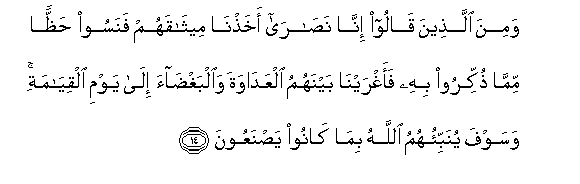

#وَمِنَ الَّذِينَ قَالُوا إِنَّا نَصَارَىٰ أَخَذْنَا مِيثَاقَهُمْ فَنَسُوا حَظًّا مِمَّا ذُكِّرُوا بِهِ فَأَغْرَيْنَا بَيْنَهُمُ الْعَدَاوَةَ وَالْبَغْضَاءَ إِلَىٰ يَوْمِ الْقِيَامَةِ ۚ وَسَوْفَ يُنَبِّئُهُمُ اللَّهُ بِمَا كَانُوا يَصْنَعُونَ 

##Wamina allatheena qaloo inna nasara akhathna meethaqahum fanasoo haththan mimma thukkiroo bihi faaghrayna baynahumu alAAadawata waalbaghdaa ila yawmi alqiyamati wasawfa yunabbiohumu Allahu bima kanoo yasnaAAoona 

## 翻译(Translation)：

| Translator | 译文(Translation)                                            |
| :--------: | ------------------------------------------------------------ |
|    马坚    | 自称基督教徒的人，我曾与他们缔约，但他们抛弃自己所受的一部分劝戒，故我使他们互相仇恨，至于复活日。那时，真主要把他们的行为告诉他们。 |
|  YUSUFALI  | From those too who call themselves Christians We did take a Covenant but they forgot a good part of the Message that was sent them: so We estranged them with enmity and hatred between the one and the other to the Day of Judgment. And soon will Allah show them what it is they have done. |
| PICKTHALL  | And with those who say: "Lo! we are Christians," We made a covenant, but they forgot a part of that whereof they were admonished. Therefor We have stirred up enmity and hatred among them till the Day of Resurrection, when Allah will inform them of their handiwork. |
|   SHAKIR   | And with those who say, We are Christians, We made a covenant, but they neglected a portion of what they were reminded of, therefore We excited among them enmity and hatred to the day of resurrection; and Allah will inform them of what they did. |

---

## 对位释义(Words Interpretation)：

| No   | العربية | 中文    | English | 曾用词 |
| ---- | ------: | ------- | ------- | ------ |
| 序号 |    阿文 | Chinese | 英文    | Used   |
| 5:14.1  | وَمِنَ      | 和从             | And from            | 见2:8.1    |
| 5:14.2  | الَّذِينَ    | 谁，那些         | those who           | 见2:6.2    |
| 5:14.3  | قَالُوا    | 他们说，         | They said           | 见2:11.8   |
| 5:14.4  | إِنَّا      | 确实我们         | surely we           | 见2:14.12  |
| 5:14.5  | نَصَارَىٰ    | 基督教徒         | a Christian         | 见2:111.10 |
| 5:14.6  | أَخَذْنَا    | 我们缔结         | we took             | 见2:63.2   |
| 5:14.7  | مِيثَاقَهُمْ  | 他们的盟约       | their covenant      | 见4:155.3  |
| 5:14.8  | فَنَسُوا    | 但是他们抛弃     | but they forgot     | 参5:13.12  |
| 5:14.9  | حَظًّا      | 一部分           | a portion           | 见3:176.17 |
| 5:14.10 | مِمَّا      | 关于什么         | to what             | 见2:23.5   |
| 5:14.11 | ذُكِّرُوا    | 他们被劝诫       | they were reminded  | 见5:13.15  |
| 5:14.12 | بِهِ       | 以它             | with it             | 见2:22.13  |
| 5:14.13 | فَأَغْرَيْنَا  | 因此我们使疏远   | so We estranged     |            |
| 5:14.14 | بَيْنَهُمُ    | 他们的之间       | among them          |            |
| 5:14.15 | الْعَدَاوَةَ  | 仇恨             | enmity              |            |
| 5:14.16 | وَالْبَغْضَاءَ | 和怨恨           | and hatred          |            |
| 5:14.17 | إِلَىٰ      | 至               | to                  | 见2:14.9   |
| 5:14.18 | يَوْمِ      | 日，日子，时候的 | day                 | 见1:4.2    |
| 5:14.19 | الْقِيَامَةِ  | 复活的           | Resurrection        | 见2:85.40  |
| 5:14.20 | وَسَوْفَ     | 和不久           | and shall soon      | 见4:146.13 |
| 5:14.21 | يُنَبِّئُهُمُ   | 他告诉他们       | he will inform them |            |
| 5:14.22 | اللَّهُ     | 安拉，真主       | Allah               | 见1:1.2    |
| 5:14.23 | بِمَا      | 在什么           | in what             | 见2:4.3    |
| 5:14.24 | كَانُوا    | 他们是           | they were           | 见2:10:11  |
| 5:14.25 | يَصْنَعُونَ   | 他们做           | they did            |            |

---
