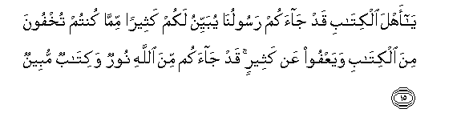

#يَا أَهْلَ الْكِتَابِ قَدْ جَاءَكُمْ رَسُولُنَا يُبَيِّنُ لَكُمْ كَثِيرًا مِمَّا كُنْتُمْ تُخْفُونَ مِنَ الْكِتَابِ وَيَعْفُو عَنْ كَثِيرٍ ۚ قَدْ جَاءَكُمْ مِنَ اللَّهِ نُورٌ وَكِتَابٌ مُبِينٌ 

##Ya ahla alkitabi qad jaakum rasooluna yubayyinu lakum katheeran mimma kuntum tukhfoona mina alkitabi wayaAAfoo AAan katheerin qad jaakum mina Allahi noorun wakitabun mubeenun 

## 翻译(Translation)：

| Translator | 译文(Translation)                                            |
| :--------: | ------------------------------------------------------------ |
|    马坚    | 信奉天经的人啊！我的使者确已来临你们，他要为你们阐明你们所隐讳的许多经，并放弃许多经文，不加以揭发。有一道光明，和一部明确的经典，确已从真主降临你们。 |
|  YUSUFALI  | O People of the Book! there hath come to you Our Apostle revealing to you much that ye used to hide in the Book and passing over much (that is now unnecessary): There hath come to you from Allah a (new) Light and a perspicuous Book. |
| PICKTHALL  | O People of the Scripture! Now hath Our messenger come unto you, expounding unto you much of that which ye used to hide in the Scripture, and forgiving much. now hath come unto you light from Allah and plain Scripture, |
|   SHAKIR   | O followers of the Book! indeed Our Apostle has come to you making clear to you much of what you concealed of the Book and passing over much; indeed, there has come to you light and a clear Book from Allah; |

---

## 对位释义(Words Interpretation)：

| No   | العربية | 中文    | English | 曾用词 |
| ---- | ------: | ------- | ------- | ------ |
| 序号 |    阿文 | Chinese | 英文    | Used   |
| 5:15.1  | يَا     | 啊         | Oh             | 见2:21.1   |
| 5:15.2  | أَهْلَ    | 人们       | People         | 见3:64.3   |
| 5:15.3  | الْكِتَابِ | 这部经的   | of the Book    | 见2:85.25  |
| 5:15.4  | قَدْ     | 当然       | may            | 见2:60.14  |
| 5:15.5  | جَاءَكُمْ  | 他来到你们 | He came to you | 见2:87.18  |
| 5:15.6  | رَسُولُنَا | 我们的使者 | Our messenger  | 参4:171.19 |
| 5:15.7  | يُبَيِّنُ   | 他阐明     | he make clear  | 见2:187.60 |
| 5:15.8  | لَكُمْ    | 为你们     | For you        | 见2:22.3   |
| 5:15.9  | كَثِيرًا  | 多         | Much           | 见2:26.31  |
| 5:15.10 | مِمَّا    | 关于什么   | to what        | 见2:23.5   |
| 5:15.11 | كُنْتُمْ   | 你们是     | You are        | 见2:23.2   |
| 5:15.12 | تُخْفُونَ  | 你们隐藏   | you concealed  | 见4:114.4  |
| 5:15.13 | مِنَ     | 从         | from           | 见2:4.8    |
| 5:15.14 | الْكِتَابِ | 这部经的   | of the Book    | 见2:85.25  |
| 5:15.15 | وَيَعْفُو  | 和他放弃   | and he passing |            |
| 5:15.16 | عَنْ     | 从         | on             | 见2:48.6   |
| 5:15.17 | كَثِيرٍ   | 大多数     | most           |            |
| 5:15.18 | قَدْ     | 当然       | may            | 见2:60.14  |
| 5:15.19 | جَاءَكُمْ  | 他来到你们 | He came to you | 见2:87.18  |
| 5:15.20 | مِنَ     | 从         | from           | 见2:4.8    |
| 5:15.21 | اللَّهِ   | 真主的     | of Allah       | 见2:23.17  |
| 5:15.22 | نُورٌ    | 一道光     | light          |            |
| 5:15.23 | وَكِتَابٌ  | 和经典     | and a book     | 参2:89.3   |
| 5:15.24 | مُبِينٌ   | 明确的     | open           | 见2:168.17 |

---
