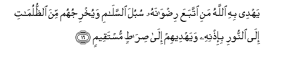

#يَهْدِي بِهِ اللَّهُ مَنِ اتَّبَعَ رِضْوَانَهُ سُبُلَ السَّلَامِ وَيُخْرِجُهُمْ مِنَ الظُّلُمَاتِ إِلَى النُّورِ بِإِذْنِهِ وَيَهْدِيهِمْ إِلَىٰ صِرَاطٍ مُسْتَقِيمٍ 

##Yahdee bihi Allahu mani ittabaAAa ridwanahu subula alssalami wayukhrijuhum mina alththulumati ila alnnoori biithnihi wayahdeehim ila siratin mustaqeemin 

## 翻译(Translation)：

| Translator | 译文(Translation)                                            |
| :--------: | ------------------------------------------------------------ |
|    马坚    | 真主要借这部经典指引追求其喜悦的人走上平安的道路，依自己的意志把他们从重重黑暗引入光明，并将他们引入正路。 |
|  YUSUFALI  | Wherewith Allah guideth all who seek His good pleasure to ways of peace and safety and leadeth them out of darkness by His Will unto the light guideth them to a Path that is Straight. |
| PICKTHALL  | Whereby Allah guideth him who seeketh His good pleasure unto paths of peace. He bringeth them out of darkness unto light by His decree, and guideth them unto a straight path. |
|   SHAKIR   | With it Allah guides him who will follow His pleasure into the ways of safety and brings them out of utter darkness into light by His will and guides them to the right path. |

---

## 对位释义(Words Interpretation)：

| No   | العربية | 中文    | English | 曾用词 |
| ---- | ------: | ------- | ------- | ------ |
| 序号 |    阿文 | Chinese | 英文    | Used   |
| 5:16.1  | يَهْدِي    | 他引导       | he guides              | 见2:142.16 |
| 5:16.2  | بِهِ      | 以它         | with it                | 见2:22.13  |
| 5:16.3  | اللَّهُ    | 安拉，真主   | Allah                  | 见1:1.2    |
| 5:16.4  | مَنِ      | 谁           | who                    | 见2:189.18 |
| 5:16.5  | اتَّبَعَ    | 他追求       | he follows             | 见3:162.2  |
| 5:16.6  | رِضْوَانَهُ  | 他的喜悦     | His pleasure           | 参3:162.3  |
| 5:16.7  | سُبُلَ     | 众道路       | ways                   |            |
| 5:16.8  | السَّلَامِ  | 平安的       | of peace               |            |
| 5:16.9  | وَيُخْرِجُهُمْ | 和他带出他们 | and He brings them out | 参2:257.5  |
| 5:16.10 | مِنَ      | 从           | from                   | 见2:4.8    |
| 5:16.11 | الظُّلُمَاتِ | 重重黑暗     | the darkness           | 见2:257.7  |
| 5:16.12 | إِلَى     | 至           | to                     | 见2:14.9   |
| 5:16.13 | النُّورِ   | 光明         | the light              | 见2:257.9  |
| 5:16.14 | بِإِذْنِهِ   | 以他的意旨   | by His will            | 见2:213.42 |
| 5:16.15 | وَيَهْدِيهِمْ | 和他指示他们 | and He guide them      | 见4:175.12 |
| 5:16.16 | إِلَىٰ     | 至           | to                     | 见2:14.9   |
| 5:16.17 | صِرَاطٍ    | 路径         | path, way              | 见1:7.1    |
| 5:16.18 | مُسْتَقِيمٍ  | 端正的       | straight               | 见2:142.21 |

---
