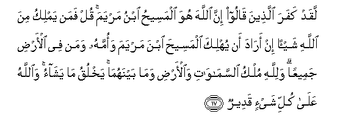

#لَقَدْ كَفَرَ الَّذِينَ قَالُوا إِنَّ اللَّهَ هُوَ الْمَسِيحُ ابْنُ مَرْيَمَ ۚ قُلْ فَمَنْ يَمْلِكُ مِنَ اللَّهِ شَيْئًا إِنْ أَرَادَ أَنْ يُهْلِكَ الْمَسِيحَ ابْنَ مَرْيَمَ وَأُمَّهُ وَمَنْ فِي الْأَرْضِ جَمِيعًا ۗ وَلِلَّهِ مُلْكُ السَّمَاوَاتِ وَالْأَرْضِ وَمَا بَيْنَهُمَا ۚ يَخْلُقُ مَا يَشَاءُ ۚ وَاللَّهُ عَلَىٰ كُلِّ شَيْءٍ قَدِيرٌ 

##Laqad kafara allatheena qaloo inna Allaha huwa almaseehu ibnu maryama qul faman yamliku mina Allahi shayan in arada an yuhlika almaseeha ibna maryama waommahu waman fee alardi jameeAAan walillahi mulku alssamawati waalardi wama baynahuma yakhluqu ma yashao waAllahu AAala kulli shayin qadeerun 

## 翻译(Translation)：

| Translator | 译文(Translation)                                            |
| :--------: | ------------------------------------------------------------ |
|    马坚    | 妄言真主就是麦尔彦之子麦西哈的人，确已不信道了。你说：如果真主欲毁灭麦西哈和他的母亲麦尔彦，以及大地上的一切人，那末，谁能干涉真主一丝毫呢？天地万物的国权，只是真主的，他创造他所欲创造的。真主对于万事是全能的。 |
|  YUSUFALI  | In blasphemy indeed are those that say that Allah is Christ the son of Mary. Say: "Who then hath the least power against Allah if His Will were to destroy Christ the son of Mary his mother and all everyone that is on the earth? For to Allah belongeth the dominion of the heavens and the earth and all that is between. He createth what He pleaseth. For Allah hath power over all things." |
| PICKTHALL  | They indeed have disbelieved who say: Lo! Allah is the Messiah, son of Mary. Say: Who then can do aught against Allah, if He had willed to destroy the Messiah son of Mary, and his mother and everyone on earth ? Allah's is the Sovereignty of the heavens and the earth and all that is between them. He createth what He will. And Allah is Able to do all things. |
|   SHAKIR   | Certainly they disbelieve who say: Surely, Allah-- He is the Messiah, son of Marium. Say: Who then could control anything as against Allah when He wished to destroy the Messiah son of Marium and his mother and all those on the earth? And Allah's is the kingdom of the heavens and the earth and what is between them; He creates what He pleases; and Allah has power over all things, |

---

## 对位释义(Words Interpretation)：

| No   | العربية | 中文    | English | 曾用词 |
| ---- | ------: | ------- | ------- | ------ |
| 序号 |    阿文 | Chinese | 英文    | Used   |
| 5:17.1  | لَقَدْ      | 必定         | Certainly        | 见3:164.1  |
| 5:17.2  | كَفَرَ      | 不信         | disbelieve       | 见2:102.9  |
| 5:17.3  | الَّذِينَ    | 谁，那些     | those who        | 见2:6.2    |
| 5:17.4  | قَالُوا    | 他们说，     | They said        | 见2:11.8   |
| 5:17.5  | إِنَّ       | 的确         | surely           | 见2:6.1    |
| 5:17.6  | اللَّهَ     | 安拉，真主   | Allah            | 见2:9.2 |
| 5:17.7  | هُوَ       | 他是         | He is            | 见2:29.1   |
| 5:17.8  | الْمَسِيحُ   | 麦西哈       | the Messiah      | 见3:45.12  |
| 5:17.9  | ابْنُ      | 儿子         | son              | 见3:45.14  |
| 5:17.10 | مَرْيَمَ     | 麦尔彦       | Marium           | 见2:87.12  |
| 5:17.11 | قُلْ       | 你说         | Say              | 见2:80.8   |
| 5:17.12 | فَمَنْ      | 无论谁       | whosoever        | 见2:38.9   |
| 5:17.13 | يَمْلِكُ     | 他控制   | he control       |            |
| 5:17.14 | مِنَ       | 从           | from             | 见2:19.3 |
| 5:17.15 | اللَّهِ     | 真主的       | of Allah         | 见2:23.17  |
| 5:17.16 | شَيْئًا     | 一件事情     | a thing          | 见2:48.8   |
| 5:17.17 | إِنْ       | 如果         | if               | 见2:23.18  |
| 5:17.18 | أَرَادَ     | 宗旨，希望   | want, wish       | 见2:26.25  |
| 5:17.19 | أَنْ       | 该           | that             | 见2:26.5   |
| 5:17.20 | يُهْلِكَ     | 他毁灭       | he destroy       |            |
| 5:17.21 | الْمَسِيحَ   | 麦西哈       | the Messiah      | 见4:157.4  |
| 5:17.22 | ابْنَ      | 儿子         | Son              | 见2:87.11  |
| 5:17.23 | مَرْيَمَ     | 麦尔彦       | Marium           | 见2:87.12  |
| 5:17.24 | وَأُمَّهُ     | 和他的母亲   | and his mother   |            |
| 5:17.25 | وَمَنْ      | 和谁         | and who          | 见2:108.11 |
| 5:17.26 | فِي       | 在           | in               | 见2:10.1   |
| 5:17.27 | الْأَرْضِ    | 大地         | Earth            | 见2:22.4   |
| 5:17.28 | جَمِيعًا    | 所有         | All              | 见2:29.8   |
| 5:17.29 | وَلِلَّهِ     | 和归真主     | and to Allah     | 见2:115.1  |
| 5:17.30 | مُلْكُ      | 国权         | the kingdom      | 见2:102.6  |
| 5:17.31 | السَّمَاوَاتِ | 诸天的       | of the heavens   | 见2:33.16  |
| 5:17.32 | وَالْأَرْضِ   | 和土地       | and earth        | 见2:33.17  |
| 5:17.33 | وَمَا      | 和什么       | and that         | 见2:4.6    |
| 5:17.34 | بَيْنَهُمَا   | 他俩之间的   | between the two  | 见4:35.17  |
| 5:17.35 | يَخْلُقُ     | 创造         | creates          | 见3:47.13  |
| 5:17.36 | مَا       | 什么         | what/ that which | 见2:17.8   |
| 5:17.37 | يَشَاءُ     | 他意欲       | He pleases       | 见2:90.18  |
| 5:17.38 | وَاللَّهُ    | 和安拉，真主 | and Allah        | 见2:19.17  |
| 5:17.39 | عَلَىٰ      | 至           | On               | 见2:5.2    |
| 5:17.40 | كُلِّ       | 所有         | All              | 见2:20.23  |
| 5:17.41 | شَيْءٍ      | 事物         | Thing            | 见2:20.24  |
| 5:17.42 | قَدِيرٌ     | 全能，大能的 | Mighty           | 见2:20.25  |

---
