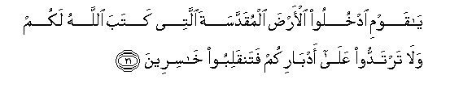

#يَا قَوْمِ ادْخُلُوا الْأَرْضَ الْمُقَدَّسَةَ الَّتِي كَتَبَ اللَّهُ لَكُمْ وَلَا تَرْتَدُّوا عَلَىٰ أَدْبَارِكُمْ فَتَنْقَلِبُوا خَاسِرِينَ 

##Ya qawmi odkhuloo alarda almuqaddasata allatee kataba Allahu lakum wala tartaddoo AAala adbarikum fatanqaliboo khasireena 

## 翻译(Translation)：

| Translator | 译文(Translation)                                            |
| :--------: | ------------------------------------------------------------ |
|    马坚    | 我的宗族呀！你们当进真主所为你们注定的圣地，你们不可败北；否则，你们要变成亏折的人。 |
|  YUSUFALI  | "O my people! enter the holy land which Allah hath assigned unto you and turn not back ignominiously for then will ye be overthrown to your own ruin." |
| PICKTHALL  | O my people! Go into the holy land which Allah hath ordained for you. Turn not in flight, for surely ye turn back as losers: |
|   SHAKIR   | O my people! enter the holy land which Allah has prescribed for you and turn not on your backs for then you will turn back losers. |

---

## 对位释义(Words Interpretation)：

| No   | العربية | 中文    | English | 曾用词 |
| ---- | ------: | ------- | ------- | ------ |
| 序号 |    阿文 | Chinese | 英文    | Used   |
| 5:21.1  | يَا       | 啊           | Oh                    | 见2:21.1   |
| 5:21.2  | قَوْمِ      | 我的宗族     | my people             | 见2:54.6   |
| 5:21.3  | ادْخُلُوا   | 进入         | Enter                 | 见2:58.3   |
| 5:21.4  | الْأَرْضَ    | 土地         | Earth                 | 见2:11.7   |
| 5:21.5  | الْمُقَدَّسَةَ  | 神圣的       | the holy              |            |
| 5:21.6  | الَّتِي     | 哪           | Which                 | 见2:24.8   |
| 5:21.7  | كَتَبَ      | 注定         | has ordained          | 见2:187.28 |
| 5:21.8  | اللَّهُ     | 安拉，真主   | Allah                 | 见2:7.2 |
| 5:21.9  | لَكُمْ      | 为你们       | For you               | 见2:22.3   |
| 5:21.10 | وَلَا      | 也不         | and not               | 见1:7.8    |
| 5:21.11 | تَرْتَدُّوا   | 你们转       | you will turn         |            |
| 5:21.12 | عَلَىٰ      | 至           | On                    | 见2:5.2    |
| 5:21.13 | أَدْبَارِكُمْ  | 你们的背     | your back             |            |
| 5:21.14 | فَتَنْقَلِبُوا | 然后你们成为 | so you will turn back | 见3:149.12 |
| 5:21.15 | خَاسِرِينَ   | 众亏折的人   | losers                | 见3:149.13 |

---
