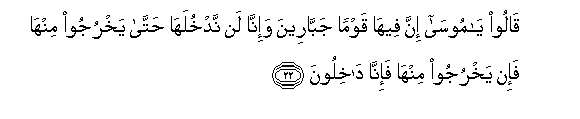

#قَالُوا يَا مُوسَىٰ إِنَّ فِيهَا قَوْمًا جَبَّارِينَ وَإِنَّا لَنْ نَدْخُلَهَا حَتَّىٰ يَخْرُجُوا مِنْهَا فَإِنْ يَخْرُجُوا مِنْهَا فَإِنَّا دَاخِلُونَ 

##Qaloo ya moosa inna feeha qawman jabbareena wainna lan nadkhulaha hatta yakhrujoo minha fain yakhrujoo minha fainna dakhiloona 

## 翻译(Translation)：

| Translator | 译文(Translation)                                            |
| :--------: | ------------------------------------------------------------ |
|    马坚    | 他们说：穆萨呀！圣地中，的确有一个强大的种族，我们绝不进去，直到他们出来。如果他们出来，我们必定进去。 |
|  YUSUFALI  | They said: "O Moses! in this land are a people of exceeding strength: never shall we enter it until they leave it: if (once) they leave then shall we enter." |
| PICKTHALL  | They said: O Moses! Lo! a giant people (dwell) therein and lo! we go not in till they go forth from thence. When they go forth from thence, then we will enter (not till then). |
|   SHAKIR   | They said: O Musa! surely there is a strong race in it, and we will on no account enter it until they go out from it, so if they go out from it, then surely we will enter. |

---

## 对位释义(Words Interpretation)：

| No   | العربية | 中文    | English | 曾用词 |
| ---- | ------: | ------- | ------- | ------ |
| 序号 |    阿文 | Chinese | 英文    | Used   |
| 5:22.1  | قَالُوا  | 他们说，   | They said   | 见2:11.8  |
| 5:22.2  | يَا     | 啊         | Oh          | 见2:21.1  |
| 5:22.3  | مُوسَىٰ   | 穆萨       | Moses       | 见2:51.3  |
| 5:22.4  | إِنَّ     | 的确       | surely      | 见2:6.1   |
| 5:22.5  | فِيهَا   | 在其中     | therein     | 见2:25.29 |
| 5:22.6  | قَوْمًا   | 民众       | a people    | 见3:86.4  |
| 5:22.7  | جَبَّارِينَ | 强大的     | strong      |           |
| 5:22.8  | وَإِنَّا   | 和我们     | and we      | 见2:70.13 |
| 5:22.9  | لَنْ     | 绝不       | will not    | 见2:55.5  |
| 5:22.10 | نَدْخُلَهَا | 我们进入它 | we enter it |           |
| 5:22.11 | حَتَّىٰ    | 直到       | Until       | 见2:55.8  |
| 5:22.12 | يَخْرُجُوا | 他们出来   | they go out |           |
| 5:22.13 | مِنْهَا   | 从它       | From it     | 见2:25.15 |
| 5:22.14 | فَإِنْ    | 因此如果   | then if     | 见2:24.1  |
| 5:22.15 | يَخْرُجُوا | 他们出来   | they go out | 见5:22.12 |
| 5:22.16 | مِنْهَا   | 从它       | From it     | 见2:25.15 |
| 5:22.17 | فَإِنَّا   | 因此确实   | then surely |           |
| 5:22.18 | دَاخِلُونَ | 我们进入   | we enter    |           |

---
