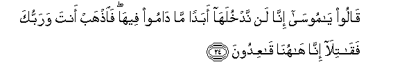

#قَالُوا يَا مُوسَىٰ إِنَّا لَنْ نَدْخُلَهَا أَبَدًا مَا دَامُوا فِيهَا ۖ فَاذْهَبْ أَنْتَ وَرَبُّكَ فَقَاتِلَا إِنَّا هَاهُنَا قَاعِدُونَ 

##Qaloo ya moosa inna lan nadkhulaha abadan ma damoo feeha faithhab anta warabbuka faqatila inna hahuna qaAAidoona 

## 翻译(Translation)：

| Translator | 译文(Translation)                                            |
| :--------: | ------------------------------------------------------------ |
|    马坚    | 他们说：穆萨啊！他们在圣地的期间，我们绝不进去。你和你的主去作战吧！我们必定要坐在这里。 |
|  YUSUFALI  | They said: O "Moses! while they remain there never shall we be able to enter to the end of time. Go thou and thy Lord and fight ye two while we sit here (and watch)." |
| PICKTHALL  | They said: O Moses! We will never enter (the land) while they are in it. So go thou and thy Lord and fight! We will sit here. |
|   SHAKIR   | They said: O Musa! we shall never enter it so long as they are in it; go therefore you and your Lord, then fight you both surely we will here sit down. |

---

## 对位释义(Words Interpretation)：

| No   | العربية | 中文    | English | 曾用词 |
| ---- | ------: | ------- | ------- | ------ |
| 序号 |    阿文 | Chinese | 英文    | Used   |
| 5:24.1  | قَالُوا  | 他们说，     | They said        | 见2:11.8   |
| 5:24.2  | يَا     | 啊           | Oh               | 见2:21.1   |
| 5:24.3  | مُوسَىٰ   | 穆萨         | Moses            | 见2:51.3   |
| 5:24.4  | إِنَّا    | 确实我们     | surely we        | 见2:14.12  |
| 5:24.5  | لَنْ     | 绝不         | will not         | 见2:55.5   |
| 5:24.6  | نَدْخُلَهَا | 我们进入它   | we enter it      | 见5:22.10  |
| 5:24.7  | أَبَدًا   | 永远         | forever          | 见2:95.3   |
| 5:24.8  | مَا     | 什么         | what/ that which | 见2:17.8   |
| 5:24.9  | دَامُوا  | 他们继续     | they are         |            |
| 5:24.10 | فِيهَا   | 在其中       | therein          | 见2:25.29  |
| 5:24.11 | فَاذْهَبْ  | 因此你们去   | so you go        |            |
| 5:24.12 | أَنْتَ    | 您           | thou             | 见2:32.10  |
| 5:24.13 | وَرَبُّكَ   | 和您的主     | and Your Lord    | 参2:30.3   |
| 5:24.14 | فَقَاتِلَا | 然后你们战斗 | then you fight   |            |
| 5:24.15 | إِنَّا    | 确实我们     | surely we        | 见2:14.12  |
| 5:24.16 | هَاهُنَا  | 这里         | here             | 见3:154.50 |
| 5:24.17 | قَاعِدُونَ | 坐着         | sit              |            |

---
