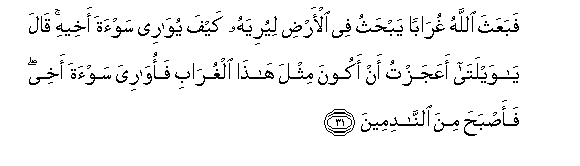

#فَبَعَثَ اللَّهُ غُرَابًا يَبْحَثُ فِي الْأَرْضِ لِيُرِيَهُ كَيْفَ يُوَارِي سَوْءَةَ أَخِيهِ ۚ قَالَ يَا وَيْلَتَا أَعَجَزْتُ أَنْ أَكُونَ مِثْلَ هَٰذَا الْغُرَابِ فَأُوَارِيَ سَوْءَةَ أَخِي ۖ فَأَصْبَحَ مِنَ النَّادِمِينَ 

##FabaAAatha Allahu ghuraban yabhathu fee alardi liyuriyahu kayfa yuwaree sawata akheehi qala ya waylata aAAajaztu an akoona mithla hatha alghurabi faowariya sawata akhee faasbaha mina alnnadimeena 

## 翻译(Translation)：

| Translator | 译文(Translation)                                            |
| :--------: | ------------------------------------------------------------ |
|    马坚    | 真主使一只乌鸦来掘地，以便指示他怎样掩埋他弟弟的尸体。他说：伤哉！我怎不能像这只乌鸦那样，把我弟弟的尸体掩埋起来呢？于是，他变成悔恨的人。 |
|  YUSUFALI  | Then Allah sent a raven who scratched the ground to show him how to hide the shame of his brother. "Woe is me!" said he: "Was I not even able to be as this raven and to hide the shame of my brother?" Then he became full of regrets. |
| PICKTHALL  | Then Allah sent a raven scratching up the ground, to show him how to hide his brother's naked corpse. He said: Woe unto me! Am I not able to be as this raven and so hide my brother's naked corpse ? And he became repentant. |
|   SHAKIR   | Then Allah sent a crow digging up the earth so that he might show him how he should cover the dead body of his brother. He said: Woe me! do I lack the strength that I should be like this crow and cover the dead body of my brother? So he became of those who regret. |

---

## 对位释义(Words Interpretation)：

| No   | العربية | 中文    | English | 曾用词 |
| ---- | ------: | ------- | ------- | ------ |
| 序号 |    阿文 | Chinese | 英文    | Used   |
| 5:31.1  | فَبَعَثَ     | 然后他派     | then he sent     | 见2:213.5  |
| 5:31.2  | اللَّهُ     | 安拉，真主   | Allah            | 见2:7.2 |
| 5:31.3  | غُرَابًا    | 一只乌鸦     | a raven          |            |
| 5:31.4  | يَبْحَثُ     | 它掘         | it digging       |            |
| 5:31.5  | فِي       | 在           | in               | 见2:10.1   |
| 5:31.6  | الْأَرْضِ    | 大地         | Earth            | 见2:22.4   |
| 5:31.7  | لِيُرِيَهُ    | 以便他指示他 | so he show him   |            |
| 5:31.8  | كَيْفَ      | 如何         | How              | 见2:28.1   |
| 5:31.9  | يُوَارِي    | 他掩埋       | he cover         |            |
| 5:31.10 | سَوْءَةَ     | 尸体         | the dead body    |            |
| 5:31.11 | أَخِيهِ     | 他兄弟       | his brother      | 见2:178.20 |
| 5:31.12 | قَالَ      | 他说，       | He said          | 见2:30.2   |
| 5:31.13 | يَا       | 啊           | Oh               | 见2:21.1   |
| 5:31.14 | وَيْلَتَا    | 伤哉我的     | Woe is me        |            |
| 5:31.15 | أَعَجَزْتُ    | 我不能吗？   | am I not able    |            |
| 5:31.16 | أَنْ       | 该           | that             | 见2:26.5   |
| 5:31.17 | أَكُونَ     | 我是         | I should be      | 见2:67.18  |
| 5:31.18 | مِثْلَ      | 类似         | Like             | 见2:113.21 |
| 5:31.19 | هَٰذَا      | 这个，此     | This             | 见2:25.20  |
| 5:31.20 | الْغُرَابِ   | 乌鸦         | the raven        |            |
| 5:31.21 | فَأُوَارِيَ   | 然后我掩埋   | so I cover       | 参5:31.9   |
| 5:31.22 | سَوْءَةَ     | 尸体         | the dead body    | 见5:31.10  |
| 5:31.23 | أَخِي      | 我的兄弟     | my brother       | 参2:178.20 |
| 5:31.24 | فَأَصْبَحَ    | 然后他成为   | then he became   |            |
| 5:31.25 | مِنَ       | 从           | from             | 见2:19.3 |
| 5:31.26 | النَّادِمِينَ | 悔恨的人     | those who regret |            |

---
