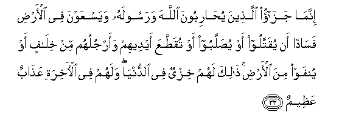

#إِنَّمَا جَزَاءُ الَّذِينَ يُحَارِبُونَ اللَّهَ وَرَسُولَهُ وَيَسْعَوْنَ فِي الْأَرْضِ فَسَادًا أَنْ يُقَتَّلُوا أَوْ يُصَلَّبُوا أَوْ تُقَطَّعَ أَيْدِيهِمْ وَأَرْجُلُهُمْ مِنْ خِلَافٍ أَوْ يُنْفَوْا مِنَ الْأَرْضِ ۚ ذَٰلِكَ لَهُمْ خِزْيٌ فِي الدُّنْيَا ۖ وَلَهُمْ فِي الْآخِرَةِ عَذَابٌ عَظِيمٌ 

##Innama jazao allatheena yuhariboona Allaha warasoolahu wayasAAawna fee alardi fasadan an yuqattaloo aw yusallaboo aw tuqattaAAa aydeehim waarjuluhum min khilafin aw yunfaw mina alardi thalika lahum khizyun fee alddunya walahum fee alakhirati AAathabun AAatheemun 

## 翻译(Translation)：

| Translator | 译文(Translation)                                            |
| :--------: | ------------------------------------------------------------ |
|    马坚    | 敌对真主和使者，而且扰乱地方的人，他们的报酬，只是处以死刑，或钉死在十字架上，或把手脚交互著割去，或驱逐出境。这是他们在今世所受的凌辱；他们在后世，将受重大的刑罚。 |
|  YUSUFALI  | The punishment of those who wage war against Allah and His Apostle and strive with might and main for mischief through the land is: execution or crucifixion of the cutting off of hands and feet from opposite sides or exile from the land: that is their disgrace in this world and a heavy punishment is theirs in the Hereafter. |
| PICKTHALL  | The only reward of those who make war upon Allah and His messenger and strive after corruption in the land will be that they will be killed or crucified, or have their hands and feet on alternate sides cut off, or will be expelled out of the land. Such will be their degradation in the world, and in the Hereafter theirs will be an awful doom; |
|   SHAKIR   | The punishment of those who wage war against Allah and His apostle and strive to make mischief in the land is only this, that they should be murdered or crucified or their hands and their feet should be cut off on opposite sides or they should be imprisoned; this shall be as a disgrace for them in this world, and in the hereafter they shall have a grievous chastisement, |

---

## 对位释义(Words Interpretation)：

| No   | العربية | 中文    | English | 曾用词 |
| ---- | ------: | ------- | ------- | ------ |
| 序号 |    阿文 | Chinese | 英文    | Used   |
| 5:33.1  | إِنَّمَا    | 仅仅           | only                   | 见2:11.9   |
| 5:33.2  | جَزَاءُ    | 报酬           | The reward             | 见2:85.29  |
| 5:33.3  | الَّذِينَ   | 谁，那些       | those who              | 见2:6.2    |
| 5:33.4  | يُحَارِبُونَ | 他们敌对       | they wage war against  |            |
| 5:33.5  | اللَّهَ    | 安拉，真主     | Allah                  | 见2:9.2 |
| 5:33.6  | وَرَسُولَهُ  | 和他的使者     | and His Messenger      | 见4:13.7   |
| 5:33.7  | وَيَسْعَوْنَ  | 和他们传播     | and they strive        |            |
| 5:33.8  | فِي      | 在             | in                     | 见2:10.1   |
| 5:33.9  | الْأَرْضِ   | 大地           | Earth                  | 见2:22.4   |
| 5:33.10 | فَسَادًا   | 纷乱           | make mischief          |            |
| 5:33.11 | أَنْ      | 该             | that                   | 见2:26.5   |
| 5:33.12 | يُقَتَّلُوا  | 他们被杀       | they will be killed    |            |
| 5:33.13 | أَوْ      | 或             | or                     | 见2:19.1   |
| 5:33.14 | يُصَلَّبُوا  | 他们被钉十字架 | they will be crucified |            |
| 5:33.15 | أَوْ      | 或             | or                     | 见2:19.1   |
| 5:33.16 | تُقَطَّعَ    | 它被切除       | it should be cut off   |            |
| 5:33.17 | أَيْدِيهِمْ  | 他们的手       | Their hands            | 见2:79.20  |
| 5:33.18 | وَأَرْجُلُهُمْ | 和他们的脚     | and their feet         |            |
| 5:33.19 | مِنْ      | 从             | from                   | 见2:4.8    |
| 5:33.20 | خِلَافٍ    | 相对的         | opposite sides         |            |
| 5:33.21 | أَوْ      | 或             | or                     | 见2:19.1   |
| 5:33.22 | يُنْفَوْا   | 他们被驱赶     | they will be expelled  |            |
| 5:33.23 | مِنَ      | 从             | from                   | 见2:19.3 |
| 5:33.24 | الْأَرْضِ   | 大地           | Earth                  | 见2:22.4   |
| 5:33.25 | ذَٰلِكَ     | 这个           | this                   | 见2:2.1    |
| 5:33.26 | لَهُمْ     | 对他们         | for them               | 见2:11.3   |
| 5:33.27 | خِزْيٌ     | 凌辱           | disgrace               | 见2:114.25 |
| 5:33.28 | فِي      | 在             | in                     | 见2:10.1   |
| 5:33.29 | الدُّنْيَا  | 今世           | this world             | 见2:85.38  |
| 5:33.30 | وَلَهُمْ    | 和对他们       | and for them           | 见2:7.10   |
| 5:33.31 | فِي      | 在             | in                     | 见2:10.1   |
| 5:33.32 | الْآخِرَةِ  | 后世           | the Hereafter          | 见2:102.64 |
| 5:33.33 | عَذَابٌ    | 煎熬，刑罚     | torment, punishment    | 见2:7.11   |
| 5:33.34 | عَظِيمٌ    | 重大           | Great                  | 见2:7.12   |

---
