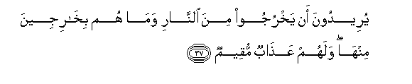

#يُرِيدُونَ أَنْ يَخْرُجُوا مِنَ النَّارِ وَمَا هُمْ بِخَارِجِينَ مِنْهَا ۖ وَلَهُمْ عَذَابٌ مُقِيمٌ 

##Yureedoona an yakhrujoo mina alnnari wama hum bikharijeena minha walahum AAathabun muqeemun 

## 翻译(Translation)：

| Translator | 译文(Translation)                                            |
| :--------: | ------------------------------------------------------------ |
|    马坚    | 他们想从火狱里出来，但他们绝不得出来，他们将受永恒的刑罚。   |
|  YUSUFALI  | Their wish will be to get out of the fire but never will they get out therefrom: their penalty will be one that endures. |
| PICKTHALL  | They will wish to come forth from the Fire, but they will not come forth from it. Theirs will be a lasting doom. |
|   SHAKIR   | They would desire to go forth from the fire, and they shall not go forth from it, and they shall have a lasting punishment. |

---

## 对位释义(Words Interpretation)：

| No   | العربية | 中文    | English | 曾用词 |
| ---- | ------: | ------- | ------- | ------ |
| 序号 |    阿文 | Chinese | 英文    | Used   |
| 5:37.1  | يُرِيدُونَ  | 他们希望   | they wish           | 见4:60.15  |
| 5:37.2  | أَنْ      | 该         | that                | 见2:26.5   |
| 5:37.3  | يَخْرُجُوا  | 他们出来   | they go out         | 见5:22.12  |
| 5:37.4  | مِنَ      | 从         | from                | 见2:4.8    |
| 5:37.5  | النَّارِ   | 火狱       | the Fire            | 见2:24.7   |
| 5:37.6  | وَمَا     | 和不       | And not             | 见2:9.9    |
| 5:37.7  | هُمْ      | 他们       | they                | 见2:4.11   |
| 5:37.8  | بِخَارِجِينَ | 逃出       | emerge              | 见2:167.21 |
| 5:37.9  | مِنْهَا    | 从它       | From it             | 见2:25.15  |
| 5:37.10 | وَلَهُمْ    | 和对他们   | and for them        | 见2:7.10   |
| 5:37.11 | عَذَابٌ    | 煎熬，刑罚 | torment, punishment | 见2:7.11   |
| 5:37.12 | مُقِيمٌ    | 永恒的     | lasting             |            |

---
