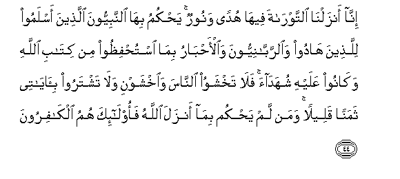

#إِنَّا أَنْزَلْنَا التَّوْرَاةَ فِيهَا هُدًى وَنُورٌ ۚ يَحْكُمُ بِهَا النَّبِيُّونَ الَّذِينَ أَسْلَمُوا لِلَّذِينَ هَادُوا وَالرَّبَّانِيُّونَ وَالْأَحْبَارُ بِمَا اسْتُحْفِظُوا مِنْ كِتَابِ اللَّهِ وَكَانُوا عَلَيْهِ شُهَدَاءَ ۚ فَلَا تَخْشَوُا النَّاسَ وَاخْشَوْنِ وَلَا تَشْتَرُوا بِآيَاتِي ثَمَنًا قَلِيلًا ۚ وَمَنْ لَمْ يَحْكُمْ بِمَا أَنْزَلَ اللَّهُ فَأُولَٰئِكَ هُمُ الْكَافِرُونَ 

## 

## 翻译(Translation)：

| Translator | 译文(Translation) |
| :--------: | ----------------- |
|    马坚    |                   |
|  YUSUFALI  |                   |
| PICKTHALL  |                   |
|   SHAKIR   |                   |

---

## 对位释义(Words Interpretation)：

| No   | العربية | 中文    | English | 曾用词 |
| ---- | ------: | ------- | ------- | ------ |
| 序号 |    阿文 | Chinese | 英文    | Used   |
|      |         |         |         |        |

---
