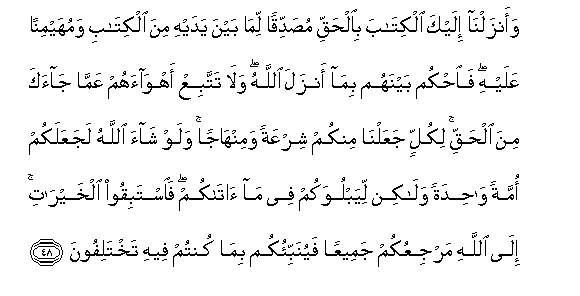

#وَأَنْزَلْنَا إِلَيْكَ الْكِتَابَ بِالْحَقِّ مُصَدِّقًا لِمَا بَيْنَ يَدَيْهِ مِنَ الْكِتَابِ وَمُهَيْمِنًا عَلَيْهِ ۖ فَاحْكُمْ بَيْنَهُمْ بِمَا أَنْزَلَ اللَّهُ ۖ وَلَا تَتَّبِعْ أَهْوَاءَهُمْ عَمَّا جَاءَكَ مِنَ الْحَقِّ ۚ لِكُلٍّ جَعَلْنَا مِنْكُمْ شِرْعَةً وَمِنْهَاجًا ۚ وَلَوْ شَاءَ اللَّهُ لَجَعَلَكُمْ أُمَّةً وَاحِدَةً وَلَٰكِنْ لِيَبْلُوَكُمْ فِي مَا آتَاكُمْ ۖ فَاسْتَبِقُوا الْخَيْرَاتِ ۚ إِلَى اللَّهِ مَرْجِعُكُمْ جَمِيعًا فَيُنَبِّئُكُمْ بِمَا كُنْتُمْ فِيهِ تَخْتَلِفُونَ 

##Waanzalna ilayka alkitaba bialhaqqi musaddiqan lima bayna yadayhi mina alkitabi wamuhayminan AAalayhi faohkum baynahum bima anzala Allahu wala tattabiAA ahwaahum AAamma jaaka mina alhaqqi likullin jaAAalna minkum shirAAatan waminhajan walaw shaa Allahu lajaAAalakum ommatan wahidatan walakin liyabluwakum fee ma atakum faistabiqoo alkhayrati ila Allahi marjiAAukum jameeAAan fayunabbiokum bima kuntum feehi takhtalifoona 

## 翻译(Translation)：

| Translator | 译文(Translation)                                            |
| :--------: | ------------------------------------------------------------ |
|    马坚    | 我降示你这部包含真理的经典，以证实以前的一切天经，而监护之。故你当依真主所降示的经典而为他们判决，你不要舍弃降临你的真理而顺从他们的私欲。我已为你们中每一个民族制定一种教律和法程。如果真主意欲，他必使你们变成一个民族。但他把你们分成许多民族，以便他考验你们能不能遵守他所赐予你们的教律和法程。故你们当争先为善。你们全体都要归于真主，他要把你们所争论的是非告诉你们。 |
|  YUSUFALI  | To thee We sent the Scripture in truth confirming the scripture that came before it and guarding it in safety; so judge between them by what Allah hath revealed and follow not their vain desires diverging from the truth that hath come to thee. To each among you have We prescribed a Law and an Open Way. If Allah had so willed He would have made you a single people but (His plan is) to test you in what He hath given you: so strive as in a race in all virtues. The goal of you all is to Allah; it is He that will show you the truth of the matters in which ye dispute. |
| PICKTHALL  | And unto thee have We revealed the Scripture with the truth, confirming whatever Scripture was before it, and a watcher over it. So judge between them by that which Allah hath revealed, and follow not their desires away from the truth which hath come unto thee. For each We have appointed a divine law and a traced-out way. Had Allah willed He could have made you one community. But that He may try you by that which He hath given you (He hath made you as ye are). So vie one with another in good works. Unto Allah ye will all return, and He will then inform you of that wherein ye differ. |
|   SHAKIR   | And We have revealed to you the Book with the truth, verifying what is before it of the Book and a guardian over it, therefore judge between them by what Allah has revealed, and do not follow their low desires (to turn away) from the truth that has come to you; for every one of you did We appoint a law and a way, and if Allah had pleased He would have made you (all) a single people, but that He might try you in what He gave you, therefore strive with one another to hasten to virtuous deeds; to Allah is your return, of all (of you), so He will let you know that in which you differed; |

---

## 对位释义(Words Interpretation)：

| No   | العربية | 中文    | English | 曾用词 |
| ---- | ------: | ------- | ------- | ------ |
| 序号 |    阿文 | Chinese | 英文    | Used   |
| 5:48.1  | وَأَنْزَلْنَا  | 和我们降下             | And we sent down              | 见2:57.4   |
| 5:48.2  | إِلَيْكَ     | 至你                   | to you                        | 见2:4.5    |
| 5:48.3  | الْكِتَابَ   | 这部经，这本书         | the book                      | 见2:2.2    |
| 5:48.4  | بِالْحَقِّ    | 以真理                 | with truth                    | 见2:71.20  |
| 5:48.5  | مُصَدِّقًا    | 证实                   | confirming                    | 见2:41.4   |
| 5:48.6  | لِمَا      | 至什么                 | for what                      | 见2:41.5   |
| 5:48.7  | بَيْنَ      | 之间                   | between                       | 见2:66.4   |
| 5:48.8  | يَدَيْهِ     | 他的双手               | His hands                     | 见2:97.15  |
| 5:48.9  | مِنَ       | 从                     | from                          | 见2:19.3 |
| 5:48.10 | الْكِتَابِ   | 这部经的               | of the Book                   | 见2:85.25  |
| 5:48.11 | وَمُهَيْمِنًا  | 和一个监护             | and a guardian                |            |
| 5:48.12 | عَلَيْهِ     | 在他                   | on him                        | 见2:37.7   |
| 5:48.13 | فَاحْكُمْ    | 然后你判断             | then you judge                | 见5:42.7   |
| 5:48.14 | بَيْنَهُمْ    | 他们之间               | between them                  | 见2:113.25 |
| 5:48.15 | بِمَا      | 在什么                 | in what                       | 见2:4.3    |
| 5:48.16 | أَنْزَلَ     | 下降，颁降，降示，揭秘 | get down                      | 见2:4.4    |
| 5:48.17 | اللَّهُ     | 安拉，真主             | Allah                         | 见2:7.2    |
| 5:48.18 | وَلَا      | 也不                   | and not                       | 见1:7.8    |
| 5:48.19 | تَتَّبِعْ     | 你顺从                 | you follow                    | 参2:120.17 |
| 5:48.20 | أَهْوَاءَهُمْ  | 他们的私欲             | their desires                 | 见2:120.18 |
| 5:48.21 | عَمَّا      | 在什么                 | of what                       | 见2:74.36  |
| 5:48.22 | جَاءَكَ     | 他来到你               | He came to you                | 见2:120.21 |
| 5:48.23 | مِنَ       | 从                     | from                          | 见2:19.3 |
| 5:48.24 | الْحَقِّ     | 正确的，真理           | Right, truth                  | 见2:26.17  |
| 5:48.25 | لِكُلٍّ      | 为每个                 | for each                      |            |
| 5:48.26 | جَعَلْنَا    | 我们使                 | we made                       | 见2:125.2  |
| 5:48.27 | مِنْكُمْ     | 从你们                 | Of you                        | 见2:65.5   |
| 5:48.28 | شِرْعَةً     | 一种教律               | a law                         |            |
| 5:48.29 | وَمِنْهَاجًا  | 和一个法程             | and a way                     |            |
| 5:48.30 | وَلَوْ      | 和如果                 | and if                        | 见2:20.14  |
| 5:48.31 | شَاءَ      | 意欲                   | Will                          | 见2:20.15  |
| 5:48.32 | اللَّهُ     | 安拉，真主             | Allah                         | 见2:7.2    |
| 5:48.33 | لَجَعَلَكُمْ   | 必定他使你们           | willed He would have made you |            |
| 5:48.34 | أُمَّةً      | 一个民族               | a nation                      | 见2:128.7  |
| 5:48.35 | وَاحِدَةً    | 一个的                 | one                           | 见2:213.4  |
| 5:48.36 | وَلَٰكِنْ     | 并且但是               | and but                       | 见2:12.5   |
| 5:48.37 | لِيَبْلُوَكُمْ  | 为了他考验你们         | for He may try you            |            |
| 5:48.38 | فِي       | 在                     | in                            | 见2:10.1   |
| 5:48.39 | مَا       | 什么                   | what/ that which              | 见2:17.8   |
| 5:48.40 | آتَاكُمْ    | 他给你们               | He gave you                   |            |
| 5:48.41 | فَاسْتَبِقُوا | 故你们当争先做         | then strive together towards  | 见2:148.5  |
| 5:48.42 | الْخَيْرَاتِ  | 善事                   | good works                    | 见2:148.6  |
| 5:48.43 | إِلَى      | 至                     | to                            | 见2:14.9   |
| 5:48.44 | اللَّهِ     | 真主的                 | of Allah                      | 见2:23.17  |
| 5:48.45 | مَرْجِعُكُمْ   | 你们被返回             | your return                   | 见3:55.25  |
| 5:48.46 | جَمِيعًا    | 所有                   | All                           | 见2:29.8   |
| 5:48.47 | فَيُنَبِّئُكُمْ  | 然后他告诉你们         | so He will let you know       |            |
| 5:48.48 | بِمَا      | 在什么                 | in what                       | 见2:4.3    |
| 5:48.49 | كُنْتُمْ     | 你们是                 | You are                       | 见2:23.2   |
| 5:48.50 | فِيهِ      | 它，其中               | in it                         | 见2:2.5    |
| 5:48.51 | تَخْتَلِفُونَ  | 你们争论               | you differ                    | 见3:55.31  |

---
